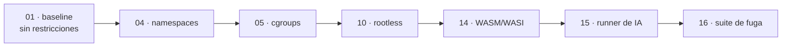
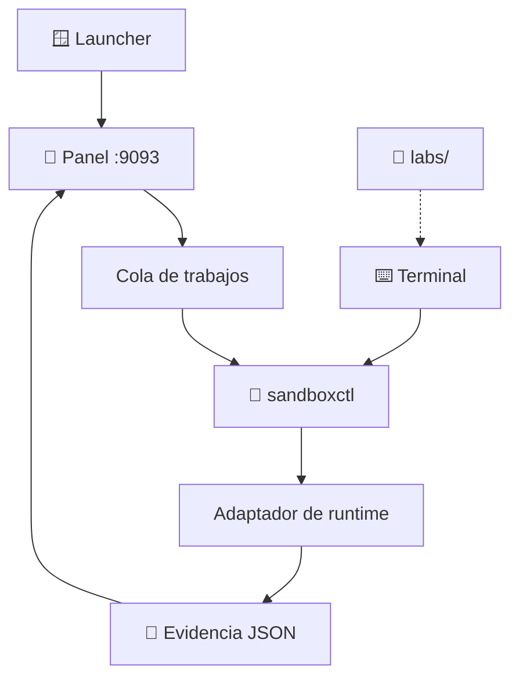

# 🎛️ Modos de operación

El mismo motor se maneja de cuatro formas. Todas comparten el catálogo, las
políticas y el formato de evidencia — cambia la interfaz, no las reglas.

---

## 1️⃣ Panel — `127.0.0.1:9093`

**Para quién:** explorar el catálogo, lanzar trabajos y leer evidencias sin
memorizar comandos.

```bash
pnpm dashboard:build
pnpm dashboard:start
```

| Capacidad | Estado |
|---|:--:|
| Crear trabajos con identificadores del catálogo | ✅ |
| Estado en vivo por SSE y logs de la ejecución | ✅ |
| Cancelar un trabajo en curso | ✅ |
| Consultar la evidencia JSON | ✅ |
| Previsión de controles antes de ejecutar | ✅ |
| Ejecutar comandos arbitrarios | ❌ **por diseño** |

> [!NOTE]
> El panel escucha solo en `127.0.0.1` y valida la cabecera `Host` en cada
> petición. No tiene autenticación porque no está pensado para salir del equipo.

---

## 2️⃣ CLI — `sandboxctl`

**Para quién:** automatizar, guionizar y reproducir resultados en CI.

```bash
cargo run -p sandboxctl -- doctor              # ¿qué runtimes hay en este host?
cargo run -p sandboxctl -- labs                # catálogo de laboratorios
cargo run -p sandboxctl -- runtimes --json     # sondeo en formato máquina
cargo run -p sandboxctl -- validate policies/minimal.json --workload workloads/benign/hello
cargo run -p sandboxctl -- plan  --workload workloads/benign/hello --runtime bwrap --policy policies/minimal.json
cargo run -p sandboxctl -- run   --workload workloads/benign/hello --runtime dry-run --policy policies/minimal.json
```

Todos los comandos aceptan `--json`, así que encadenar con `jq` es directo:

```bash
cargo run -q -p sandboxctl -- plan --json \
  --workload workloads/benign/hello --runtime bwrap --policy policies/high-risk.json \
  | jq '.controls.unsupported'
```

---

## 3️⃣ Laboratorios — `labs/`

**Para quién:** entender *por qué* cada control importa, no solo cómo se activa.

Cada laboratorio trae README con objetivo, pasos y qué observar. Algunos
incluyen scripts (`run-baseline.sh`, `run-unshare.sh`, `inspect-cgroup.sh`).

Recorrido recomendado:



---

## 4️⃣ Launcher de Windows

**Para quién:** arrancar el panel sin abrir una terminal.

```text
launcher/windows/start-sandbox-labs.cmd
launcher/windows/start-sandbox-labs.ps1
```

Construye el panel si hace falta, lo levanta y abre el navegador. El
aislamiento real sigue requiriendo WSL2 — ver [COMPATIBILITY.md](COMPATIBILITY.md).

---

## 🔀 Cómo se relacionan



El panel **no ejecuta cargas**: delega en `sandboxctl`, que es quien sondea el
host, compila el plan y decide si ejecutar. Si el CLI no está compilado, el
panel deja evidencia de reserva en vez de simular un resultado.

---

## 🧭 Cuál usar

| Situación | Modo |
|---|---|
| Primer contacto con el proyecto | Panel |
| Comparar dos runtimes sobre la misma carga | CLI con `plan --json` |
| Integrar en CI | CLI |
| Enseñar o aprender el concepto | `labs/` |
| Demostrar en un equipo Windows | Launcher |

---

## 🔗 Ver también

- [Preparación del entorno](ENVIRONMENT_SETUP.md)
- [Referencia de la API](docs/API.md)
- [Runbook](RUNBOOK.md)
