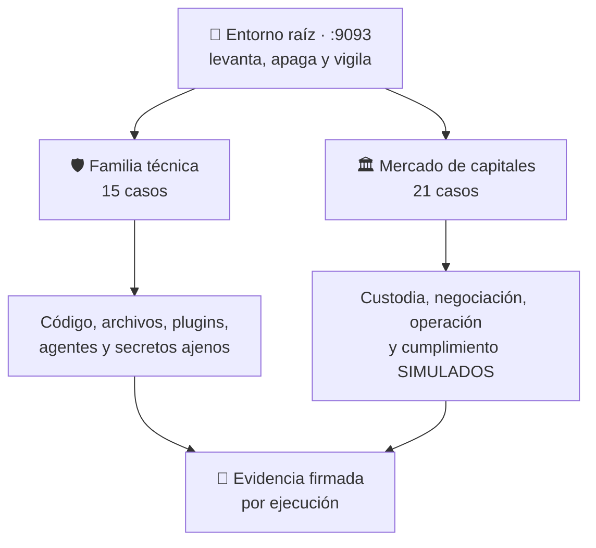

# 🛡️ sandbox-labs

**Ejecuta código que no controlas, sin entregarle tu equipo.**

Una plataforma para aprender —y comprobar— cómo se contiene lo desconocido. Cada
caso es un producto que se levanta en su propio `localhost`, donde haces tareas
reales, y que se apaga dejando constancia de qué pudo tocar y qué no.

[](https://github.com/vladimiracunadev-create/sandbox-labs/actions/workflows/ci.yml)
[](https://github.com/vladimiracunadev-create/sandbox-labs/actions/workflows/security.yml)


[](LICENSE)

🌐 **[Sitio del proyecto](https://vladimiracunadev-create.github.io/sandbox-labs/)** · 📋 **[Catálogo de los 36 casos](docs/CATALOGO.md)** · 📊 **[Estado real](docs/ESTADO.md)** · 📚 **[Documentación](docs/)**

---

## 📊 Estado, sin adornos

| | Construido | Del total |
|---|:--:|:--:|
| **Núcleo de aislamiento** | 9 de 9 controles | ✅ completo, verificado en CI |
| **Casos técnicos** | 15 | de 15 |
| **Casos de mercado de capitales** | 21 | de 21 |

Los 36 casos tienen código y prueba que corre en cada commit. Ninguno llega a
`verified`: para eso hace falta evidencia firmada por ejecución.
**[docs/ESTADO.md](docs/ESTADO.md)** dice, caso por caso, qué hay, qué lo
demuestra y qué falta — sin usar la palabra «listo» en ningún sitio.

> [!IMPORTANT]
> Proyecto **experimental y educativo**. `experimental` **no** significa «seguro
> para código hostil»: no te promete una caja fuerte, te dice con evidencia qué
> controles quedaron efectivos en tu equipo. Para cargas desconocidas de verdad,
> usa una máquina virtual desechable. **Nunca ejecutes malware real en el equipo
> anfitrión.**

---

## Qué puedes ejecutar hoy

Cinco comprobaciones que corren **en cada commit**, no en un documento:

```bash
cargo run -p sandboxctl -- escape             # 8 sondas intentan escaparse del sandbox
```

```bash
cargo run -p sandboxctl -- evidence verify    # huella, firma, cadena y hashes de la evidencia
```

```bash
cargo run -p sandboxctl -- markets reconcile  # custodia de activos: 6 escenarios
```

```bash
cargo run -p sandboxctl -- markets check      # 19 casos financieros: 119 escenarios
```

```bash
node scripts/verify-cases.mjs                # comportamiento de los casos técnicos
```

---

## Qué es un sandbox

Cuando ejecutas un programa, **corre con tus permisos**. Puede leer cualquier
archivo que tú puedas leer, conectarse a donde quiera y ver todo lo que tienes
abierto. No hay término medio.

Un sandbox es decidir **de antemano** qué puede tocar. Y no como un aviso que el
programa pueda esquivar: desde dentro, lo que no le concediste **no existe**. Si
pide tu clave SSH no recibe «acceso denegado», recibe «ese archivo no está».

### En qué se diferencia de lo que ya conoces

| | La pregunta que responde | Qué te da |
|---|---|---|
| **Docker** | ¿Cómo llevo mi aplicación a producción? | Empaquetado, distribución, orquestación. El aislamiento le sale de rebote |
| **WSL** | ¿Cómo hago convivir Windows y Linux? | Integración — `/mnt/c` está montado **a propósito**, que es lo contrario de aislar |
| **Unikernel** | ¿Cómo reduzco al mínimo lo que puede fallar? | Elimina el sistema operativo: solo queda tu app |
| **Sandbox** | **¿Cómo ejecuto esto sin fiarme de ello?** | **Contención, y nada más** |

Por eso conviven: metes tu app en Docker para desplegarla, y metes en un sandbox
el código de terceros que esa app tiene que ejecutar.

Comparación completa en [docs/COMPARATIVA.md](docs/COMPARATIVA.md) · Concepto
desde cero en [docs/QUE-ES-UN-SANDBOX.md](docs/QUE-ES-UN-SANDBOX.md).

---

## Dos familias que no se mezclan



Están separadas porque tienen modelos de amenazas distintos, y «esto está
contenido» significa cosas muy diferentes en cada lado.

### 🛡️ Familia técnica — 15 casos

Ejecutar código, archivos, plugins, agentes y secretos que no controlas, bajo
políticas verificables.

| # | Caso | La idea que enseña | Estado |
|---|---|---|:--:|
| 01 | [Contenido web no confiable](docs/casos/01-contenido-web-no-confiable.md) | Quien interpreta contenido ajeno no toca el disco | 🟡 `building` |
| 02 | [Código generado por IA](docs/casos/02-codigo-generado-por-ia.md) | Efímero: se crea, ejecuta y se destruye | 🟡 `building` |
| 03 | [Procesamiento seguro de archivos](docs/casos/03-procesamiento-seguro-de-archivos.md) | El informe por entrada vale más que el bloqueo | 🟡 `building` |
| 04 | [Plugins de terceros](docs/casos/04-plugins-de-terceros.md) | Conceder capacidades una a una, no restar permisos | 🟡 `building` |
| 05 | [Custodia de claves y firma](docs/casos/05-custodia-de-claves-y-firma.md) | El secreto entra solo si manifiesto, política y entorno coinciden | 🟡 `building` |
| 06–15 | [Diez casos más](docs/casos/README.md#-familia-técnica--15-casos) | microVM, determinismo, agentes IA, CI, cadena de suministro… | 🟡 `building` |

### 🏛️ Familia mercado de capitales — 21 casos

Probar modelos Fintech con dinero, instrumentos y participantes **simulados**.

| # | Caso | Qué prueba | Estado |
|---|---|---|:--:|
| CM-03 | [Custodia y segregación de activos](docs/casos/cm-03-custodia-y-segregacion-de-activos.md) | Que los activos de clientes cuadren con los custodiados | 🟢 `functional` |
| CM-02 | [Sistema alternativo de transacción](docs/casos/cm-02-sistema-alternativo-de-transaccion.md) | Libro de órdenes con prioridad precio-tiempo | 🟠 `prototype` |
| CM-00, CM-01, CM-04–CM-20 | [Diecinueve casos más](docs/casos/README.md#-familia-mercado-de-capitales--21-casos) | Entrada regulatoria, liquidación, vigilancia, salida ordenada… | 🟠 `prototype` |

> [!WARNING]
> El simulador de mercado de capitales usa **dinero, instrumentos y participantes
> simulados**. Sin conexión a ningún banco ni medio de pago, **sin autorización de
> la CMF ni de ninguna autoridad**, y nada de lo que salga de él es una
> recomendación de inversión.

**Cada uno de los 36 casos tiene ficha completa** —por qué existe, esquemas,
software necesario, instalación, procesos, tiempo de carga y diagramas— en
**[docs/casos/](docs/casos/README.md)**.

---

## Empezar

Necesitas **Linux o WSL2**: los sandboxes son primitivas del kernel de Linux
—namespaces, cgroups, capabilities— y en Windows no existen. Guía completa en
[docs/INSTALACION.md](docs/INSTALACION.md).

```bash
sudo apt install bubblewrap util-linux python3
```

```bash
cargo build --release
```

```bash
cargo run -p sandboxctl -- doctor
```

`doctor` es el paso que importa: enumera qué runtimes hay en **tu** equipo, qué
controles puede aplicar cada uno aquí, y **qué controles se pedirán pero no se
podrán aplicar**.

Después, levantar un caso:

```bash
cargo run -p sandboxctl -- service up file-detonation
```

```bash
cargo run -p sandboxctl -- service down --all
```

O con el panel de control:

```bash
pnpm install --frozen-lockfile && pnpm dashboard:build && pnpm dashboard:start
```

> Este proyecto usa **pnpm**, no `npm`. Los ficheros de bloqueo están versionados
> a propósito: son lo que hace que una instalación sea reproducible.

---

## Cómo se define qué puede tocar

En un archivo de política, **separado del código**. Ni el programa negocia sus
permisos ni quien lo escribió decide sus límites.

```json
{
  "filesystem": { "root": "ephemeral", "writable": ["/workspace/output"] },
  "network":    { "mode": "none" },
  "resources":  { "memoryMb": 512, "processes": 32 },
  "process":    { "capabilities": [], "allowedEnvironment": [] }
}
```

Lo que no aparece ahí no se monta. Y lo que no se monta, dentro no existe.

Referencia completa en [docs/POLICY_REFERENCE.md](docs/POLICY_REFERENCE.md).

---

## La regla central del proyecto

> **Un control solicitado, un control aplicado y un control reportado tienen que
> describir la misma realidad.**

Por eso cada acta de ejecución distingue cinco listas: `requestedControls`,
`effectiveControls`, `unsupportedControls`, `failedControls` y
`observedControls`.

Y por eso, si una política estricta pide un control obligatorio que este equipo
no puede aplicar, **la ejecución no ocurre**: falla cerrada y explica qué falta.
La alternativa —ejecutar con menos controles de los pedidos— es exactamente cómo
se construyen sistemas que **parecen** seguros.

### Qué aplica de verdad, y con qué

Cada control se traduce a un mecanismo concreto del kernel. Lo que no tiene
mecanismo **no se declara**:

| Control | Mecanismo | Estado |
|---|---|---|
| `filesystem` | mount namespace de bubblewrap | ✅ |
| `network` | namespace de red propio (`--unshare-net`) | ✅ con `none` y `loopback` |
| `capabilities` | `--cap-drop ALL` + user namespace + `--uid`/`--gid` | ✅ |
| `memory` | `memory.max` de cgroups v2 | ✅ donde el host lo admita |
| `processes` | `pids.max` de cgroups v2 | ✅ donde el host lo admita |
| `cpu` | `cpu.max` de cgroups v2 | ✅ donde el host lo admita |
| `syscalls` | filtro seccomp BPF, `EPERM` en las denegadas | ✅ si la política deniega algo |
| `timeout`, `output` | el supervisor | ✅ |
| `network` con `allowlist` | namespace propio + proxy con lista y registro | ✅ salida solo por canal explícito |

Los tres de cgroups pasan por `systemd-run --user --scope`, y **antes de la
primera ejecución se levanta un scope de prueba** para comprobar que el kernel
los acepta. Donde falle, los controles no aparecen en la evidencia y una política
estricta que los exija no ejecuta.

Los aplica **un solo compilador**, el mismo para una carga que termina y para un
servicio que se queda levantado. Tenerlos separados fue exactamente cómo el
camino de los servicios acabó sin `--cap-drop ALL`, sin identidad propia y sin
filtro de llamadas, mientras su tarjeta prometía los tres.

Los huecos conocidos, uno por uno, en
**[docs/IMPLEMENTATION_BACKLOG.md](docs/IMPLEMENTATION_BACKLOG.md)**.

---

## Comprobar que contiene de verdad

Un runtime puede *declarar* que corta la red y no cortarla. Por eso el
repositorio trae ocho sondas que **intentan escaparse** y publican el resultado:

```bash
cargo run -p sandboxctl -- escape
```

Es lo que CI ejecuta en cada commit, incluida la contraprueba de que sin
aislamiento las sondas **tienen** que escaparse — si no, no estarían midiendo
nada. Detalle en [docs/CONTAINMENT_SUITE.md](docs/CONTAINMENT_SUITE.md).

El peor veredicto posible no es «escapó», es **`❌ DECLARADO`**: el runtime
prometió el control y la sonda demostró que no lo aplica. Eso tumba el build.

### Y que la evidencia no se ha tocado

Cada ejecución escribe un informe firmado con su propia huella:

```bash
cargo run -p sandboxctl -- evidence verify
```

Comprueba cuatro cosas, y cada una ve lo que la anterior no:

| Mecanismo | Detecta |
|---|---|
| huella SHA-256 | el fichero se tocó |
| firma Ed25519 | alguien lo **rehízo** recalculando la huella |
| cadena entre evidencias | alguien **borró** un informe entero |
| rehash de política y carga | el código cambió desde aquella ejecución |

Lo último no es corrupción: es un informe viejo diciendo con razón que ya no
describe el código de hoy. También corre en CI.

> **La firma no es una notarización.** La clave la guarda la misma máquina que
> ejecuta, así que prueba que el informe no cambió tras escribirse — no que la
> ejecución ocurriera. Para eso haría falta una clave que el operador no controle.

---

## Reglas que el proyecto no rompe

| Regla | Por qué |
|---|---|
| **Nunca malware real** en el repositorio ni en el equipo anfitrión | Las muestras son sintéticas e inofensivas |
| **Nunca dinero real** ni conectividad de producción | La familia financiera es un simulador, no un servicio |
| **Nunca credenciales reales** | Ni en fixtures, ni en evidencia, ni en logs, ni en CI, ni en capturas |
| **Nunca datos personales reales**, tampoco como datos de prueba | Todo es sintético y está documentado como tal |
| **No es autorización regulatoria** de ninguna autoridad | Ni lo será |
| **No se declara probado lo que no se ejecutó** | Y no se ocultan los errores |

---

## Documentación

| Si quieres… | Ve a |
|---|---|
| **Saber qué está construido de verdad** | **[Estado del proyecto](docs/ESTADO.md)** |
| **Ver los 36 casos y su estado** | **[Catálogo completo](docs/CATALOGO.md)** |
| **La ficha detallada de un caso** | **[docs/casos/](docs/casos/README.md)** |
| Entender el concepto desde cero | [Qué es un sandbox](docs/QUE-ES-UN-SANDBOX.md) |
| Saber en qué se diferencia de Docker | [Comparativa](docs/COMPARATIVA.md) |
| Instalarlo | [Instalación](docs/INSTALACION.md) |
| Escribir una política | [Referencia de políticas](docs/POLICY_REFERENCE.md) |
| Entender el formato de la evidencia | [Formato de evidencia](docs/EVIDENCE_FORMAT.md) |
| Ver las sondas de contención | [Suite de contención](docs/CONTAINMENT_SUITE.md) |
| Entender el vocabulario | [Glosario](docs/GLOSARIO.md) |
| Saber qué protege y qué no | [Modelo de amenazas](docs/THREAT_MODEL.md) |
| **Resolver un fallo** | **[Cuando algo falla](docs/SOLUCION-DE-PROBLEMAS.md)** |
| Operarlo día a día | [Runbook](RUNBOOK.md) |
| Ver la arquitectura | [Arquitectura](docs/ARCHITECTURE.md) |

Índice completo en **[docs/](docs/)**.

---

## Licencia

Apache License 2.0. Ver [LICENSE](LICENSE) y [NOTICE](NOTICE).
