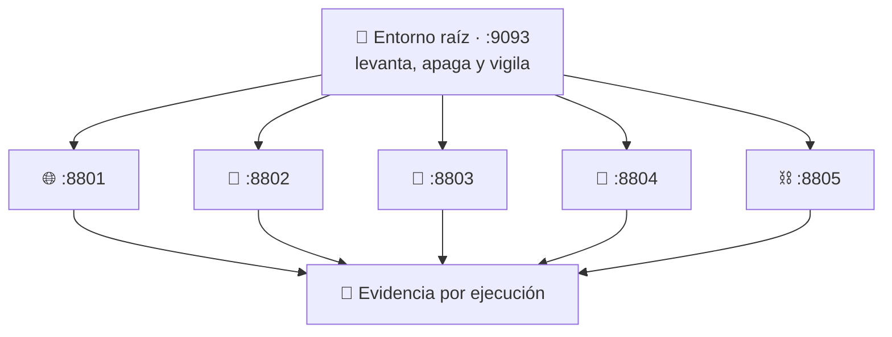

# 🛡️ sandbox-labs

**Ejecuta código que no controlas, sin entregarle tu equipo.**

Cada caso es un producto que se levanta en su propio `localhost`, donde haces
tareas reales, y que se apaga dejando constancia de qué pudo tocar y qué no.

[](https://github.com/vladimiracunadev-create/sandbox-labs/actions/workflows/ci.yml)
[](https://github.com/vladimiracunadev-create/sandbox-labs/actions/workflows/security.yml)


[](LICENSE)

🌐 **[Sitio del proyecto](https://vladimiracunadev-create.github.io/sandbox-labs/)** · 📚 **[Documentación](docs/)** · 🧠 **[Qué es un sandbox](docs/QUE-ES-UN-SANDBOX.md)**

---

## Qué es un sandbox

Cuando ejecutas un programa, **corre con tus permisos**. Puede leer cualquier
archivo que tú puedas leer, conectarse a donde quiera y ver todo lo que tienes
abierto. No hay término medio.

Un sandbox es decidir **de antemano** qué puede tocar. Y no como un aviso que el
programa pueda esquivar: desde dentro, lo que no le concediste **no existe**. Si
pide tu clave SSH no recibe «acceso denegado», recibe «ese archivo no está».

### En qué se diferencia de lo que ya conoces

| | La pregunta que responde | Qué te da |
|---|---|---|
| **Docker** | ¿Cómo llevo mi aplicación a producción? | Empaquetado, distribución, orquestación. El aislamiento le sale de rebote |
| **WSL** | ¿Cómo hago convivir Windows y Linux? | Integración — `/mnt/c` está montado **a propósito**, que es lo contrario de aislar |
| **Unikernel** | ¿Cómo reduzco al mínimo lo que puede fallar? | Elimina el sistema operativo: solo queda tu app |
| **Sandbox** | **¿Cómo ejecuto esto sin fiarme de ello?** | **Contención, y nada más** |

Por eso conviven: metes tu app en Docker para desplegarla, y metes en un sandbox
el código de terceros que esa app tiene que ejecutar.

Comparación completa en [docs/COMPARATIVA.md](docs/COMPARATIVA.md).

---

## Los cinco casos

Cada uno enseña una idea que ningún otro enseña.

| # | Caso | La idea | Puerto | Estado |
|---|---|---|:--:|:--:|
| 01 | Contenido web no confiable | Quien interpreta contenido ajeno no toca el disco | 8801 | 🔴 pendiente |
| 02 | Código generado por IA | Efímero y sin red: se crea, corre y se destruye | 8802 | 🟡 en obra |
| 03 | Detonación de archivo | El sandbox como microscopio: el informe vale más que el bloqueo | 8803 | 🟡 en obra |
| 04 | Plugins de terceros | Conceder capacidades una a una, no restar permisos | 8804 | 🔴 pendiente |
| 05 | Contratos inteligentes | Sin entrada ni salida, con el trabajo medido en vez del tiempo | 8805 | 🟡 en obra |



Por encima, el **entorno raíz** en `127.0.0.1:9093` los levanta, los apaga y
muestra bajo qué política corre cada uno.

Ficha de cada caso en [docs/CASOS.md](docs/CASOS.md).

---

## Empezar

Necesitas **Linux o WSL2**: los sandboxes son primitivas del kernel de Linux
—namespaces, cgroups, capabilities— y en Windows no existen. Guía completa en
[docs/INSTALACION.md](docs/INSTALACION.md).

```bash
sudo apt install bubblewrap util-linux
cargo build -p sandboxctl --release

cargo run -p sandboxctl -- doctor            # qué hay en este host
cargo run -p sandboxctl -- cases             # los casos y su estado
cargo run -p sandboxctl -- service up file-detonation
cargo run -p sandboxctl -- service list
cargo run -p sandboxctl -- service down --all
```

O con el panel:

```bash
pnpm install --frozen-lockfile
pnpm dashboard:build && pnpm dashboard:start
```

---

## Cómo se define qué puede tocar

En un archivo de política, **separado del código**. Ni el programa negocia sus
permisos ni quien lo escribió decide sus límites.

```json
{
  "filesystem": { "root": "ephemeral", "writable": ["/workspace/output"] },
  "network":    { "mode": "none" },
  "resources":  { "memoryMb": 512, "processes": 32 },
  "process":    { "capabilities": [], "allowedEnvironment": [] }
}
```

Lo que no aparece ahí no se monta. Y lo que no se monta, dentro no existe.

Referencia completa en [docs/POLICY_REFERENCE.md](docs/POLICY_REFERENCE.md).

---

## Qué aplica de verdad, y con qué

Cada control de la política se traduce a un mecanismo concreto del kernel. Lo
que no tiene mecanismo **no se declara**:

| Control | Mecanismo | Estado |
|---|---|---|
| `filesystem` | mount namespace de bubblewrap | ✅ |
| `network` | namespace de red propio (`--unshare-net`) | ✅ con `none` y `loopback` |
| `capabilities` | `--cap-drop ALL` + user namespace + `--uid`/`--gid` | ✅ |
| `memory` | `memory.max` de cgroups v2 | ✅ donde el host lo admita |
| `processes` | `pids.max` de cgroups v2 | ✅ donde el host lo admita |
| `cpu` | `cpu.max` de cgroups v2 | ✅ donde el host lo admita |
| `syscalls` | filtro seccomp BPF, `EPERM` en las denegadas | ✅ si la política deniega algo |
| `timeout`, `output` | el supervisor | ✅ |
| `network` con `allowlist` | namespace propio + proxy con lista y registro | ✅ salida solo por canal explícito |

Los tres de cgroups pasan por `systemd-run --user --scope`, y **antes de la
primera ejecución se levanta un scope de prueba** para comprobar que el kernel
los acepta. Donde falle, los controles no aparecen en la evidencia y una
política estricta que los exija no ejecuta. `sandboxctl doctor` lo enseña.

Los aplica **un solo compilador**, el mismo para una carga que termina y para un
servicio que se queda levantado. Tenerlos separados fue exactamente cómo el
camino de los servicios acabó sin `--cap-drop ALL`, sin identidad propia y sin
filtro de llamadas, mientras su tarjeta prometía los tres.

Los huecos conocidos, uno por uno y con lo que haría falta para cerrarlos, en
**[docs/IMPLEMENTATION_BACKLOG.md](docs/IMPLEMENTATION_BACKLOG.md)**.

---

## Comprobar que contiene de verdad

Un runtime puede *declarar* que corta la red y no cortarla. Por eso el
repositorio trae ocho sondas que **intentan escaparse** y publican el resultado:

```bash
cargo run -p sandboxctl -- escape
```

Es lo que CI ejecuta en cada commit, incluida la contraprueba de que sin
aislamiento las sondas **tienen** que escaparse — si no, no estarían midiendo
nada. Detalle en [docs/CONTAINMENT_SUITE.md](docs/CONTAINMENT_SUITE.md).

El peor veredicto posible no es «escapó», es **`❌ DECLARADO`**: el runtime
prometió el control y la sonda demostró que no lo aplica. Eso tumba el build.

## Y que la evidencia no se ha tocado

Cada ejecución escribe un informe firmado con su propia huella:

```bash
cargo run -p sandboxctl -- evidence verify
```

Recalcula esa huella y vuelve a hashear la política y la carga. Distingue que
alguien editara el informe de que el código haya cambiado desde entonces, que no
es lo mismo. También corre en CI.

---

> [!IMPORTANT]
> `experimental` **no** significa «seguro para código hostil». Este proyecto no
> te promete una caja fuerte: te dice, con evidencia, qué controles quedaron
> efectivos en tu host. Antes de ejecutar una carga desconocida, valida el
> runtime en una VM que puedas destruir.

## Documentación

| Si quieres… | Ve a |
|---|---|
| Entender el concepto desde cero | [Qué es un sandbox](docs/QUE-ES-UN-SANDBOX.md) |
| Saber en qué se diferencia de Docker | [Comparativa](docs/COMPARATIVA.md) |
| Ver qué hace cada caso | [Los cinco casos](docs/CASOS.md) |
| Instalarlo | [Instalación](docs/INSTALACION.md) |
| Escribir una política | [Referencia de políticas](docs/POLICY_REFERENCE.md) |
| Entender el vocabulario | [Glosario](docs/GLOSARIO.md) |
| Saber qué protege y qué no | [Modelo de amenazas](docs/THREAT_MODEL.md) |

Índice completo en **[docs/](docs/)**.

---

## Licencia

Apache License 2.0. Ver [LICENSE](LICENSE) y [NOTICE](NOTICE).
