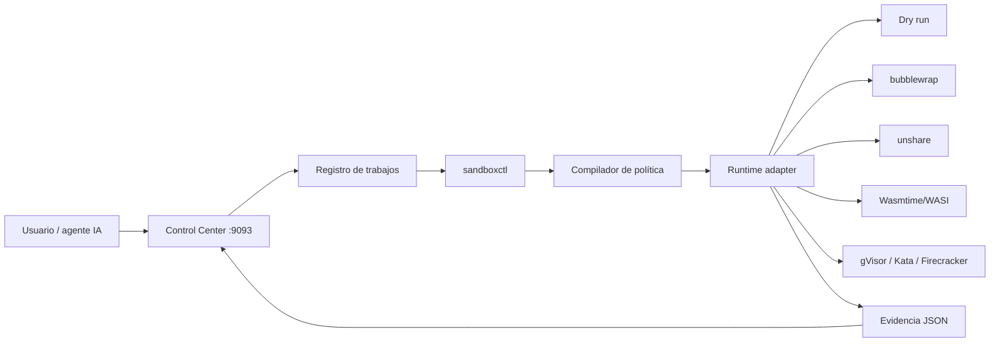

# Sandbox Labs

> Plataforma educativa y experimental para planificar, ejecutar y comparar cargas registradas bajo políticas explícitas de aislamiento.

[](https://github.com/vladimiracunadev-create/sandbox-labs/actions/workflows/ci.yml)
[](https://github.com/vladimiracunadev-create/sandbox-labs/actions/workflows/docs.yml)
[](LICENSE)

## Estado — v0.6.0

Esta versión deja una base **implementation-ready** para Codex y otros agentes de desarrollo:

- CLI `sandboxctl` en Rust con contratos tipados, validación y evidencias reproducibles.
- Modelo neutral de políticas con `strict` y `best-effort`.
- Separación entre controles solicitados, efectivos y no soportados.
- Adaptadores `dry-run`, `native`, `bubblewrap`, `unshare` y `WASI`.
- Adaptadores fail-closed/documentados para gVisor, Kata y Firecracker.
- Timeout, límite de salida, limpieza efímera y evidencia JSON.
- Control Center local en `127.0.0.1:9093`.
- API de trabajos, cancelación, eventos SSE y evidencias.
- Solo workloads registrados: no existe endpoint para comandos arbitrarios.
- Validación local contra JSON Schema sin dependencias npm.
- Protección de rutas, symlinks, Origin/CSRF local y Host anti DNS-rebinding.
- Interfaz con cancelación, logs, errores y consulta de evidencias.
- Pruebas negativas de filesystem, red y rechazo de cargas riesgosas en native.

> [!IMPORTANT]
> `experimental` no significa “seguro para código hostil”. Antes de usar una carga desconocida, valida el runtime en una VM dedicada. Los adaptadores avanzados requieren pruebas reales del host y del kernel.

## Arquitectura



## Quickstart

### Validación sin instalar dependencias

```bash
node scripts/validate-config.mjs
node scripts/check-doc-links.mjs
node scripts/run-negative-tests.mjs
node scripts/validate-evidence.mjs
cd control-center
node scripts/build.mjs
node --test test/*.test.mjs
```

### CLI Rust

```bash
bash scripts/generate-lockfiles.sh
cargo build --workspace --locked
cargo run -p sandboxctl -- doctor
cargo run -p sandboxctl -- labs
cargo run -p sandboxctl -- plan \
  --workload workloads/benign/hello \
  --runtime bwrap \
  --policy policies/minimal.json
```

Baseline nativo, únicamente para la carga benigna `hello`:

```bash
SANDBOX_LABS_ALLOW_NATIVE=1 cargo run -p sandboxctl -- run \
  --workload workloads/benign/hello \
  --runtime native \
  --policy policies/web-application.json
```

### Control Center

```bash
corepack enable
pnpm install --frozen-lockfile
pnpm dashboard:build
pnpm dashboard:start
```

Abre <http://127.0.0.1:9093>.

## Runtimes

| Runtime | Estado | Qué aplica hoy |
|---|---|---|
| `dry-run` | ready | Plan y evidencia sin ejecutar |
| `native` | experimental | Opt-in, timeout y límite de salida; no es aislamiento |
| `bwrap` | experimental | Filesystem, namespaces, red cerrada, capabilities y `prlimit` cuando existe |
| `unshare` | experimental | Namespaces y red cerrada; no ofrece jail completo de filesystem |
| `wasi` | experimental | Preopens de Wasmtime y ejecución de módulos WASI registrados |
| `gvisor` | documented | Contrato y backlog para OCI bundle + `runsc` |
| `kata` | documented | Contrato y backlog para runtime respaldado por VM |
| `firecracker` | manual | Requiere KVM, jailer, kernel y rootfs validados |

## Estructura

```text
sandbox-labs/
├── crates/
│   ├── sandbox-core/          # JSON, políticas, workloads, hashes y evidencia
│   ├── sandbox-runtimes/      # RuntimeAdapter + ejecución
│   └── sandboxctl/            # CLI
├── control-center/            # API local, UI, trabajos y SSE
├── policies/                  # Perfiles reproducibles
├── workloads/                 # Cargas registradas y manifiestos
├── tests/scenarios/           # Pruebas negativas declarativas
├── schemas/                   # Catálogo, policy, workload, job y evidence
├── labs/                      # 18 recorridos educativos
├── adapters/                  # Notas y artefactos por runtime
├── evidence/runs/             # Salidas JSON ignoradas por Git
├── docs/                      # Arquitectura, amenazas, API y backlog
└── .github/workflows/         # CI, docs y release
```

## Ruta recomendada

1. `01-baseline-unrestricted`
2. `04-linux-namespaces`
3. `05-cgroups-limits`
4. `10-rootless-sandbox`
5. `14-wasm-wasi`
6. `15-ai-code-runner`
7. `16-escape-test-suite`

## Reglas de seguridad

- Fallar cerrado cuando una política `strict` exige controles no disponibles.
- No ejecutar workloads `resource-abuse` o `adversarial-simulation` en native.
- No aceptar comandos libres desde HTTP.
- No heredar el entorno del proceso por defecto.
- Limitar stdout/stderr y tiempo de vida.
- Conservar hash de política, workload y runner.
- Tratar contenedores, namespaces y WASI como fronteras diferentes, no equivalentes.

Consulta [SECURITY.md](SECURITY.md), [docs/THREAT_MODEL.md](docs/THREAT_MODEL.md) y [docs/IMPLEMENTATION_BACKLOG.md](docs/IMPLEMENTATION_BACKLOG.md).

## Licencia

Apache License 2.0. Revisa [LICENSE](LICENSE) y [NOTICE](NOTICE).
