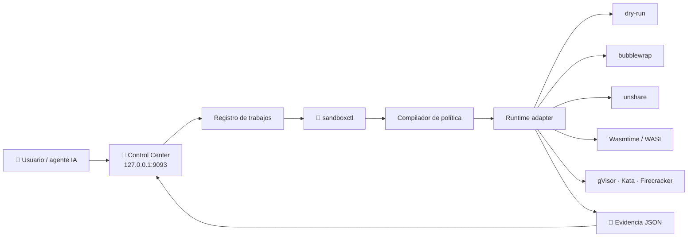
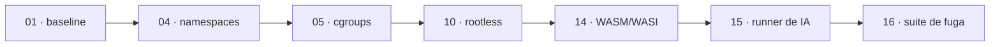

# 🧪 sandbox-labs — Sandbox Control Center

**Ejecuta cargas registradas bajo políticas explícitas de aislamiento y quédate
con la prueba de qué se aplicó de verdad.** Panel local + CLI en Rust, sobre
namespaces, bubblewrap, WASI, gVisor, Kata y Firecracker.

[](https://github.com/vladimiracunadev-create/sandbox-labs/actions/workflows/ci.yml)
[](https://github.com/vladimiracunadev-create/sandbox-labs/actions/workflows/docs.yml)
[](https://github.com/vladimiracunadev-create/sandbox-labs/actions/workflows/security.yml)


[](LICENSE)

> [!IMPORTANT]
> `experimental` **no** significa «seguro para código hostil». El valor de este
> proyecto no es prometerte una caja fuerte: es decirte, con evidencia firmada,
> **qué controles quedaron efectivos** en tu host y cuáles no. Antes de usar una
> carga desconocida, valida el runtime en una VM que puedas destruir.

---

## 🗺️ Qué es este repo

| Pieza | Rol |
|---|---|
| 🧭 **Control Center** (Node.js, `:9093`) | Panel local: lanza trabajos, sigue el estado por SSE y abre evidencias |
| 🦀 **`sandboxctl`** (Rust) | Sondea el host, compila el plan, ejecuta y firma la evidencia |
| 🛡️ **7 políticas** (`policies/`) | Perfiles neutrales de aislamiento: `strict` o `best-effort` |
| 📦 **14 cargas** (`workloads/`) | Lo único ejecutable — no hay comandos libres |
| 🧪 **7 sondas de contención** (`escape-suite/`) | Intentan salirse del sandbox y reportan qué se contuvo |
| 🧪 **18 laboratorios** (`labs/`) | Recorrido educativo del baseline a la plataforma multi-tenant |
| 📇 **`sandbox.config.json`** | Fuente única de verdad: labs, runtimes, rutas y versión |

### La idea en una frase

Un control **solicitado** por la política no es un control **efectivo**. Este
sistema mantiene los dos conjuntos separados, cruza uno con otro para cada
runtime y guarda el resultado.

```text
política.requiredControls  ∩  runtime.supportedControls  =  efectivos
política.requiredControls  ∖  runtime.supportedControls  =  no soportados
                                        ↓
                    ¿strict y hay no soportados?  →  🚫 bloquea (fail-closed)
```

---

## 🏗️ Arquitectura



El panel **no es la frontera de aislamiento**: la frontera es el runtime
efectivo. El panel reduce superficie, impide comandos libres y conserva
trazabilidad.

---

## 🚀 Quickstart

### Sin instalar nada más que Node

```bash
git clone https://github.com/vladimiracunadev-create/sandbox-labs.git
cd sandbox-labs

node scripts/validate-config.mjs      # el catálogo es coherente
node scripts/check-doc-links.mjs      # la documentación no tiene enlaces rotos
node scripts/run-negative-tests.mjs   # los contratos negativos cuadran
```

### El panel

```bash
corepack enable
pnpm install --frozen-lockfile
pnpm dashboard:build
pnpm dashboard:start
```

Abre **<http://127.0.0.1:9093>**.

### El CLI

```bash
cargo build --workspace --locked

cargo run -p sandboxctl -- doctor      # qué runtimes hay en este host
cargo run -p sandboxctl -- escape      # qué aísla cada uno DE VERDAD
cargo run -p sandboxctl -- bench       # cuánto cuesta cada frontera
```

Baseline sin aislamiento — solo carga benigna y con doble opt-in:

```bash
SANDBOX_LABS_ALLOW_NATIVE=1 cargo run -p sandboxctl -- run \
  --workload workloads/benign/hello \
  --runtime native \
  --policy policies/web-application.json
```

> [!TIP]
> ¿Primera vez? [`ENVIRONMENT_SETUP.md`](ENVIRONMENT_SETUP.md) va paso a paso
> desde un equipo en blanco hasta la primera evidencia.

---

## ⚙️ Runtimes

| Runtime | Estado | Qué aplica hoy |
|---|---|---|
| `dry-run` | 🟢 ready | Plan y evidencia sin ejecutar |
| `native` | 🟡 experimental | Opt-in doble, timeout y límite de salida. **No es aislamiento** |
| `bwrap` | 🟡 experimental | Filesystem, namespaces, red cerrada, capabilities y `prlimit` |
| `unshare` | 🟡 experimental | Namespaces y red cerrada; sin jail completo de filesystem |
| `wasi` | 🟡 experimental | Preopens de Wasmtime y módulos WASI registrados |
| `gvisor` | ⚪ documented | Contrato y backlog para bundle OCI + `runsc` |
| `kata` | ⚪ manual | Contrato y backlog para runtime respaldado por VM |
| `firecracker` | ⚪ manual | Requiere KVM, jailer, kernel y rootfs validados |

Detalle control a control en
[docs/CONTROL_ENFORCEMENT_MATRIX.md](docs/CONTROL_ENFORCEMENT_MATRIX.md).

---

## 🛡️ Lo que hace distinto a este repositorio

Casi cualquier proyecto de sandboxing te dice qué **debería** aislar. Este
ejecuta sondas que **intentan salirse** y te devuelve lo que realmente pasó en
tu host:

```bash
cargo run -p sandboxctl -- escape
```

```text
DIMENSIÓN / SONDA             native         bwrap       unshare
────────────────────────────────────────────────────────────────
network-egress                     ❌             ✅             ✅
filesystem-escape                  ❌             ✅             ❌
process-visibility                 ❌             ✅             ✅
environment-leak                   ✅             ✅             ✅
privilege-check                    ✅             ✅             ✅
memory-limit                       —              ✅             ✅
process-limit                      —              ❌             ❌
```

El veredicto que más importa no es ❌ sino **❌ DECLARADO**: el runtime dice que
aplica el control y la sonda demuestra que no. La suite ya encontró dos casos
así **en este mismo repositorio** — un PID namespace sin `/proc` remontado y un
`RLIMIT_NPROC` que no limitaba lo que decía limitar. Los dos están corregidos y
documentados en [docs/CONTAINMENT_SUITE.md](docs/CONTAINMENT_SUITE.md).

CI instala bubblewrap y ejecuta la suite en cada commit, incluida la
contraprueba de que `native` **tiene** que escaparse: si sin aislamiento
saliera todo contenido, las sondas no estarían midiendo nada.

### Y cuánto cuesta cada frontera

```bash
cargo run -p sandboxctl -- bench --repeat 20
```

```text
RUNTIME         p50 ms    p95 ms  SOBRECOSTE
native            9.48     10.40       1.00×
unshare          13.07     13.42       1.38×
```

---

## 🧪 Laboratorios

Ruta recomendada:



| # | Laboratorio | Nivel |
|---|---|---|
| 01 | [baseline-unrestricted](labs/01-baseline-unrestricted/) | initial |
| 02 | [users-and-permissions](labs/02-users-and-permissions/) | initial |
| 03 | [filesystem-jail](labs/03-filesystem-jail/) | initial |
| 04 | [linux-namespaces](labs/04-linux-namespaces/) | core |
| 05 | [cgroups-limits](labs/05-cgroups-limits/) | core |
| 06 | [linux-capabilities](labs/06-linux-capabilities/) | core |
| 07 | [seccomp-syscalls](labs/07-seccomp-syscalls/) | core |
| 08 | [landlock-policies](labs/08-landlock-policies/) | core |
| 09 | [network-egress](labs/09-network-egress/) | core |
| 10 | [rootless-sandbox](labs/10-rootless-sandbox/) | advanced |
| 11 | [gvisor-runsc](labs/11-gvisor-runsc/) | advanced |
| 12 | [kata-containers](labs/12-kata-containers/) | advanced |
| 13 | [firecracker-microvm](labs/13-firecracker-microvm/) | advanced |
| 14 | [wasm-wasi](labs/14-wasm-wasi/) | advanced |
| 15 | [ai-code-runner](labs/15-ai-code-runner/) | platform |
| 16 | [escape-test-suite](labs/16-escape-test-suite/) | platform |
| 17 | [sandbox-benchmarks](labs/17-sandbox-benchmarks/) | platform |
| 18 | [multi-tenant-platform](labs/18-multi-tenant-platform/) | platform |

---

## 📁 Estructura

```text
sandbox-labs/
├── crates/
│   ├── sandbox-core/          # 🦀 Modelos, políticas, hashes y evidencia
│   ├── sandbox-runtimes/      # ⚙️ RuntimeAdapter y ejecución supervisada
│   └── sandboxctl/            # ⌨️ CLI
├── control-center/            # 🧭 API local, UI, trabajos y SSE
├── policies/                  # 🛡️ Perfiles reproducibles
├── workloads/                 # 📦 Cargas registradas y manifiestos
├── schemas/                   # 📐 Catálogo, policy, workload, job y evidence
├── labs/                      # 🧪 18 recorridos educativos
├── tests/scenarios/           # 🚫 Contratos negativos declarativos
├── adapters/                  # 📓 Notas y artefactos por runtime
├── evidence/runs/             # 🧾 Salidas JSON (ignoradas por Git)
├── docs/                      # 📚 Arquitectura, amenazas, API y backlog
└── .github/workflows/         # 🤖 CI, docs, seguridad, Pages y release
```

Mapa completo en [FILE_ARCHITECTURE.md](FILE_ARCHITECTURE.md).

---

## 📖 Documentación

Empieza por el **[🗂️ índice maestro](docs/DOCUMENTATION_INDEX.md)**.

| Si quieres… | Ve a |
|---|---|
| Instalar desde cero | [ENVIRONMENT_SETUP.md](ENVIRONMENT_SETUP.md) |
| Elegir cómo usarlo | [OPERATING-MODES.md](OPERATING-MODES.md) |
| Entender el vocabulario | [GLOSSARY.md](GLOSSARY.md) |
| Resolver un error | [docs/TROUBLESHOOTING.md](docs/TROUBLESHOOTING.md) |
| Dudas de diseño | [FAQ.md](FAQ.md) |
| Saber qué protege y qué no | [docs/THREAT_MODEL.md](docs/THREAT_MODEL.md) |
| Escribir una política | [docs/POLICY_REFERENCE.md](docs/POLICY_REFERENCE.md) |
| Medir contención real | [docs/CONTAINMENT_SUITE.md](docs/CONTAINMENT_SUITE.md) |
| Leer una evidencia | [docs/EVIDENCE_FORMAT.md](docs/EVIDENCE_FORMAT.md) |

---

## ✅ Verificación

```bash
make check                      # validadores + suite del Control Center
cargo test --workspace --locked # contratos del repositorio
```

| Suite | Qué cubre |
|---|---|
| `crates/sandbox-core/tests/repository.rs` | Catálogo ↔ `labs/`, políticas, cargas, fail-closed, hashes, rutas portables |
| `control-center/test/` | API, referencias no registradas, anti DNS-rebinding, traversals, cabeceras |
| `scripts/*.mjs` | Esquemas JSON, enlaces de documentación, contratos negativos, evidencias |

Lo verificado en esta versión está en [VALIDATION.md](VALIDATION.md); lo que
sigue pendiente, en [PROJECT_STATUS.md](PROJECT_STATUS.md).

---

## 🔒 Reglas de seguridad del proyecto

- Fallar cerrado cuando una política `strict` exige controles no disponibles.
- No ejecutar cargas `resource-abuse` ni `adversarial-simulation` en `native`.
- No aceptar comandos libres desde HTTP.
- No heredar el entorno del proceso por defecto.
- Limitar stdout/stderr y tiempo de vida.
- Conservar hash de política, carga y runner en cada evidencia.
- Tratar contenedores, namespaces y WASI como fronteras **diferentes**, no
  equivalentes.

Ver [SECURITY.md](SECURITY.md) y [docs/THREAT_MODEL.md](docs/THREAT_MODEL.md).

---

## 🌐 Proyectos hermanos

[docker-labs](https://github.com/vladimiracunadev-create/docker-labs) ·
[wsl-labs](https://github.com/vladimiracunadev-create/wsl-labs) ·
[unikernel-labs](https://github.com/vladimiracunadev-create/unikernel-labs)

---

## 📜 Licencia

Apache License 2.0. Ver [LICENSE](LICENSE) y [NOTICE](NOTICE).
