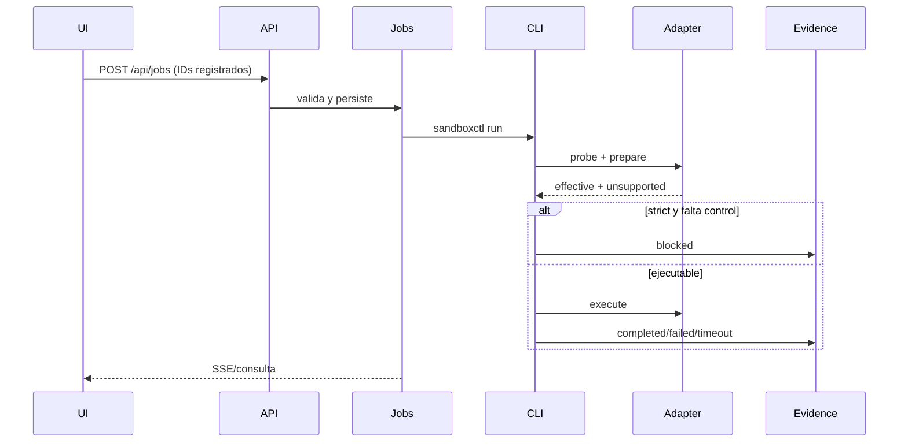

# Arquitectura

## Capas

1. **Registro:** catálogo, políticas y manifiestos de workloads.
2. **Control:** API local y cola de trabajos del Control Center.
3. **Compilación:** traducción de una policy neutral a controles del runtime.
4. **Ejecución:** adaptadores y supervisor de procesos.
5. **Evidencia:** hashes, host, límites, resultado y controles efectivos.

## Contrato RuntimeAdapter

Cada runtime implementa:

- `probe`: disponibilidad y versión.
- `prepare`: comando, entorno, cwd, controles efectivos y no soportados.
- `execute`: supervisor común con timeout y truncado de salida.
- `cleanup`: eliminación de directorios efímeros.

La preparación no puede presentar un control como efectivo solo porque fue solicitado. `Policy::should_fail_closed` compara `requiredControls` con `EffectivePolicy`.

## Flujo de un trabajo

## Límites de confianza

El panel no es la frontera de aislamiento. La frontera corresponde al runtime efectivo. El panel reduce exposición de la interfaz, evita comandos libres y conserva trazabilidad.
