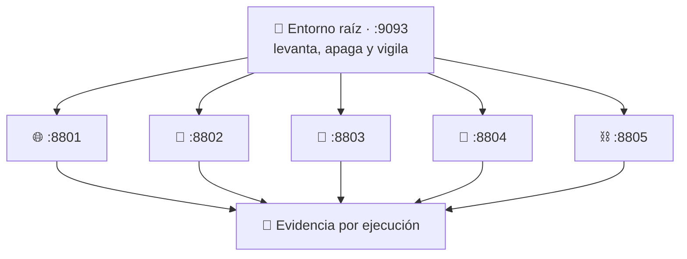

# 🧪 Los cinco casos

Cada caso es **un producto en su propio `localhost`**: se levanta, haces tareas
dentro y se apaga dejando constancia de qué pudo tocar.

No son temas que se explican. Un caso solo entra en este repositorio si responde
que **sin sandbox no se puede hacer, o hacerlo sin sandbox es imprudente**.

Y cada uno enseña **una idea que ningún otro enseña**. Si dos casos comparten
idea, uno de los dos sobra.

---

## De un vistazo

| # | Caso | La idea propia | Puerto | Estado |
|---|---|---|:--:|:--:|
| 01 | [Contenido web no confiable](#01--contenido-web-no-confiable) | Quien interpreta contenido ajeno no toca el disco | `8801` | 🔴 pendiente |
| 02 | [Código generado por IA](#02--código-generado-por-ia) | Efímero y sin red: se crea, corre y se destruye | `8802` | 🟡 en obra |
| 03 | [Detonación de archivo](#03--detonación-de-archivo-sospechoso) | El sandbox como microscopio: el informe vale más que el bloqueo | `8803` | 🟡 en obra |
| 04 | [Plugins de terceros](#04--plugins-de-terceros) | Conceder capacidades una a una, no restar permisos | `8804` | 🔴 pendiente |
| 05 | [Contratos inteligentes](#05--contratos-inteligentes) | Medir el trabajo, no el tiempo. Determinismo | `8805` | 🟡 en obra |

**Estados:** 🔴 pendiente · 🟡 en obra (base construida, falta interfaz y ficha) · 🟢 listo

---

## 01 · Contenido web no confiable

**El problema.** Abrir una web es descargar y ejecutar el programa de un
desconocido. Es el sandbox más usado del planeta y nadie lo llama así.

**La idea que enseña.** *Aislar por proceso*: el componente que interpreta
contenido ajeno **no toca el disco**. Le pide todo a otro proceso, que decide.

**Qué pasa al levantarlo.** Se montan dos procesos: uno con acceso al sistema y
otro sin ninguno, comunicados por una tubería. El segundo es el que procesa el
contenido que no controlas.

**Tareas dentro.** Pegar contenido no confiable, verlo procesado, y comprobar
qué intentó pedir el proceso interpretador.

> [!NOTE]
> No se empotra un motor de navegador: eso no cabe en un laboratorio. Lo que se
> reproduce es su **arquitectura**, que es la lección.

---

## 02 · Código generado por IA

**El problema.** Un modelo escribe código y alguien lo ejecuta. Nadie lo ha
revisado: se generó hace medio segundo.

**La idea que enseña.** *Efímero y sin red*: el sandbox se crea para una
ejecución, corre sin salida a internet y se destruye. Nada persiste entre
ejecuciones porque nada debe persistir.

**Qué pasa al levantarlo.** Filesystem efímero, red cerrada, techo de memoria y
de tiempo. El entorno se limpia: el fragmento no hereda ni una variable que la
política no declare.

**Tareas dentro.** Pegar un fragmento, ejecutarlo, ver su salida y qué intentó
tocar, iterar sobre él.

**Estado.** Base construida en `cases/02-ai-code-runner/`.

---

## 03 · Detonación de archivo sospechoso

**El problema.** Recibes un adjunto que huele mal. Bloquearlo te deja sin saber
qué era; abrirlo en tu equipo es exactamente lo que el atacante quiere.

**La idea que enseña.** *El sandbox como microscopio*. Aquí **quieres** que el
código se ejecute: el valor está en el informe de qué hizo, no en haberlo
impedido. Es el único caso donde el sandbox no es un muro sino un instrumento.

**Qué pasa al levantarlo.** Jaula con carpeta efímera, sin acceso al árbol del
host, con techo de memoria y de entradas.

**Tareas dentro.**

| Tarea | Qué ocurre |
|---|---|
| Subes un ZIP que no controlas | Entra en la jaula, no a tu disco |
| Se extrae | En una carpeta efímera con techo de tamaño |
| Rechaza el **zip slip** | `../../etc/cron.d/backdoor` → rechazado, con el motivo de cada entrada |
| Corta la **zip bomb** | 40 KB que declaran 41 MB → parado antes de escribir un byte |
| Descargas lo seguro | Solo lo que pasó los filtros |

**Estado.** Base construida y verificada en `cases/03-file-detonation/`. Es el
caso que fija el molde de los demás.

---

## 04 · Plugins de terceros

**El problema.** Tu producto deja que cualquiera escriba extensiones. Ese código
corre **con los datos del usuario delante**.

**La idea que enseña.** *Conceder capacidades una a una*. Los demás casos
**restan** permisos partiendo de todo; este **suma** partiendo de nada: el
plugin declara qué necesita, el usuario aprueba, y el sandbox aplica esa lista y
nada más. Es el modelo del móvil cuando una app te pide la cámara.

**Qué pasa al levantarlo.** El sandbox arranca sin ninguna capacidad. Cada
concesión del usuario se traduce en un montaje o un permiso concreto.

**Tareas dentro.** Cargar un plugin, ver qué pide, aprobarlo o no, ejecutarlo
sobre datos de prueba y ver si intentó salirse de lo concedido.

---

## 05 · Contratos inteligentes

**El problema.** Miles de personas suben programas que ejecuta todo el mundo, y
el resultado tiene que ser idéntico en cualquier máquina.

**La idea que enseña.** *Medir el trabajo, no el tiempo*. Cortar por segundos da
resultados distintos según lo rápida que sea tu máquina. Aquí se cuenta **cuánto
trabajo** ha hecho el programa y se corta ahí. Eso es el determinismo, y no
aparece en ningún otro caso.

**Qué pasa al levantarlo.** Sin entrada ni salida: `network: none`, sin reloj del
sistema, sin filesystem del host. La comunicación entra por **socket Unix**,
porque un sandbox sin pila de red no se alcanza por un puerto.

**Tareas dentro.** Subir un programa, asignarle presupuesto, ejecutarlo y ver el
consumo paso a paso y dónde se quedó sin.

**Estado.** Base construida en `cases/05-smart-contracts/`, con la clave privada
viviendo solo dentro del sandbox y sin ninguna salida por donde exfiltrarla.

---

## Qué hace que algo sea un caso

Antes de añadir uno nuevo, tiene que pasar estas cuatro:

1. **¿Existe el problema fuera de este repositorio?** Si hay que inventarse el
   escenario, no es un caso.
2. **¿Sin sandbox sería imprudente?** Si se puede hacer tranquilamente sin
   aislamiento, no lo necesita.
3. **¿Enseña una idea que ningún otro enseña?** Si la comparte, sobra uno.
4. **¿Se pueden hacer tareas dentro?** Si solo se mira estado, es una página de
   estado, no un caso.

El catálogo obliga a declarar la `idea` de cada caso, y hay una prueba de
contrato que falla si falta.

---

## Siguiente paso

- [Qué es un sandbox](QUE-ES-UN-SANDBOX.md) · [Comparativa](COMPARATIVA.md)
- [Arquitectura](ARCHITECTURE.md) — cómo se levantan por dentro
- [Referencia de políticas](POLICY_REFERENCE.md) — cómo se declara lo que puede tocar
