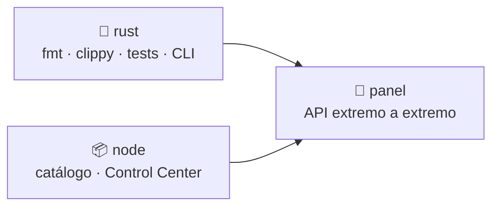
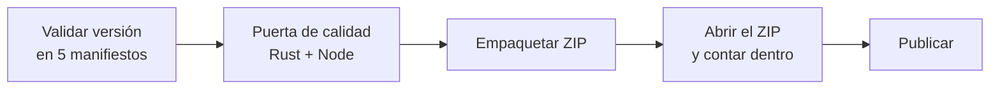

# 🤖 Workflows de integración continua

Cinco workflows, cada uno con una responsabilidad y un motivo de fallo
distinto. Si dos cosas pueden romperse por razones diferentes, van separadas:
un fallo tiene que decir qué arreglar sin leer el log entero.

---

## 📋 Resumen

| Workflow | Cuándo corre | Qué garantiza |
|---|---|---|
| **CI** | Cada push y PR | El árbol compila, pasa lint, pruebas y humo del CLI y del panel |
| **Docs** | Cambios en `.md` | Ningún enlace interno roto y Markdown conforme al estilo |
| **Security** | Push a `main`, PR y semanal | Sin CVEs conocidos, sin secretos, workflows auditados |
| **Pages** | Cambios en `site/` | La portada se publica completa y autocontenida |
| **Release** | Tag `v*` o manual | El artefacto sale de un árbol verde y **lleva dentro lo que dice** |

---

## 🔒 Reglas transversales

### Toda acción va fijada a SHA

```yaml
- uses: actions/checkout@3d3c42e5aac5ba805825da76410c181273ba90b1 # v7.0.1
```

Un tag es mutable: `@v5` puede apuntar mañana a otro código sin que cambie
nada en este repositorio. El comentario `# v7.0.1` mantiene la legibilidad y
Dependabot actualiza SHA y comentario a la vez. **zizmor lo verifica en cada
ejecución**, así que no es una convención que se pueda olvidar.

### `persist-credentials: false`

Por defecto, `checkout` deja el token de Actions en `.git/config`. Cualquier
paso posterior —incluido código de terceros— puede leerlo. Ningún workflow de
este repositorio necesita empujar commits, así que el token no se conserva.

### Permisos mínimos por trabajo

El workflow declara `contents: read`. Solo el trabajo que realmente necesita
escribir amplía sus permisos, y solo los que usa:

```yaml
jobs:
  deploy:
    permissions:
      pages: write
      id-token: write
```

### `timeout-minutes` en todos los trabajos

Un trabajo colgado consume minutos de runner hasta el límite de la plataforma.

---

## ⚙️ CI



### Trabajo `rust`

1. `cargo metadata --locked` — `Cargo.lock` está versionado; si el build lo
   modificaría, falla aquí con un mensaje claro en vez de más adelante.
2. `cargo fmt --all -- --check`.
3. `cargo clippy --workspace --all-targets --locked -- -D warnings`.
4. `cargo test --workspace --locked` — 18 pruebas.
5. Humo del CLI: `validate`, `run --runtime dry-run` y validación de la
   evidencia generada contra su esquema.

> [!NOTE]
> `components` se pasa como cadena (`components: rustfmt, clippy`). En formato
> de flujo YAML, `{ components: rustfmt, clippy }` se lee como **dos claves** y
> la acción descarta clippy en silencio.

### Trabajo `node`

Ejecuta `pnpm check` (validadores + suite del panel) y después comprueba que
`control-center/dist/` versionado coincide con lo que produce el build. El
build es determinista, así que una diferencia significa que alguien editó
`src/` sin regenerar `dist/`.

> [!NOTE]
> `pnpm/action-setup` va **sin** `version`: la fija `packageManager` en
> `package.json`. Declararla en los dos sitios hace abortar la acción.

### Trabajo `panel`

Arranca el servidor real y comprueba el contrato de la API con `curl`:
modo seguro declarado, escritura sin cabecera de confianza → `403`, endpoint
de comandos arbitrarios → `404`, `Host` no confiable → `421`, y un trabajo
registrado que llega a estado terminal con evidencia.

Corre con `SANDBOX_LABS_CLI_FALLBACK=off`, es decir sin CLI compilado: es la
ruta que ve cualquiera que levante el panel sin toolchain de Rust.

---

## 📚 Docs

Dos trabajos porque fallan por motivos distintos:

- **Enlaces internos** — `scripts/check-doc-links.mjs` recorre los `.md` y
  reporta **todos** los enlaces relativos rotos, no solo el primero.
- **Lint de Markdown** — `markdownlint-cli2` con `.markdownlint.json`.

---

## 🛡️ Security

| Trabajo | Herramienta | Qué busca |
|---|---|---|
| `dependencies` | `cargo-audit` + `pnpm audit` | CVEs conocidos en los árboles versionados |
| `secrets` | `gitleaks` | Credenciales en el **historial completo** (`fetch-depth: 0`) |
| `workflows` | `actionlint` + `zizmor` | Sintaxis y shell embebido; acciones sin fijar, permisos anchos |

Corre también los lunes por la mañana: una dependencia sin cambios puede tener
un CVE nuevo mañana.

---

## 🌐 Pages

Publica `site/` en GitHub Pages. Antes de subir, comprueba que la portada está
completa y que **no carga recursos externos** — una portada estática que pide
scripts a un CDN es una dependencia sin auditar en la cara pública del
proyecto.

El Control Center nunca se publica: escucha en `localhost` y no tiene
autenticación.

---

## 📦 Release



1. **La versión debe cuadrar en cinco sitios**: `version.txt`, los dos
   `package.json`, `sandbox.config.json` y `Cargo.toml`. Si uno se quedó atrás,
   el release publicaría un artefacto que se contradice a sí mismo.
2. **Puerta de calidad completa**, la misma que CI: empaquetar un árbol en rojo
   no sirve de nada.
3. **Verificación del contenido del artefacto.** Un ZIP puede compilar, cuadrar
   de checksum y estar vacío por dentro. Así que se abre y se cuenta: número
   mínimo de entradas, presencia de los archivos clave y los 18 laboratorios.
4. Publicación con `gh release create` — el CLI ya viene en el runner, lo que
   quita una acción de terceros de la ruta que firma el release.

Uso:

```bash
# 1. Bumpear la versión en los cinco manifiestos y actualizar el CHANGELOG
# 2. Etiquetar
git tag v0.7.0 && git push origin v0.7.0
```

O desde **Actions → Release → Run workflow**, indicando la versión.

---

## 🧪 Reproducir CI en local

```bash
# Rust
cargo metadata --locked --format-version 1 > /dev/null
cargo fmt --all -- --check
cargo clippy --workspace --all-targets --locked -- -D warnings
cargo test --workspace --locked

# Node
pnpm check && pnpm dashboard:build

# Documentación
npx markdownlint-cli2 "**/*.md" "#node_modules"

# Workflows
actionlint .github/workflows/*.yml
pipx run zizmor --persona=regular .github/workflows/
```

---

## 🔗 Ver también

- [Testing](TESTING.md) · [Validación](../VALIDATION.md) · [Contribuir](../CONTRIBUTING.md)
