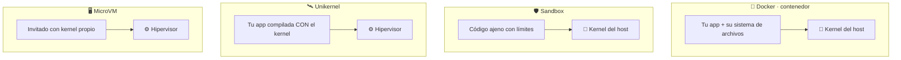
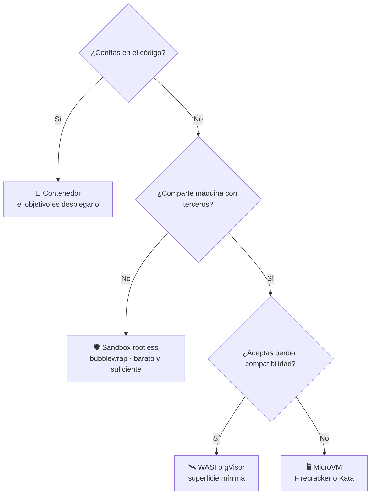

# ⚖️ Sandbox, Docker, WSL y unikernel

> La pregunta que casi nadie responde: los cuatro «aíslan», y la gente los usa
> como sinónimos. No lo son.

---

## La diferencia está en la pregunta que responde cada uno

| | La pregunta que responde | Qué te da | Qué **no** te da |
|---|---|---|---|
| 🐳 **Docker** | ¿Cómo llevo mi aplicación a producción con todo lo que necesita? | Empaquetado, distribución, orquestación, reproducibilidad | Contención fuerte: usa los mismos namespaces, pero el aislamiento es un efecto secundario, no el objetivo |
| 🪟 **WSL** | ¿Cómo hago convivir Windows y Linux? | Un Linux real integrado con tu escritorio | Contención: `/mnt/c` está montado **a propósito**, y la integración es lo contrario de aislar |
| 🛰️ **Unikernel** | ¿Cómo reduzco al mínimo lo que puede fallar? | Superficie mínima: no hay sistema operativo, solo tu app | Flexibilidad: hay que compilar la app dentro del kernel |
| 🛡️ **Sandbox** | **¿Cómo ejecuto esto sin fiarme de ello?** | **Contención con límites explícitos y verificables** | Empaquetado, distribución, orquestación — no es su trabajo |

**La frase que lo ordena todo:**

> Docker responde *«¿cómo llevo mi app a producción?»*.
> Un sandbox responde *«¿cómo ejecuto esto sin fiarme de ello?»*.

Son preguntas distintas. Por eso conviven: metes **tu** app en Docker para
desplegarla, y metes en un sandbox el código **de terceros** que esa app tiene
que ejecutar.

---

## Qué separa cada frontera

Docker y sandbox **comparten kernel contigo**. Unikernel y microVM no: entre
ellos y tu máquina hay un hipervisor.

Esa línea es la que importa cuando aparece una vulnerabilidad del kernel.

---

## Coste y fuerza, lado a lado

| Frontera | Arranque | Si el kernel tiene un fallo | Cuándo elegirla |
|---|---|---|---|
| **Namespaces** (`unshare`) | milisegundos | Se atraviesa | Separar procesos propios que se fían entre sí |
| **Sandbox rootless** (`bubblewrap`) | milisegundos | Se atraviesa | Ejecutar código ajeno sin privilegios, en tu equipo |
| **Contenedor** (Docker) | cientos de ms | Se atraviesa | Desplegar tu propia app de forma reproducible |
| **WASI** (`wasmtime`) | microsegundos | Superficie mínima | Plugins recompilables a WebAssembly |
| **gVisor** (`runsc`) | decenas de ms | Hay que atravesar dos kernels | Multi-tenancy donde el coste de compatibilidad es aceptable |
| **MicroVM** (Firecracker, Kata) | cientos de ms | No alcanza al host | Código de clientes distintos en la misma máquina |

---

## Los errores que salen caros

### «Tengo Docker, ya estoy aislado»

Docker usa los mismos namespaces que un sandbox, pero su configuración por
defecto está pensada para **que tu app funcione**, no para contener a un
atacante: el contenedor arranca con capabilities, con red completa y muchas
veces con volúmenes de tu disco montados dentro.

Un sandbox parte del extremo contrario: **nada**, y vas concediendo.

### «Lo ejecuto en WSL, está separado de Windows»

WSL está diseñado para **integrarse**. Tu disco C: está montado en `/mnt/c` por
comodidad, no por descuido. Un programa dentro de WSL llega a tus documentos de
Windows sin esfuerzo.

WSL es *dónde* corren los sandboxes en un equipo Windows. No es el sandbox.

### «Un contenedor es como una máquina virtual pero ligero»

Es la confusión más extendida. Una VM tiene **su propio kernel**; un contenedor
usa el tuyo. Por eso un fallo del kernel atraviesa contenedores y no atraviesa
VMs — y por eso existen Kata y Firecracker, que dan interfaz de contenedor con
frontera de VM.

---

## Cómo elegir

> [!NOTE]
> Este repositorio se centra en la rama de la izquierda del «No»: el **sandbox
> rootless**, que es el que puedes usar hoy en tu equipo sin privilegios ni
> infraestructura. Los demás se documentan para que sepas cuándo no basta.

---

## Siguiente paso

- [Qué es un sandbox](QUE-ES-UN-SANDBOX.md) — el cimiento
- [Catálogo completo](CATALOGO.md) — los 36 casos y dónde se aplica cada uno
- [Modelo de amenazas](THREAT_MODEL.md) — qué protege y qué explícitamente no
