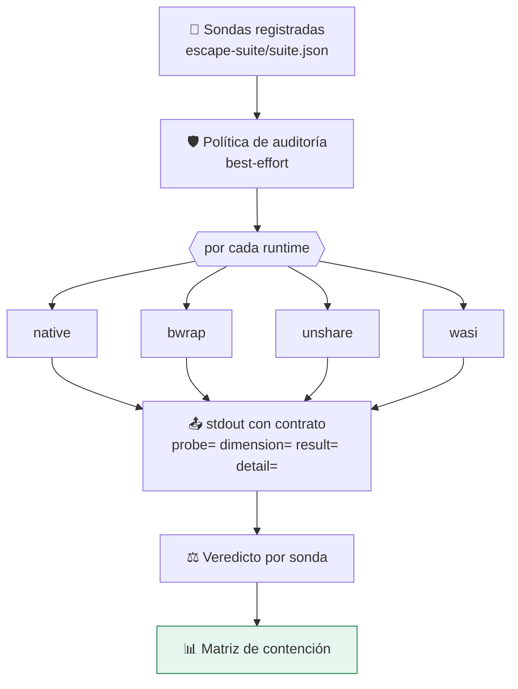

# 🛡️ Suite de contención

La diferencia entre este repositorio y un documento sobre aislamiento.

`plan` dice lo que un runtime **declara**. `escape` dice lo que ese runtime
**hace** en tu host, ahora, con tu kernel y tus binarios.

---

## 🤔 El problema que resuelve

Un runtime puede declarar que aísla la red y no cortarla. Motivos reales:

- falta el binario (`bwrap` no instalado y el plan degrada en silencio);
- el kernel no lo permite (user namespaces deshabilitados por política);
- la política se compiló mal (un flag que se dejó de pasar en un refactor);
- el control **no significa lo que parece** (`RLIMIT_NPROC` no limita los
  procesos de la carga, sino los del UID en todo el host).

Los cuatro producen el mismo síntoma: un ✅ en un documento y una fuga en
producción. La distancia entre **declarado** y **efectivo** es donde viven los
incidentes.

---

## ⚙️ Cómo funciona



Cada sonda es una **carga registrada** como cualquier otra: tiene manifiesto,
hash y se ejecuta por el mismo camino que el resto. No hay una vía especial
para las sondas — si la hubiera, no estarían midiendo el sistema real.

### Contrato de salida

Las sondas imprimen una línea por dimensión medida:

```text
probe=<id> dimension=<dim> result=<contained|escaped|error> detail=<texto>
```

Se parsea la salida en lugar de mirar el código de salida porque una sonda
puede reportar varias dimensiones, y porque el runtime puede matar el proceso
(OOM killer, timeout) dejando un código que no dice nada útil.

---

## 🧪 Las siete dimensiones

| Dimensión | Qué intenta la sonda | Por qué importa |
|---|---|---|
| `network` | Conectar por TCP y resolver DNS | Una carga con red exfiltra lo que lea y descarga lo que ejecutará después |
| `filesystem` | Leer secretos, escribir fuera, ver el árbol real | Leer claves o escribir en el sistema convierte una ejecución en persistencia |
| `process` | Contar PIDs visibles, inspeccionar el PID 1 | Ver el árbol del host permite inspeccionar y señalizar procesos ajenos |
| `environment` | Buscar credenciales heredadas | Un token en el entorno convierte cualquier ejecución en una filtración |
| `privilege` | Leer `CapEff` y `uid_map` | Las capabilities que sobreviven permiten montar, trazar o tocar la red |
| `memory` | Pedir el doble del presupuesto | Sin techo, una carga tumba el host y todo lo que corra en él |
| `processes` | Crear procesos hasta pasarse | Sin techo de PIDs, una carga agota la tabla de procesos |

> [!NOTE]
> Las sondas de red, filesystem, proceso, entorno y privilegios son de riesgo
> `controlled`: **solo observan y reportan**, no dañan nada, y por eso pueden
> ejecutarse también en `native` para obtener la línea base. Las de memoria y
> procesos son `resource-abuse` y nunca corren sin aislamiento.

---

## 📊 Los cuatro veredictos

| Veredicto | Significado |
|:---:|---|
| ✅ **contenido** | La sonda intentó salirse y no pudo |
| ❌ **escapó** | La sonda se salió: el control no se aplica en este host |
| ❌ **DECLARADO** | El runtime **dice** que aplica el control y la sonda demostró que no |
| ⚠️ **no concluyente** | No se pudo medir (error de la sonda, salida vacía) |
| — **no aplica** | El runtime no ejecuta cargas, o la política bloqueó el plan |

**`❌ DECLARADO` es el hallazgo que más importa.** Es peor que un ❌ normal,
porque un control no declarado es honesto: te dice que no cuentes con él. Uno
declarado y no aplicado invita a confiar.

---

## ▶️ Uso

```bash
# Matriz completa de este host
cargo run -p sandboxctl -- escape

# Un runtime concreto, como puerta de CI (código 1 si algo escapa)
cargo run -p sandboxctl -- escape --runtime bwrap --strict

# Informe verificable
cargo run -p sandboxctl -- escape --json --report evidence/escape/matriz.json

# Línea base obligatoria: sin aislamiento TIENE que escapar
SANDBOX_LABS_ALLOW_NATIVE=1 cargo run -p sandboxctl -- escape --runtime native
```

### Por qué la política por defecto es `best-effort`

`escape` usa `policies/containment-audit.json`, que pide todos los controles en
modo `best-effort`. Con una política `strict`, el plan **fallaría cerrado antes
de ejecutar** y la matriz saldría entera en «no aplica»: correcto como
comportamiento, inútil como medición.

Auditar exige ejecutar. Por eso la política de auditoría es distinta de la
política de producción, y por eso está separada y documentada.

---

## 🔍 Hallazgos reales de esta suite

Los dos primeros los encontró la suite en su primera ejecución, sobre este
mismo repositorio:

### 1. PID namespace sin `/proc` remontado

El adaptador `unshare` pasaba `--pid --fork` y creaba el namespace… pero sin
`--mount-proc` el proceso seguía leyendo el `/proc` del host y enumeraba sus 48
PIDs. El namespace existía y no se notaba.

**Corregido** en `crates/sandbox-runtimes/src/adapters/unshare.rs`.

### 2. `RLIMIT_NPROC` no es un límite de procesos de contenedor

Los adaptadores declaraban el control `processes` porque envolvían la carga con
`prlimit --nproc`. Pero RLIMIT_NPROC cuenta los procesos **del UID en todo el
host**: fijarlo al presupuesto de la política mataba la ejecución nada más
arrancar (`unshare: fork failed: Resource temporarily unavailable`) y, peor,
hacía pasar por control de contención algo que no lo era.

**Corregido**: se retiró `--nproc` y el control `processes` dejó de
declararse. Después se cerró de verdad: bubblewrap envuelve la ejecución en un
scope de systemd con `TasksMax`, que el kernel traduce a `pids.max`. El control
vuelve a declararse, pero **solo donde el sondeo demuestra que el host lo
admite** — donde no hay gestor de usuario de systemd, sigue sin declararse. Ver
[B-01](IMPLEMENTATION_BACKLOG.md).

### 3. `--strict` aprobaba sin haber medido nada

En el primer run de CI, bubblewrap no llegó a ejecutar ninguna sonda (AppArmor
restringía los user namespaces en el runner) y las siete quedaron «no
concluyente». `--strict` pasó igual, porque solo miraba si algo había escapado.
Cero fugas de cero mediciones no es contención: es no haber mirado.

**Corregido**: `--strict` falla si un runtime está disponible y ninguna sonda
llegó a un veredicto. Y el detalle de una sonda sin salida arrastra ahora la
última línea de stderr — fue lo que permitió diagnosticar la causa exacta
(`bwrap: loopback: Failed RTM_NEWADDR: Operation not permitted`) en un solo
intento.

### 4. La sonda de filesystem sobre-reportaba

Contaba como fuga poder escribir en `/` y `/etc` dentro del sandbox. Pero la
raíz que monta bubblewrap es un tmpfs efímero: escribir ahí no toca al host.

**Corregido**: la sonda resuelve el tipo de filesystem en `/proc/mounts` y solo
cuenta como fuga la escritura en un sistema persistente.

> [!IMPORTANT]
> Que la suite encontrara fallos en el propio repositorio es la mejor prueba de
> que mide algo. Una suite que siempre sale verde no está midiendo: está
> decorando.

---

## 🤖 En integración continua

El trabajo `isolation` de [CI](../.github/workflows/ci.yml) instala bubblewrap
y ejecuta tres comprobaciones que se sostienen entre sí:

1. **bubblewrap debe contenerlo todo** — `escape --runtime bwrap --strict`.
   Si deja de contener una dimensión, el build se cae.
2. **unshare debe cortar red y PIDs** — no ofrece jaula de filesystem y se
   documenta así, pero esas dos dimensiones son obligatorias.
3. **native debe ESCAPAR** — contraprueba deliberada. Si sin aislamiento
   saliera todo contenido, las sondas no estarían midiendo nada y los ✅ de
   bubblewrap no valdrían nada.

La tercera es la que impide que la suite se degrade en silencio.

### Lo que mide hoy el runner

```text
✅ bwrap contiene network: sin salida TCP ni resolución DNS
✅ bwrap contiene filesystem: ninguna ruta sensible del host es legible
✅ bwrap contiene process: solo 2 PIDs visibles, propio PID 2
✅ bwrap contiene environment: 4 variables, ninguna sensible
✅ bwrap contiene privilege: sin capabilities peligrosas (CapEff=0x0000000000000000)
✅ bwrap contiene memory: MemoryError tras 96 MB con presupuesto de 128 MB
✅ unshare contiene network: sin salida TCP ni resolución DNS
✅ unshare contiene process: solo 1 PIDs visibles, propio PID 1
✅ native escapa por 3 dimensiones (esperado): network, filesystem, process
```

### Qué hace fallar el build

| Situación | ¿Falla? | Por qué |
|---|:--:|---|
| Falsa garantía (declara y no aplica) | ✅ sí | Es la clase de fallo que el proyecto persigue |
| Ninguna sonda pudo medirse | ✅ sí | Un informe sin mediciones no prueba contención |
| Fuga en un control **no** declarado | ❌ no | Es un hueco honesto y documentado (`processes`) |
| Runtime ausente en el host | ❌ no | No hay nada que medir |

Hacer fallar el build por un hueco documentado dejaría dos salidas —silenciar
la sonda o declarar un control inexistente— y las dos empeoran el sistema.

---

## ➕ Añadir una sonda

1. Crea la carga en `workloads/escape/<id>/` con su `probe.py` y su
   `manifest.json`.
2. Imprime al menos una línea con el contrato
   `probe= dimension= result= detail=`.
3. Regístrala en `escape-suite/suite.json` con su dimensión y el control del
   modelo que mide.
4. `node scripts/validate-config.mjs` comprueba que la sonda apunta a una carga
   registrada, a una dimensión declarada y a un control conocido.

Las pruebas de contrato en `crates/sandbox-core/tests/repository.rs` verifican
además que ninguna dimensión se quede sin sonda.

---

## 🔗 Ver también

- [Modelo de amenazas](THREAT_MODEL.md) — qué protege el sistema y qué no
- [Formato de evidencia](EVIDENCE_FORMAT.md)
