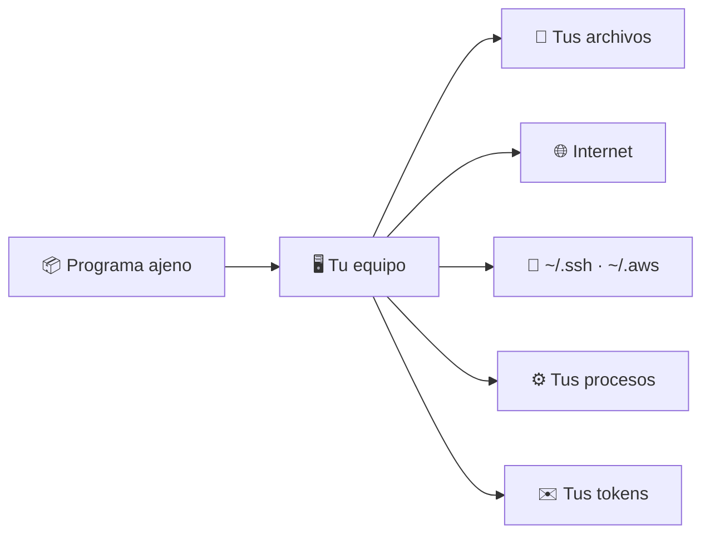
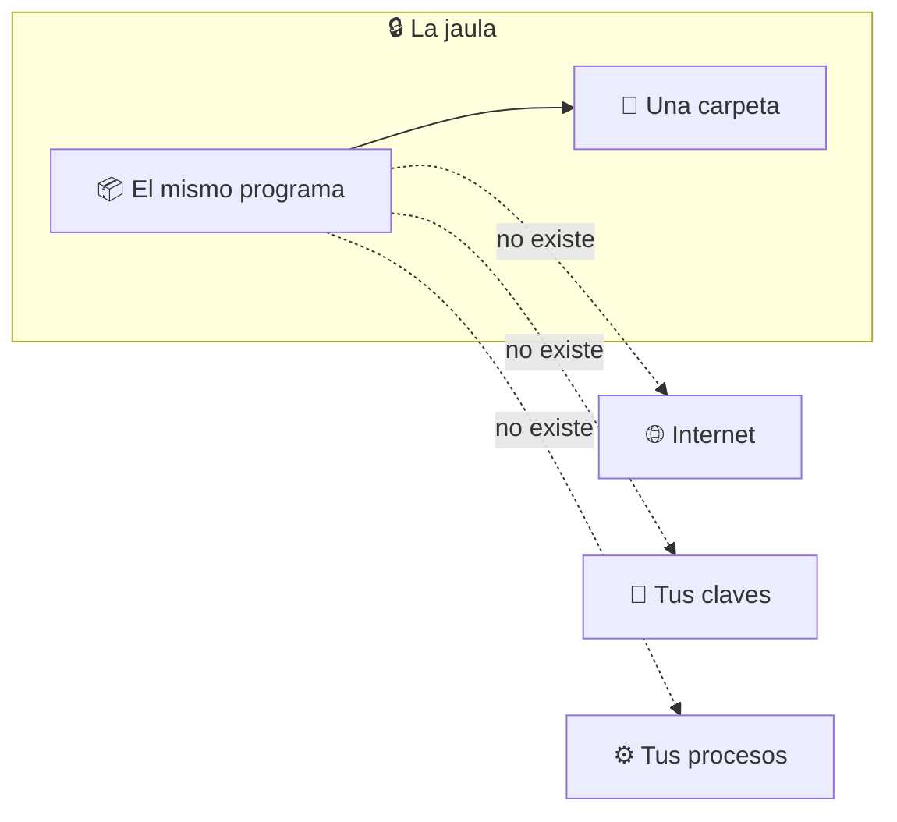
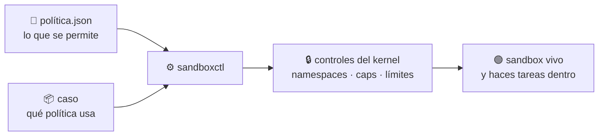

# 🧠 Qué es un sandbox

> Empieza aquí. Sin este documento, el resto del repositorio no se entiende.

---

## El problema de partida

Cuando ejecutas un programa en tu equipo, ese programa **corre como tú**. Tiene
exactamente tus permisos: puede leer cualquier archivo que tú puedas leer,
conectarse a donde quiera y ver todo lo que tienes abierto.

No hay término medio. O lo ejecutas con todo tu poder, o no lo ejecutas.

Y ejecutas código ajeno constantemente sin pensarlo:

- cada `npm install` descarga decenas de paquetes que **ejecutan scripts** durante la instalación;
- cada dependencia tiene sus propias dependencias, y nadie las lee;
- abres el adjunto que te mandaron, el script que te pasó un compañero, el fragmento que generó un modelo.



---

## La definición

> Un **sandbox** es decidir de antemano qué puede tocar un programa, y hacerlo
> cumplir desde fuera de ese programa.

Lo importante es **cómo** se hace cumplir. No es un aviso de permisos que el
programa pueda esquivar ni una promesa de buena conducta: desde dentro del
sandbox, lo que no le concediste **no existe**.

Si pide `~/.ssh/id_rsa`, no recibe «acceso denegado». Recibe **«ese archivo no
está»**. Si intenta conectarse, no hay red que usar — no una red bloqueada: no
hay pila de red.



### La analogía

Contratas a un cerrajero.

- **Sin sandbox:** le das las llaves de toda la casa y te vas a trabajar.
- **Con sandbox:** entra solo al recibidor, la puerta al resto está tapiada, no
  hay teléfono, y cuando se va compruebas qué tocó.

---

## Qué se controla

| Control | Qué decides | Sin él |
|---|---|---|
| **Filesystem** | Qué ve: una carpeta de entrada y otra de salida | Lee tus claves y escribe donde tú escribas |
| **Red** | Si tiene internet, unos destinos concretos, o ninguno | Exfiltra lo que encuentre y descarga su segunda etapa |
| **Procesos** | Si ve tus otros programas o solo el suyo | Inspecciona y señaliza procesos ajenos |
| **Recursos** | Cuánta memoria, cuánto tiempo, cuántos procesos | Una carga descontrolada tumba el equipo |
| **Privilegios** | Qué capabilities conserva | Puede montar, trazar procesos o tocar la red del host |
| **Entorno** | Qué variables hereda | Un token heredado convierte la ejecución en una filtración |

---

## Dónde se declara todo eso

En un **archivo de política, separado del código**. Ni el programa negocia sus
permisos, ni quien lo escribió decide sus límites.

```json
{
  "filesystem": { "root": "ephemeral", "writable": ["/workspace/output"] },
  "network":    { "mode": "none" },
  "resources":  { "memoryMb": 512, "processes": 32 },
  "process":    { "capabilities": [], "allowedEnvironment": [] }
}
```

Léelo como una lista de decisiones tuyas. **Lo que no aparece ahí no se monta, y
lo que no se monta dentro no existe.**



Referencia campo a campo en [POLICY_REFERENCE.md](POLICY_REFERENCE.md).

---

## Cinco sandboxes que ya usas

No es una técnica de laboratorio: la usas a diario sin llamarla así.

| Dónde | Qué código ajeno ejecuta | Con qué aísla |
|---|---|---|
| **El navegador** | El JavaScript de cada web que abres | namespaces + seccomp · AppContainer |
| **El móvil** | Cada app instalada | Un UID por app + SELinux |
| **Serverless** | Código de miles de clientes en la misma máquina | Firecracker, una microVM por invocación |
| **Los runners de CI** | El código de cualquier pull request | VM efímera por job |
| **Los intérpretes de IA** | Código recién generado que nadie ha leído | gVisor o microVM, sin red |

Escaparse del sandbox de un navegador se paga por encima de los 200.000 dólares
en las competiciones de seguridad. Si fuera fácil, no valdría tanto.

---

## Lo que un sandbox NO es

- **No es un antivirus.** No busca amenazas conocidas: limita lo que cualquier
  programa puede hacer, conocido o no.
- **No es una promesa absoluta.** Un sandbox rootless comparte kernel contigo:
  contiene muy bien a un script descuidado y mucho peor a alguien con un exploit
  de kernel en la mano.
- **No sustituye a leer el código.** Reduce el coste de equivocarte, no la
  necesidad de tener criterio.

> [!IMPORTANT]
> Por eso este repositorio no te dice «esto es seguro». Te dice, con evidencia
> medida en tu host, **qué controles quedaron efectivos y cuáles no**.

---

## Siguiente paso

- [Comparativa: sandbox, Docker, WSL y unikernel](COMPARATIVA.md) — en qué se diferencian de verdad
- [Los cinco casos](CASOS.md) — dónde se aplica esto
- [Suite de contención](CONTAINMENT_SUITE.md) — cómo se comprueba que contiene
