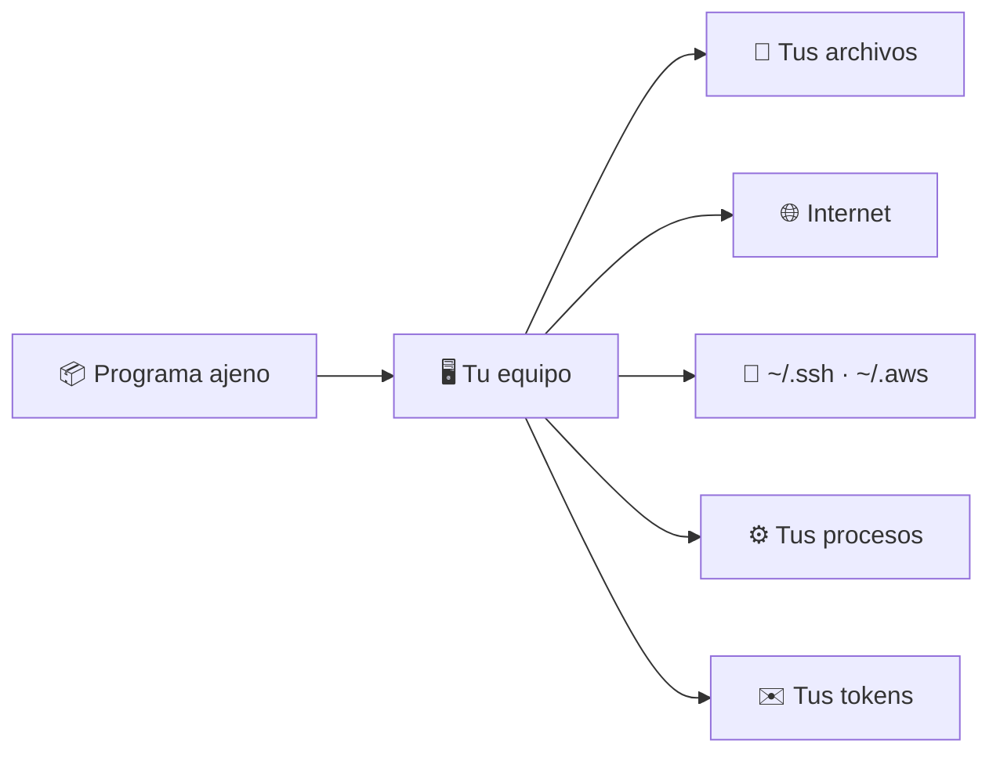
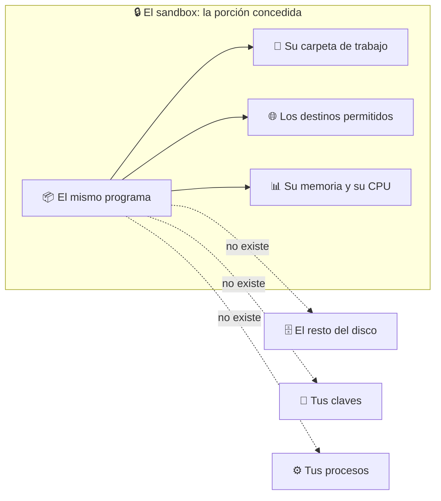
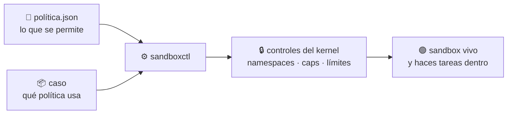
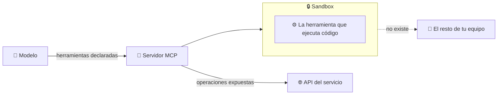

# 🧠 Qué es un sandbox

> Empieza aquí. Sin este documento, el resto del repositorio no se entiende.

---

## El problema de partida

Cuando ejecutas un programa en tu equipo, ese programa **corre como tú**. Tiene
exactamente tus permisos: puede leer cualquier archivo que tú puedas leer,
conectarse a donde quiera y ver todo lo que tienes abierto.

No hay término medio. O lo ejecutas con todo tu poder, o no lo ejecutas.

Y ejecutas código ajeno constantemente sin pensarlo:

- cada `npm install` descarga decenas de paquetes que **ejecutan scripts** durante la instalación;
- cada dependencia tiene sus propias dependencias, y nadie las lee;
- abres el adjunto que te mandaron, el script que te pasó un compañero, el fragmento que generó un modelo.



---

## La definición

> Un **sandbox** es un entorno que le entrega a un programa **una porción
> declarada del sistema** —unas carpetas, quizá algo de red, un techo de memoria
> y de CPU— para que haga trabajo real dentro de ella, y donde el resto del
> sistema **no existe**.

Las dos mitades importan, y la primera se olvida siempre:

- **Se concede.** Un sandbox **no es una pared**: es un espacio de trabajo. Se le
  da al programa lo que necesita para hacer su tarea de verdad —leer esta
  carpeta, escribir en esta otra, hablar con este servidor— y con eso funciona
  igual que fuera. Un sandbox donde no se puede hacer nada no sirve para nada.
- **Lo demás no existe.** Todo lo que no se concedió, desde dentro, no está.

Lo importante es **cómo** se hace cumplir la segunda mitad. No es un aviso de
permisos que el programa pueda esquivar ni una promesa de buena conducta: si pide
`~/.ssh/id_rsa`, no recibe «acceso denegado». Recibe **«ese archivo no está»**. Si
intenta conectarse, no hay red que usar — no una red bloqueada: no hay pila de
red.



Por eso la pregunta útil no es «¿está aislado?», que se responde sí o no y no
sirve de nada. Es **«¿qué porción del sistema le he dado, y qué hace con ella?»**

### La analogía

Contratas a un cerrajero.

- **Sin sandbox:** le das las llaves de toda la casa y te vas a trabajar.
- **Con sandbox:** entra solo al recibidor, la puerta al resto está tapiada, no
  hay teléfono, y cuando se va compruebas qué tocó.

---

## Qué se controla

| Control | Qué decides | Sin él |
|---|---|---|
| **Filesystem** | Qué ve: una carpeta de entrada y otra de salida | Lee tus claves y escribe donde tú escribas |
| **Red** | Si tiene internet, unos destinos concretos, o ninguno | Exfiltra lo que encuentre y descarga su segunda etapa |
| **Procesos** | Si ve tus otros programas o solo el suyo | Inspecciona y señaliza procesos ajenos |
| **Recursos** | Cuánta memoria, cuánto tiempo, cuántos procesos | Una carga descontrolada tumba el equipo |
| **Privilegios** | Qué capabilities conserva | Puede montar, trazar procesos o tocar la red del host |
| **Entorno** | Qué variables hereda | Un token heredado convierte la ejecución en una filtración |

---

## Dónde se declara todo eso

En un **archivo de política, separado del código**. Ni el programa negocia sus
permisos, ni quien lo escribió decide sus límites.

```json
{
  "filesystem": { "root": "ephemeral", "writable": ["/workspace/output"] },
  "network":    { "mode": "none" },
  "resources":  { "memoryMb": 512, "processes": 32 },
  "process":    { "capabilities": [], "allowedEnvironment": [] }
}
```

Léelo como una lista de decisiones tuyas. **Lo que no aparece ahí no se monta, y
lo que no se monta dentro no existe.**



Referencia campo a campo en [POLICY_REFERENCE.md](POLICY_REFERENCE.md).

---

## Cinco sandboxes que ya usas

No es una técnica de laboratorio: la usas a diario sin llamarla así.

| Dónde | Qué código ajeno ejecuta | Con qué aísla |
|---|---|---|
| **El navegador** | El JavaScript de cada web que abres | namespaces + seccomp · AppContainer |
| **El móvil** | Cada app instalada | Un UID por app + SELinux |
| **Serverless** | Código de miles de clientes en la misma máquina | Firecracker, una microVM por invocación |
| **Los runners de CI** | El código de cualquier pull request | VM efímera por job |
| **Los intérpretes de IA** | Código recién generado que nadie ha leído | gVisor o microVM, sin red |

Escaparse del sandbox de un navegador se paga por encima de los 200.000 dólares
en las competiciones de seguridad. Si fuera fácil, no valdría tanto.

---

## En qué se parece a una API o a un MCP, y en qué no

Es la comparación más útil que se puede hacer, porque los tres responden a la
misma idea: **dar acceso a una parte del sistema y no al resto**. Pero el
mecanismo es distinto, y la diferencia decide cuándo sirve cada uno.

| | Qué es la frontera | Quién la hace cumplir | Qué pasa si el programa no colabora |
|---|---|---|---|
| **API** | Un conjunto de operaciones ofrecidas. El programa solo puede pedir lo que la API expone | El servicio que la publica | Nada: el programa **sigue teniendo todo lo demás del sistema**. La API solo limita lo que pide *a ese servicio* |
| **MCP** | Un conjunto de herramientas declaradas para un modelo | El servidor de herramientas | Igual: el modelo no puede usar otras herramientas, pero el proceso que lo ejecuta conserva sus permisos |
| **Sandbox** | Una porción del sistema operativo: ficheros, red, procesos, memoria | **El kernel** | El programa puede intentar cualquier cosa, y **el kernel se la niega**. No depende de su colaboración |

### La diferencia que importa

Una API y un MCP son fronteras con las que el programa **colabora**. Funcionan
porque el programa decide pedir las cosas por ahí.

Un sandbox funciona **sobre un programa que no colabora**: uno que llama
directamente a `open("/home/tú/.ssh/id_rsa")` sin pasar por ninguna API. No hay
nada que le impida hacer esa llamada; lo que hay es un kernel que responde que
ese fichero no existe.

De ahí la regla práctica:

> Si puedes confiar en que el código use solo tu API, **no necesitas un
> sandbox**. Si no puedes confiar en eso —porque el código es ajeno, generado o
> simplemente desconocido—, la API no te protege de nada.

### Y se combinan, que es lo habitual

No compiten. Un agente de IA real usa los tres a la vez:



El MCP decide **qué herramientas** hay. La API decide **qué operaciones** ofrece
cada servicio. El sandbox decide **qué puede tocar del sistema** la herramienta
que de verdad ejecuta algo — y es el único de los tres que sigue en pie si la
herramienta hace algo que nadie previó. Eso es exactamente el
[caso 08](casos/08-sandbox-de-herramientas-de-agente-ia.md).

---

## Lo que un sandbox NO es

- **No es un antivirus.** No busca amenazas conocidas: limita lo que cualquier
  programa puede hacer, conocido o no.
- **No es una promesa absoluta.** Un sandbox rootless comparte kernel contigo:
  contiene muy bien a un script descuidado y mucho peor a alguien con un exploit
  de kernel en la mano.
- **No sustituye a leer el código.** Reduce el coste de equivocarte, no la
  necesidad de tener criterio.

> [!IMPORTANT]
> Por eso este repositorio no te dice «esto es seguro». Te dice, con evidencia
> medida en tu host, **qué controles quedaron efectivos y cuáles no**.

---

## Siguiente paso

- [Comparativa: sandbox, Docker, WSL y unikernel](COMPARATIVA.md) — en qué se diferencian de verdad
- [Catálogo completo](CATALOGO.md) — los 36 casos, con ficha propia cada uno
- [Suite de contención](CONTAINMENT_SUITE.md) — cómo se comprueba que contiene
