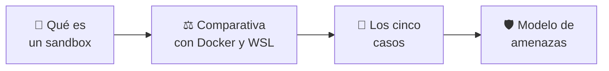

# 📚 Documentación de sandbox-labs

> **Versión** 0.1.0 · Empieza por [Qué es un sandbox](QUE-ES-UN-SANDBOX.md) si
> es tu primera vez aquí.

---

## 🧭 Tres rutas de lectura

### Quiero entender el tema



1. [Qué es un sandbox](QUE-ES-UN-SANDBOX.md) — el problema, la definición y qué se controla
2. [Comparativa](COMPARATIVA.md) — en qué se diferencia de Docker, WSL y unikernel
3. [Los cinco casos](CASOS.md) — dónde se aplica y qué enseña cada uno
4. [Modelo de amenazas](THREAT_MODEL.md) — qué protege y qué explícitamente no

### Quiero usarlo

1. [Instalación](INSTALACION.md) — de un equipo en blanco al primer sandbox
2. [Los cinco casos](CASOS.md) — cuál levantar y qué hacer dentro
3. [Runbook](../RUNBOOK.md) — operación diaria y qué hacer cuando algo falla

### Quiero tocar el código

1. [Arquitectura](ARCHITECTURE.md) — capas, contrato de adaptador y flujo
2. [Referencia de políticas](POLICY_REFERENCE.md) — cada campo y qué significa
3. [Formato de evidencia](EVIDENCE_FORMAT.md) — qué queda escrito de cada ejecución
4. [Suite de contención](CONTAINMENT_SUITE.md) — cómo se mide que aísla de verdad
5. [Cómo contribuir](../CONTRIBUTING.md) — y la regla de `ready`

---

## 📖 Todos los documentos

### Fundamentos

| Documento | Qué resuelve |
|---|---|
| [Qué es un sandbox](QUE-ES-UN-SANDBOX.md) | El concepto desde cero, sin jerga |
| [Comparativa](COMPARATIVA.md) | Sandbox, Docker, WSL y unikernel: qué separa cada uno |
| [Glosario](GLOSARIO.md) | Vocabulario del proyecto y del aislamiento en Linux |

### El producto

| Documento | Qué resuelve |
|---|---|
| [Los cinco casos](CASOS.md) | Qué hace cada caso, qué enseña y qué tareas admite |
| [Instalación](INSTALACION.md) | Requisitos, puesta en marcha y problemas frecuentes |
| [Runbook](../RUNBOOK.md) | Operación diaria |

### Referencia técnica

| Documento | Qué resuelve |
|---|---|
| [Arquitectura](ARCHITECTURE.md) | Cómo se levanta un sandbox por dentro |
| [Referencia de políticas](POLICY_REFERENCE.md) | Cada campo de una política |
| [Formato de evidencia](EVIDENCE_FORMAT.md) | El JSON que queda de cada ejecución |
| [Suite de contención](CONTAINMENT_SUITE.md) | Las sondas que intentan escaparse |
| [Backlog técnico](IMPLEMENTATION_BACKLOG.md) | Cada hueco del núcleo, por qué está y qué haría falta |

### Seguridad y proceso

| Documento | Qué resuelve |
|---|---|
| [Modelo de amenazas](THREAT_MODEL.md) | Qué protege el sistema y qué no |
| [Política de seguridad](../SECURITY.md) | Cómo reportar una vulnerabilidad |
| [Cómo contribuir](../CONTRIBUTING.md) | Y por qué nada pasa a `ready` sin evidencia |
| [Código de conducta](../CODE_OF_CONDUCT.md) | Convivencia en el proyecto |
| [Changelog](../CHANGELOG.md) · [Roadmap](../ROADMAP.md) | Historial y hacia dónde va |

---

## 🗺️ El repositorio de un vistazo

```text
sandbox-labs/
├── crates/              🦀 El motor
│   ├── sandbox-core/       modelos, políticas, evidencia, contención
│   ├── sandbox-runtimes/   adaptadores bwrap y unshare
│   └── sandboxctl/         el CLI
├── cases/               🧪 Los casos, uno por localhost
├── control-center/      🧭 El entorno raíz en :9093
├── policies/            🛡️ Qué puede tocar cada caso
├── workloads/           📦 Cargas registradas y sondas
├── escape-suite/        🔍 Las sondas que intentan escaparse
├── docs/                📚 Esto
└── site-src/            🌐 Fuente del sitio publicado
```

---

## 🔗 Fuera de aquí

- 🌐 [Sitio del proyecto](https://vladimiracunadev-create.github.io/sandbox-labs/)
- 💻 [Código en GitHub](https://github.com/vladimiracunadev-create/sandbox-labs)
- 🐳 [docker-labs](https://github.com/vladimiracunadev-create/docker-labs) ·
  🪟 [wsl-labs](https://github.com/vladimiracunadev-create/wsl-labs) ·
  🛰️ [unikernel-labs](https://github.com/vladimiracunadev-create/unikernel-labs)
