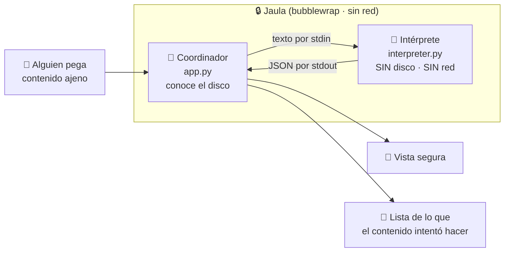
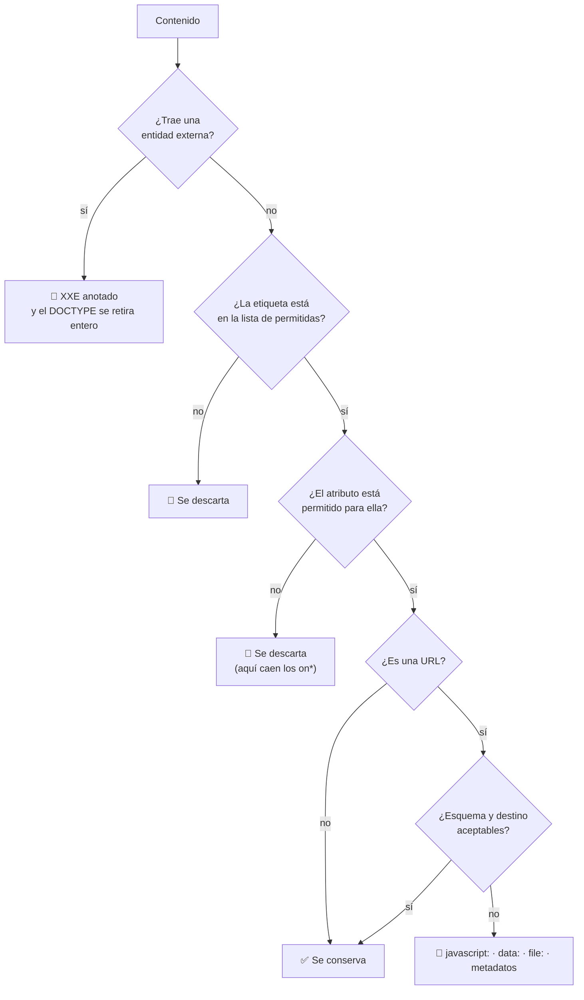

# 01 · Contenido web no confiable

> **En una frase, para cualquiera:** cuando tu programa muestra un texto que
> escribió un desconocido, ese texto puede pedirle cosas a tu computador. Este
> caso pone a quien lee ese texto en una habitación sin puertas.

**Estado real:** 🟡 `building` · **Carpeta:** [`cases/01-untrusted-render/`](../../cases/01-untrusted-render) · **Puerto:** `8801`

---

## Por qué se realiza este caso

Imagina que recibes una carta y, para leerla, tienes que hacer todo lo que la
carta diga mientras la lees. Eso es lo que hace un programa cuando interpreta
contenido ajeno: **leerlo es ejecutar las instrucciones de quien lo escribió**.

La parte que sorprende es que **no hace falta que la carta traiga un programa**.
Basta con que quien la lee tenga acceso a algo. Tres ejemplos, los tres reales:

| Lo que trae el contenido | Lo que consigue | Nombre técnico |
|---|---|---|
| Una «entidad externa» declarada al principio del documento | Que el lector abra `/etc/passwd` y lo devuelva dentro de la respuesta | **XXE** |
| Una imagen apuntando a `http://169.254.169.254/` | Que el servidor pida a la nube sus propias credenciales y te las entregue | **SSRF** |
| Un enlace a `file:///home/tu-usuario/.ssh/id_rsa` | Que el lector lea tu clave privada | **Travesía de rutas** |

Ninguno de los tres ejecuta JavaScript. Los tres funcionan **solo porque el
lector tenía permiso para abrir ficheros o para conectarse a algún sitio**.

De ahí la respuesta de este caso: quitarle esos permisos al lector. No
vigilarlos, no filtrarlos: **quitarlos**.

## La idea que enseña, y que ningún otro caso enseña

**Separar por proceso.** Hay dos programas, no uno:

- El **coordinador** conoce el disco, habla por la red y decide qué se permite.
- El **intérprete** no conoce nada. Recibe texto por su entrada, devuelve un
  informe por su salida, y no tiene ninguna otra forma de comunicarse con el
  mundo.

La diferencia con «filtrar el contenido» es la que hay entre cerrar una puerta y
poner un cartel de prohibido el paso. Cuando el contenido pide leer un fichero,
aquí no ocurre un «permiso denegado»: **es que no existe la función que abriría
el fichero**. El intento se anota y se sigue.

Y hay un segundo efecto, menos obvio y igual de importante: si el intérprete
falla —porque un contenido raro lo hace reventar—, **el que revienta es el
intérprete, no el servicio**. El coordinador recoge el fallo y responde.

## Casos de uso reales

- Un gestor de correo que muestra el HTML de un mensaje recibido.
- Un lector de noticias que consume fuentes RSS de terceros.
- Un foro o comentarios donde la gente escribe en Markdown.
- Una herramienta que previsualiza el `README` de un repositorio ajeno.
- Un sistema de tickets que muestra lo que pegó el cliente en el formulario.

Todos comparten la misma forma: **texto que llega de fuera, y un programa tuyo
que lo interpreta**.

## Cómo funciona



El paso que importa es la flecha del medio. Entre el coordinador y el intérprete
solo pasan **dos tuberías de texto**. No hay memoria compartida, no hay ficheros
comunes, no hay sockets. Esa estrechez es el control.

### Qué hace el intérprete con lo que recibe



Es una **lista de permitidos**, no de prohibidos. La diferencia importa: una
lista de prohibidos hay que actualizarla cada vez que alguien inventa una
etiqueta nueva; una lista de permitidos deja fuera lo que se invente mañana sin
tocar nada.

## Esquemas

### Entrada — `POST /api/render`

```json
{ "content": "<p>el HTML o Markdown que llegó de fuera</p>" }
```

| Campo | Tipo | Obligatorio | Límite |
|---|---|:--:|---|
| `content` | texto | sí | 256 KB en el coordinador; 200 000 caracteres en el intérprete |

### Salida

```json
{
  "ok": true,
  "elapsedMs": 41,
  "capabilities": {
    "filesystem": false, "network": false, "subprocess": false,
    "clock": false, "environment": false
  },
  "safeHtml": "<p>Hola </p><a>mira</a>",
  "rejections": [
    {
      "kind": "entidad-externa",
      "detail": "<!ENTITY x SYSTEM \"file:///etc/passwd\">",
      "why": "XXE: una entidad externa haría que el parser leyese un fichero por ti"
    }
  ],
  "rejectionsByKind": { "entidad-externa": 1, "ssrf": 1 },
  "stats": { "inputBytes": 335, "nodes": 19, "maxDepth": 2, "inputTruncated": false, "outputTruncated": false }
}
```

| Campo | Qué es |
|---|---|
| `capabilities` | Las capacidades del intérprete. **Todas en `false`, siempre.** Si alguna apareciera en `true`, el caso estaría roto |
| `safeHtml` | Lo que sobrevivió a la interpretación |
| `rejections` | **El producto de verdad de este caso**: qué pidió el contenido y por qué no se le dio |
| `rejectionsByKind` | El mismo dato contado, para poder vigilarlo |
| `stats` | Cuánto trabajo costó, para detectar contenidos que buscan agotar el proceso |

### Los tipos de rechazo

| `kind` | Cuándo aparece |
|---|---|
| `entidad-externa` | XXE: una entidad `SYSTEM` o `PUBLIC` en el DOCTYPE |
| `etiqueta-descartada` | `script`, `style`, `iframe`, `object`, `embed`, `link`, `meta`, `base`… |
| `etiqueta-no-permitida` | Cualquier etiqueta fuera de la lista de permitidas |
| `manejador-de-evento` | Un atributo `on*`: código escondido en un atributo |
| `atributo-no-permitido` | Un atributo que esa etiqueta no admite |
| `script-en-url` | `javascript:` o `vbscript:` en un `href` o `src` |
| `data-uri` | `data:` — trae su propio contenido y se salta el origen |
| `acceso-a-fichero` | `file://`, `/etc/…` o `..` |
| `ssrf` | Direcciones de metadatos de nube, `localhost`, `127.0.0.1` |
| `esquema-desconocido` | Cualquier otro esquema de URL |
| `red-no-concedida` | Una referencia `http(s)` legítima que **queda sin resolver**, porque no hay red |
| `enlace-markdown` | Un enlace Markdown con esquema hostil |
| `comentario-con-marcado` | Un comentario HTML que esconde etiquetas |
| `anidamiento` | Más de 100 niveles: revienta parsers recursivos |
| `presupuesto` | Más de 20 000 nodos: un documento sin fin es una denegación de servicio |

## Software necesario

| Componente | Versión | Para qué | ¿Obligatorio? |
|---|---|---|---|
| **Python** | 3.11+ | El coordinador y el intérprete. **Sin dependencias externas**: solo biblioteca estándar | Sí |
| **Rust** | 1.75+ | `sandboxctl`, el supervisor que levanta el caso | Solo para levantarlo como servicio |
| **`bubblewrap`** | 0.6+ | La jaula que aplica los controles | Solo para el servicio con aislamiento |
| **Linux o WSL2** | kernel 5.10+ | Namespaces de usuario sin privilegios | Solo para el servicio |
| **Node.js** | 20+ | La prueba de comportamiento y el panel | Solo para comprobarlo |

El intérprete por sí solo **funciona en cualquier sistema con Python**, incluido
Windows: no necesita jaula porque no usa nada que haya que enjaular.

## Instalación

```bash
git clone https://github.com/vladimiracunadev-create/sandbox-labs
cd sandbox-labs
sudo apt install bubblewrap util-linux python3
cargo build --release
cargo run -p sandboxctl -- doctor
```

`doctor` dice qué controles puede aplicar **tu** equipo y cuáles no. Los pasos
completos, incluida la configuración de WSL2, están en
[Instalación](../INSTALACION.md).

## Cómo se ejecuta

El caso completo, como producto en su propio `localhost`:

```bash
cargo run -p sandboxctl -- service up untrusted-render
```

Solo el intérprete, sin levantar nada:

```bash
python3 cases/01-untrusted-render/interpreter.py < contenido.html
```

Para bajarlo:

```bash
cargo run -p sandboxctl -- service down untrusted-render
```

## Procesos que se crean

```text
sandboxctl service up untrusted-render
  │
  ├─ systemd --user scope              ← cgroup: memory.max, pids.max, cpu.max
  │   └─ bwrap                         ← namespaces, montajes, seccomp, sin red
  │       └─ python3 app.py            ← el coordinador, escucha en socket Unix
  │           └─ python3 interpreter.py ← uno por petición, nace y muere con ella
  │
  └─ sandboxctl service forward        ← puente TCP :8801 ↔ socket Unix
```

Dos detalles que explican la forma:

- **El servicio no tiene red.** Escucha en un socket Unix dentro de la jaula, y
  es el puente —que vive fuera— quien publica `127.0.0.1:8801`. Si matas el
  puente, el servicio queda inalcanzable pero **sigue contenido**, que es el
  fallo correcto.
- **El intérprete es de usar y tirar.** Se lanza por petición y se destruye al
  responder. Si tarda más de 5 segundos, se le corta.

## Tiempo de carga

Medido en WSL2 (Ubuntu 24.04, bubblewrap 0.9.0) sobre un portátil corriente:

| Operación | Coste típico |
|---|---|
| `service up` hasta que `/health` responde | 0,5–2 s |
| Arranque de la jaula `bwrap` | 5–15 ms |
| Envoltura en cgroup (`systemd-run`) | 30–80 ms |
| Una interpretación de un documento normal | 15–60 ms |
| Una interpretación de un documento de 200 KB | 150–400 ms |
| Corte por tiempo del intérprete | 5 s (techo fijo) |

Casi todo el tiempo de arranque es **el intérprete de Python encendiéndose**, no
el aislamiento: la jaula cuesta milisegundos.

## Cómo se comprueba que funciona

```bash
node scripts/verify-cases.mjs
```

Le da al intérprete nueve entradas hostiles concretas y comprueba **dos cosas por
cada una**: que el rechazo esperado aparece en el informe, y que el fragmento
peligroso **no** sobrevive en la salida.

| Entrada | Debe rechazar | No puede sobrevivir |
|---|---|---|
| Entidad externa en el DOCTYPE | `entidad-externa` | `/etc/passwd` |
| `<script>fetch(…cookie)</script>` | `etiqueta-descartada` | `fetch`, `document.cookie`, `<script` |
| `` | `ssrf` | la dirección |
| `` | `manejador-de-evento` | `onerror`, `alert` |
| `<a href="file:///…/id_rsa">` | `acceso-a-fichero` | `id_rsa` |
| `<a href="javascript:alert(1)">` | `script-en-url` | `javascript:` |
| `` | `data-uri` | `data:text/html` |
| Un enlace Markdown con esquema `javascript:` | `enlace-markdown` | — |
| 30 000 párrafos seguidos | `presupuesto` | — |

Y una décima comprobación: que el intérprete **no declara ninguna capacidad
concedida**.

## Estado real y qué falta

**Construido:** el coordinador, el intérprete, la política de capacidades vacía,
los quince tipos de rechazo y la prueba de comportamiento con diez
comprobaciones.

**Falta para llegar a `functional`:**

- Ficha del caso en el panel de control.
- Levantar el servicio bajo `bwrap` dentro de CI y comprobar el flujo completo,
  no solo el intérprete por separado.

**Falta para llegar a `verified`:** que cada interpretación emita evidencia
firmada con los controles solicitados, aplicados y observados.

## Si algo falla

| Síntoma | Causa | Cómo se soluciona |
|---|---|---|
| `el intérprete no terminó en 5s y se le cortó` | El contenido hace que el parser tarde mucho. Se llama ReDoS | 1. Mirar `stats.nodes` y `stats.maxDepth` en la respuesta: dicen si el documento es desproporcionado. 2. Subir `INTERPRETER_TIMEOUT` en `app.py` si el contenido legítimo es grande. 3. Bajar `MAX_TEXT` para cortar antes |
| `el intérprete terminó con código N` | El parser reventó con ese contenido | El servicio sigue en pie —para eso son dos procesos—. Reproducirlo con `python3 cases/01-untrusted-render/interpreter.py < fichero.html` y leer el `stderr` completo, que la respuesta trunca a 500 caracteres |
| `contenido de más de 262144 bytes` | La entrada supera el techo del coordinador | 1. Trocear el contenido y interpretarlo por partes. 2. Subir `MAX_CONTENT` en `app.py`, sabiendo que un techo alto convierte el servicio en un blanco fácil |
| Aparecen muchos `red-no-concedida` | El contenido trae enlaces `http(s)` que **no se resuelven**, porque el intérprete no tiene red | Si necesitas resolverlos, hazlo **fuera** del intérprete y con lista de permitidos —el proxy de salida ya existe— y vuelve a entrar solo con el resultado |
| `python3: command not found` | En algunos sistemas el binario se llama `python` | `PYTHON=python node scripts/verify-cases.mjs`, y en `app.py` el intérprete se lanza con `sys.executable`, que ya usa el correcto |
| Una comprobación de `verify-cases.mjs` falla tras tocar el intérprete | Una regla dejó de detectar lo que declaraba | El mensaje dice qué entrada, qué rechazo esperaba y qué obtuvo. Arreglar la regla en `interpreter.py`. **Relajar la prueba para que pase deja el caso mintiendo** |
| Sale HTML que esperabas conservar | La etiqueta no está en `ALLOWED_TAGS`, o el atributo no está en `ALLOWED_ATTRS` | Añadirla a la lista de permitidos y **añadir una entrada en `verify-cases.mjs`** que fije qué no debe pasar con ella |

Los fallos que afectan a **cualquier** caso —no se puede crear el sandbox, no hay
cgroups, un puerto ocupado, procesos huérfanos, la compilación en Windows— están
resueltos uno a uno en **[Cuando algo falla](../SOLUCION-DE-PROBLEMAS.md)**.

---

**Ver también:** [Catálogo completo](../CATALOGO.md) · [Estado del proyecto](../ESTADO.md) · [Qué es un sandbox](../QUE-ES-UN-SANDBOX.md) · [Glosario](../GLOSARIO.md)
