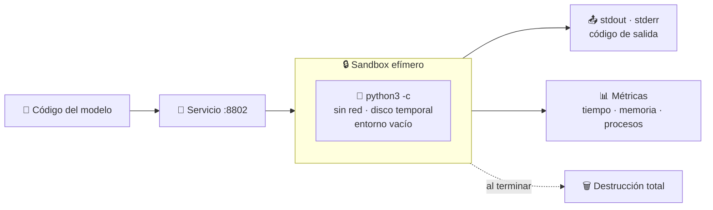
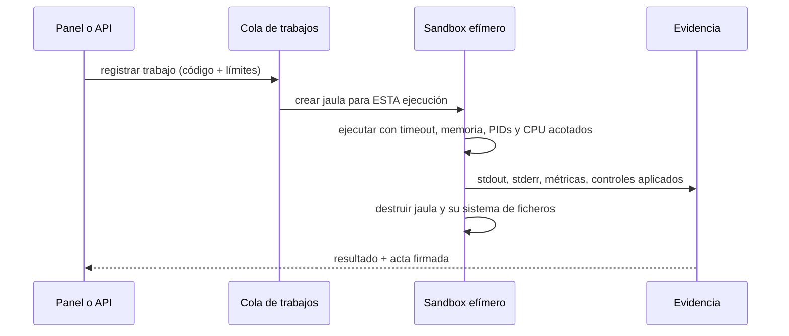

# 02 · Código generado por IA

> **En una frase, para cualquiera:** un modelo de lenguaje te escribe un
> programa en dos segundos. Nadie lo ha leído. Este caso lo ejecuta en una
> habitación que se construye para esa única vez y se demuele al terminar.

**Estado real:** 🟡 `building` · **Carpeta:** [`cases/02-ai-code-runner/`](../../cases/02-ai-code-runner) · **Puerto:** `8802`

---

## Por qué se realiza este caso

El código que escribe un modelo **no es malicioso ni es fiable: es
desconocido**. Y es desconocido de una forma nueva: se produce más rápido de lo
que nadie puede revisarlo, y llega con un aire de corrección que invita a
ejecutarlo sin mirar.

Lo que puede salir mal no requiere mala intención:

| Lo que hace el fragmento | Consecuencia sin aislamiento |
|---|---|
| Un bucle infinito | El servicio deja de responder a todo el mundo |
| `open("/etc/hosts", "w")` porque el modelo «arregló» algo | Se modifica el sistema |
| Reservar memoria en un bucle | El sistema mata procesos al azar para recuperarla |
| Una petición a internet «para comprobar algo» | Datos que salen sin que nadie lo decidiera |
| Leer una variable de entorno con una clave | La clave acaba en la salida del programa |

Y hay algo más sutil, que es lo que este caso enseña de verdad: **el segundo
fragmento no debería ver lo que dejó el primero**. Si el sandbox se reutiliza,
un fragmento puede dejar un fichero preparado para el siguiente, o simplemente
llenar el disco y arruinar la ejecución de otra persona.

## La idea que enseña, y que ningún otro caso enseña

**Lo efímero como control de seguridad.** El aislamiento no es solo una pared:
es que la habitación **no existe antes** de la ejecución y **no existe después**.

- Se crea un sandbox por ejecución, no uno por servicio.
- El sistema de ficheros es temporal: lo que se escriba desaparece con él.
- La red es `none`. No «filtrada»: ausente.
- El entorno se vacía entero, no variable a variable.
- Lo único que cruza la frontera es el código que entra y el texto que sale.

## Casos de uso reales

- Un asistente de programación que ofrece «ejecutar este ejemplo».
- Un cuaderno donde el modelo propone una transformación de datos y hay que ver
  el resultado antes de aplicarla.
- Una evaluación automática que compara la salida de varios modelos ante el
  mismo enunciado.
- Un agente que escribe un script auxiliar para resolver un paso intermedio.
- Ejercicios de programación corregidos ejecutando el código del alumno.

## Cómo funciona



### El flujo que exige el diseño objetivo



## Esquemas

### Entrada — `POST /api/run`

```json
{ "code": "print(sum(range(10)))" }
```

| Campo | Tipo | Obligatorio | Límite |
|---|---|:--:|---|
| `code` | texto | sí | Tamaño máximo de cuerpo acotado; se rechaza con `413` si se pasa |

### Salida

```json
{
  "stdout": "45\n",
  "stderr": "",
  "exitCode": 0,
  "timedOut": false,
  "runtime": "bwrap",
  "controls": { "network": "none", "filesystem": "ephemeral", "environment": "cleared" }
}
```

| Campo | Qué es |
|---|---|
| `stdout` / `stderr` | Lo que el fragmento escribió, truncado a un techo |
| `exitCode` | Cómo terminó. `null` si se le cortó |
| `timedOut` | Si se agotó el tiempo, que es un resultado válido y no un error |
| `runtime` | Qué frontera se usó de verdad: `bwrap`, `unshare` o ninguna |
| `controls` | Qué se aplicó realmente, no qué se pidió |

También hay `GET /api/containment`, que devuelve qué controles puede aplicar
este equipo **antes** de ejecutar nada.

## Software necesario

| Componente | Versión | Para qué | ¿Obligatorio? |
|---|---|---|---|
| **Python** | 3.11+ | El servicio y el lenguaje de los fragmentos | Sí |
| **Rust** | 1.75+ | `sandboxctl` y el compilador de políticas | Sí |
| **`bubblewrap`** | 0.6+ | La jaula por ejecución | Sí para aislamiento real |
| **`util-linux`** (`prlimit`) | 2.37+ | Límites de memoria y procesos | Recomendado |
| **`systemd`** en modo usuario | 249+ | cgroups v2: `memory.max`, `pids.max`, `cpu.max` | Solo para límites de recursos reales |
| **Linux o WSL2** | kernel 5.10+ | Namespaces sin privilegios | Sí |

## Instalación

```bash
sudo apt install bubblewrap util-linux python3
cargo build --release
cargo run -p sandboxctl -- doctor
```

Si `doctor` dice que no hay cgroups disponibles, el caso **sigue funcionando**
pero sin límite de memoria ni de CPU, y así lo declara en `controls`. Esa es la
regla del proyecto: lo que se aplica y lo que se reporta tienen que coincidir.

## Cómo se ejecuta

```bash
cargo run -p sandboxctl -- service up ai-code-runner
```

```bash
cargo run -p sandboxctl -- service down ai-code-runner
```

## Procesos que se crean

```text
sandboxctl service up ai-code-runner
  │
  ├─ systemd --user scope        ← cgroup con los límites del servicio
  │   └─ bwrap                   ← la jaula del servicio
  │       └─ python3 app.py      ← el servicio, escucha en socket Unix
  │           └─ (por petición) el fragmento, en su propia jaula efímera
  │
  └─ sandboxctl service forward  ← puente TCP :8802 ↔ socket Unix
```

El objetivo del rediseño es que la jaula efímera **no cuelgue del servicio** sino
del supervisor, para que el servicio pueda caerse sin dejar ejecuciones vivas.

## Tiempo de carga

| Operación | Coste típico |
|---|---|
| `service up` hasta que `/health` responde | 0,5–2 s |
| Crear la jaula efímera de una ejecución | 5–15 ms |
| Envoltura en cgroup | 30–80 ms |
| Un fragmento corto de Python | 40–150 ms |
| Techo de tiempo por ejecución | configurable por política |

## Estado real y qué falta

**Construido:** el servicio, la ejecución con red ausente, entorno vacío,
sistema de ficheros temporal, techo de tiempo y reporte honesto de qué controles
se aplicaron de verdad.

**Falta, y es un rediseño, no un retoque:** hoy el fragmento se ejecuta **dentro
del servicio web persistente**. Debe pasar a un trabajo registrado con **un
sandbox efímero por ejecución**, con cola limitada, cancelación, protección
contra abuso y reproducibilidad.

**Falta también:** soporte progresivo de más lenguajes —JavaScript, TypeScript
compilado, Rust, Go, Java, WASI—, y la regla que los gobierna: **no se habilita
un lenguaje que no tenga aislamiento y límites equivalentes a los de Python**.

---

**Ver también:** [Catálogo completo](../CATALOGO.md) · [Estado del proyecto](../ESTADO.md) · [Referencia de políticas](../POLICY_REFERENCE.md)
