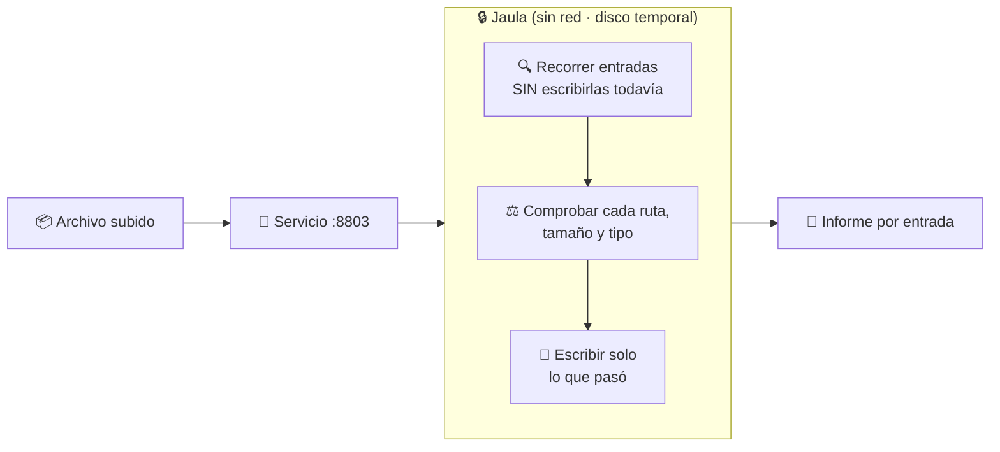
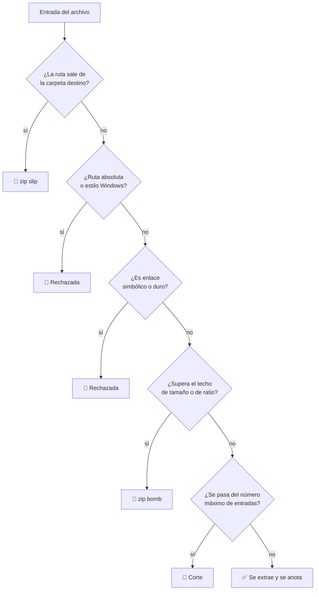

# 03 · Procesamiento seguro de archivos comprimidos

> **En una frase, para cualquiera:** descomprimir un fichero que te mandó otra
> persona es dejar que esa persona decida dónde se escriben cosas en tu disco.
> Este caso lo hace dentro de una jaula y te entrega un informe de cada entrada.

**Estado real:** 🟡 `building` · **Carpeta:** [`cases/03-file-detonation/`](../../cases/03-file-detonation) · **Puerto:** `8803`

---

## Por qué se realiza este caso

Un archivo comprimido no es una caja: es **una lista de instrucciones de
escritura**. Cada entrada dice «crea un fichero en esta ruta con este
contenido». Y la ruta la eligió quien hizo el archivo.

Si tu programa se fía de esa ruta, quien te manda el fichero elige dónde
escribes:

| Lo que trae el archivo | Lo que consigue |
|---|---|
| Una entrada llamada `../../etc/cron.d/tarea` | Escribir fuera de la carpeta de destino, en el sistema. Se llama **zip slip** |
| Una entrada llamada `/etc/passwd` | Ruta absoluta: ignora tu carpeta por completo |
| Un fichero de 42 KB que descomprime a 4,5 GB | Llenar el disco o agotar la memoria. Se llama **zip bomb** |
| Un enlace simbólico apuntando a `/home/tú/.ssh/` | Que la siguiente entrada escriba a través de él |
| Un nombre con `C:\Windows\` o con caracteres Unicode confusos | Saltarse comprobaciones escritas para el otro sistema |
| Archivos dentro de archivos, veinte niveles | Agotar el proceso que los recorre |

Este es **el caso donde el sandbox no es opcional**. En los demás se puede
discutir si hace falta; aquí la operación consiste literalmente en escribir en el
disco lo que dijo un desconocido.

## La idea que enseña, y que ningún otro caso enseña

**El informe vale más que el bloqueo.** Un antivirus dice «sí» o «no» y no
explica nada. Aquí el resultado es una tabla: por cada entrada del archivo, qué
se hizo con ella y por qué. Se aprende más de una entrada rechazada con su motivo
que de un «archivo peligroso» sin más.

El sandbox deja de ser una pared y pasa a ser **un microscopio**: sirve para
mirar, no solo para impedir.

## Casos de uso reales

- Un servicio que acepta que los usuarios suban un `.zip` con documentos.
- Una plataforma educativa donde los alumnos entregan trabajos comprimidos.
- Una herramienta que abre copias de seguridad de origen desconocido.
- Un correo con un adjunto comprimido que hay que inspeccionar antes de abrir.
- Un proceso automático que ingiere archivos de un proveedor externo.

## Cómo funciona



### Qué se comprueba en cada entrada



La comprobación ocurre **antes** de escribir. Comprobar después de extraer es no
comprobar: el daño ya está hecho.

## Esquemas

### Entrada — `POST /api/inspect`

El cuerpo es el archivo comprimido en crudo. Hay también ejemplos preparados en
`GET /api/sample/<nombre>` para no tener que fabricar uno hostil a mano.

| Límite | Valor |
|---|---|
| Tamaño de subida | acotado; se responde `413` al pasarse |
| Total descomprimido | acotado, para cortar la zip bomb |
| Número de entradas | acotado |

### Salida

```json
{
  "entries": [
    { "name": "documento.txt", "status": "extraída", "bytes": 1024 },
    { "name": "../../etc/cron.d/x", "status": "rechazada", "reason": "zip slip: la ruta sale de la carpeta destino" },
    { "name": "grande.bin", "status": "rechazada", "reason": "zip bomb: supera el total descomprimido permitido" }
  ],
  "summary": { "total": 3, "extracted": 1, "rejected": 2 },
  "runtime": "bwrap"
}
```

| Campo | Qué es |
|---|---|
| `entries` | **El producto del caso**: una línea por entrada, con motivo |
| `summary` | El recuento, para vigilar |
| `runtime` | Qué frontera se usó de verdad |

## Software necesario

| Componente | Versión | Para qué | ¿Obligatorio? |
|---|---|---|---|
| **Python** | 3.11+ | El servicio; `zipfile` es de la biblioteca estándar | Sí |
| **Rust** | 1.75+ | `sandboxctl` | Sí |
| **`bubblewrap`** | 0.6+ | La jaula. **Aquí no es opcional**: se escribe en disco | Sí |
| **Linux o WSL2** | kernel 5.10+ | Namespaces sin privilegios | Sí |

## Instalación

```bash
sudo apt install bubblewrap util-linux python3
cargo build --release
cargo run -p sandboxctl -- doctor
```

## Cómo se ejecuta

```bash
cargo run -p sandboxctl -- service up file-detonation
```

## Procesos que se crean

```text
sandboxctl service up file-detonation
  │
  ├─ systemd --user scope        ← cgroup: memoria y PIDs acotados
  │   └─ bwrap                   ← jaula con disco temporal y sin red
  │       └─ python3 app.py      ← el servicio, en socket Unix
  │
  └─ sandboxctl service forward  ← puente TCP :8803 ↔ socket Unix
```

El límite de memoria del cgroup importa más aquí que en otros casos: es lo que
convierte una zip bomb en «el proceso murió» en lugar de «el equipo se quedó sin
memoria».

## Tiempo de carga

| Operación | Coste típico |
|---|---|
| `service up` hasta que `/health` responde | 0,5–2 s |
| Inspección de un archivo pequeño (decenas de entradas) | 20–80 ms |
| Inspección de un archivo con miles de entradas | 0,3–2 s |
| Corte por zip bomb | inmediato al superar el techo |

## Estado real y qué falta

**Construido:** el servicio, la detección de zip slip, zip bomb, rutas absolutas
y enlaces, los techos de tamaño y de número de entradas, y el informe por
entrada.

**Falta, y empieza por el nombre:** este caso **no es detonación**. Detonar es
ejecutar la muestra y observar su comportamiento; aquí solo se extrae con
cuidado. Debe renombrarse a `03-safe-archive-processing`, y la detonación de
verdad pasa a ser el [caso 06](06-detonacion-en-microvm.md), que necesita una
máquina virtual desechable.

**Falta también:** más formatos comprimidos, detección de tipo MIME real —no por
extensión—, nombres Unicode confusos, archivos anidados y checksum por entrada.

## Si algo falla

| Síntoma | Causa | Cómo se soluciona |
|---|---|---|
| Todas las entradas salen `rechazada` | El archivo trae rutas absolutas o estilo Windows | Leer el `reason` de cada entrada: dice qué regla la paró. Reempaquetar con rutas relativas (`zip -r salida.zip carpeta/` desde dentro de la carpeta) |
| `zip bomb: supera el total descomprimido permitido` | El archivo se expande más allá del techo, y puede ser legítimo | 1. Subir el techo en `app.py`. 2. **Si el equipo no tiene cgroups, no lo subas**: sin `memory.max` el corte por tamaño es la única defensa que queda |
| El proceso muere sin responder nada | El cgroup lo mató al alcanzar `memory.max` | Es contención, no avería. Confirmarlo mirando `memory.peak` y `oom_kill` en la evidencia. Si el archivo es legítimo, subir `memoryMb` en la política |
| `cuerpo ausente o mayor que N bytes` (413) | La subida supera el techo del servicio | Trocear el archivo, o subir `MAX_UPLOAD_BYTES` sabiendo que el techo protege el proceso que lo recorre |
| Un archivo válido se rechaza por completo | Alguna entrada trae un enlace simbólico o duro | Los enlaces no se extraen nunca: permiten que la entrada siguiente escriba a través de ellos. Reempaquetar resolviendo los enlaces (`zip --symlinks` **no**; usar `tar -h` o copiar el contenido real) |
| El informe no coincide con lo que ves al descomprimir con otra herramienta | Otras herramientas aplican menos comprobaciones | Ese es el punto del caso. El informe por entrada es la referencia; la otra herramienta es la que está siendo permisiva |

Los fallos que afectan a **cualquier** caso —no se puede crear el sandbox, no hay
cgroups, un puerto ocupado, procesos huérfanos, la compilación en Windows— están
resueltos uno a uno en **[Cuando algo falla](../SOLUCION-DE-PROBLEMAS.md)**.

---

**Ver también:** [Catálogo completo](../CATALOGO.md) · [Estado del proyecto](../ESTADO.md) · [Modelo de amenazas](../THREAT_MODEL.md)
