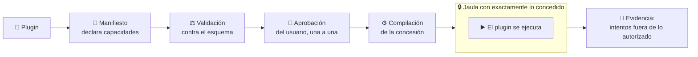
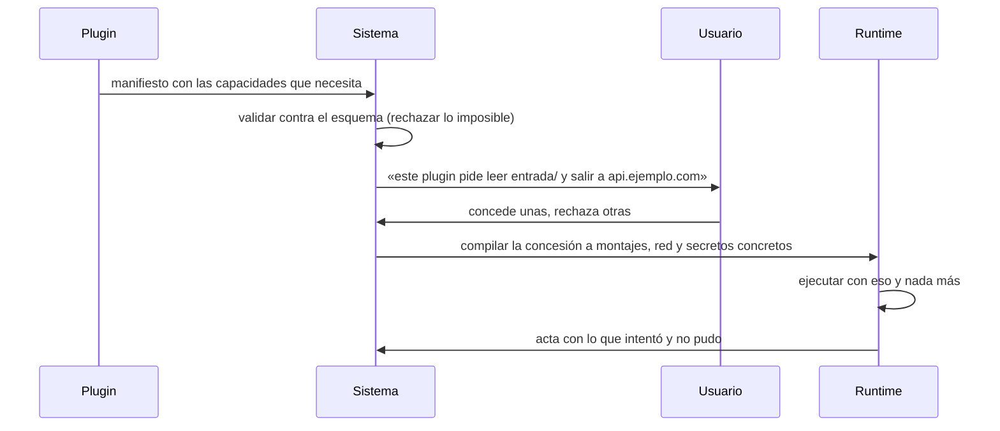

# 04 · Plugins de terceros

> **En una frase, para cualquiera:** cuando instalas una extensión, normalmente
> le das acceso a todo y confías en que se porte bien. Este caso invierte el
> trato: la extensión no tiene nada hasta que alguien le concede, una a una, las
> cosas que pidió.

**Estado real:** 🔴 `planned` — **no hay código todavía** · **Puerto reservado:** `8804`

---

## Por qué se realiza este caso

Un plugin es código de un desconocido que corre **dentro de tu programa**, con
tus permisos, con acceso a tu memoria y a tus ficheros. La única barrera suele
ser la buena fe.

El modelo habitual es **restar**: se da acceso a todo y luego se quitan cosas.
Ese modelo falla siempre por el mismo sitio: hay que acordarse de quitar cada
permiso, y basta olvidar uno.

| Lo que pasa con el modelo de restar | Ejemplo |
|---|---|
| Se olvida un permiso | El plugin lee variables de entorno con claves |
| Aparece una capacidad nueva | Nadie la añadió a la lista de prohibidos |
| El plugin se actualiza | La versión de ayer era honesta; la de hoy no |
| Una dependencia del plugin es maliciosa | El plugin ni siquiera sabe lo que arrastra |

## La idea que enseña, y que ningún otro caso enseña

**Sumar capacidades en vez de restar permisos.** El punto de partida no es «todo
menos lo prohibido», es **nada**. Cada cosa que el plugin puede hacer existe
porque alguien la concedió explícitamente y quedó registrada.

Y la concesión no es una casilla de confianza: es **una traducción a controles
reales**. «Puede leer la carpeta `entrada/`» se convierte en un montaje de solo
lectura de esa carpeta y nada más del sistema de ficheros.

## Casos de uso reales

- Un editor de código con extensiones de la comunidad.
- Una plataforma de comercio con módulos de terceros para pasarelas de pago.
- Un sistema de automatización donde cada usuario instala sus propios pasos.
- Un navegador con extensiones que ven todo lo que abres.
- Un CMS con plugins que corren en cada visita a la web.

## Cómo funcionará



### El flujo, paso a paso



## Capacidades previstas

| Capacidad | A qué se traduce de verdad |
|---|---|
| `read:<carpeta>` | Montaje de solo lectura de esa carpeta, nada más |
| `write:output` | Montaje de escritura de una única carpeta de salida |
| `net:<host>` | Lista de permitidos en el proxy de salida; todo lo demás se anota y se corta |
| `clock` | Acceso al reloj. Sin ella, el plugin no puede medir tiempo ni sembrar aleatoriedad |
| `storage` | Almacenamiento propio, aislado del de otros plugins |
| `camera` (simulada) | Un dispositivo falso, para probar el flujo sin hardware |
| `secret:<nombre>` | Un secreto **con nombre**, inyectado solo si el manifiesto, la política y el entorno coinciden |
| `events` | Recibir eventos del anfitrión |

## Esquemas

### Manifiesto del plugin

```json
{
  "id": "informe-mensual",
  "version": "1.2.0",
  "capabilities": [
    { "kind": "read", "path": "entrada/" },
    { "kind": "write", "path": "salida/" },
    { "kind": "net", "host": "api.ejemplo.com", "port": 443 }
  ]
}
```

### Concesión

```json
{
  "plugin": "informe-mensual@1.2.0",
  "granted": [ { "kind": "read", "path": "entrada/" } ],
  "denied":  [ { "kind": "net", "host": "api.ejemplo.com", "reason": "el usuario no lo aprobó" } ],
  "approvedBy": "usuario-local",
  "approvedAt": "2026-08-07T03:00:00Z"
}
```

### Acta de ejecución

```json
{
  "plugin": "informe-mensual@1.2.0",
  "attempts": [
    { "capability": "read:entrada/", "outcome": "permitido" },
    { "capability": "read:/etc/passwd", "outcome": "no concedida", "detail": "no existe en la jaula" },
    { "capability": "net:evil.example", "outcome": "bloqueada por la lista de permitidos" }
  ]
}
```

Lo que hace útil el acta es la tercera línea: **los intentos fuera de lo
autorizado son el dato**, no un efecto secundario.

## Plugins de ejemplo que traerá el caso

| Plugin | Para qué sirve como ejemplo |
|---|---|
| Correcto | Pide poco, usa lo que pide |
| Excesivamente permisivo | Pide todo «por si acaso»: enseña a leer un manifiesto con desconfianza |
| Que intenta leer de más | Declara una carpeta y abre otra |
| Que intenta salir a internet | Sin capacidad de red concedida |
| Que modifica datos | Escribe donde solo debía leer |
| Con dependencia vulnerable simulada | El plugin es honesto; lo que arrastra, no |

## Software necesario

| Componente | Versión | Para qué |
|---|---|---|
| **Rust** | 1.75+ | Validación del manifiesto y compilación de la concesión |
| **`bubblewrap`** | 0.6+ | Traducir cada capacidad a montajes y namespaces |
| **Python** | 3.11+ | Los plugins de ejemplo y el servicio |
| **Linux o WSL2** | kernel 5.10+ | Namespaces sin privilegios |

## Instalación

Los mismos requisitos comunes que el resto de la familia técnica:

```bash
sudo apt install bubblewrap util-linux python3
cargo build --release
cargo run -p sandboxctl -- doctor
```

## Procesos que se crearán

```text
sandboxctl service up third-party-plugins
  │
  ├─ systemd --user scope
  │   └─ bwrap                    ← montajes derivados de la concesión, no fijos
  │       └─ el plugin
  │
  ├─ proxy de salida              ← solo si se concedió alguna capacidad de red
  └─ sandboxctl service forward   ← puente TCP :8804 ↔ socket Unix
```

La diferencia con los demás casos: **los montajes de la jaula no están escritos
en la política, se calculan a partir de lo que el usuario aprobó**.

## Tiempo de carga estimado

| Operación | Coste esperado |
|---|---|
| Validar un manifiesto | < 5 ms |
| Compilar la concesión a controles | < 10 ms |
| Arrancar la jaula del plugin | 5–15 ms |
| Ejecución del plugin | lo que tarde el plugin, con techo por política |

## Qué hace falta para construirlo

1. Esquema JSON del manifiesto de capacidades, validado en cada commit.
2. Traducción de cada capacidad a controles reales del compilador de `bwrap`.
3. Flujo de aprobación en el panel de control.
4. Acta de ejecución con los intentos fuera de lo autorizado.
5. Los seis plugins de ejemplo.

Depende del [proxy de salida con lista de permitidos](../POLICY_REFERENCE.md),
que **ya está construido** y es lo que hará posible la capacidad `net:`.

## Si algo falla

Este caso **todavía no tiene código**. Lo que sigue son los fallos que el diseño
tiene que resolver, y cómo va a resolverlos — para que quede escrito antes de
escribir la primera línea:

| Situación | Causa | Cómo se resuelve |
|---|---|---|
| El manifiesto se rechaza antes de instalarse | Pide una capacidad que no existe en el esquema | Se rechaza al validar, **antes** de llegar a la pantalla de aprobación: el usuario nunca ve una petición imposible. Corregir el manifiesto contra el esquema publicado |
| El plugin falla al hacer algo que declaró | El usuario concedió menos de lo que pidió | El plugin corre con lo concedido y el intento queda en el acta con su capacidad y su motivo. Volver a pedir esa capacidad y explicar para qué. **La concesión no se amplía por conveniencia** |
| El plugin intenta algo que nunca declaró | Código que hace más de lo que dice su manifiesto | No hay «permiso denegado»: la capacidad no existe dentro de la jaula. El intento se registra, y ese registro es el producto del caso |
| La ejecución no ocurre y dice que falta un control | Una capacidad no se puede traducir a un control real en este equipo | Resolver la carencia del equipo —ver [Cuando algo falla](../SOLUCION-DE-PROBLEMAS.md)—. La alternativa, ejecutar con menos contención de la prometida, es peor que no ejecutar |
| Un plugin funcionaba y deja de funcionar tras actualizarse | La versión nueva pide capacidades nuevas | El manifiesto va versionado: un cambio de capacidades **vuelve a pedir aprobación**, no se hereda |
| El plugin arrastra una dependencia vulnerable | El plugin es honesto y lo que trae, no | Es uno de los seis plugins de ejemplo previstos. Se resuelve por capacidades: la dependencia tampoco tiene más de lo concedido |

Los fallos que afectan a **cualquier** caso —no se puede crear el sandbox, no hay
cgroups, un puerto ocupado, procesos huérfanos, la compilación en Windows— están
resueltos uno a uno en **[Cuando algo falla](../SOLUCION-DE-PROBLEMAS.md)**.

---

**Ver también:** [Catálogo completo](../CATALOGO.md) · [Estado del proyecto](../ESTADO.md) · [Referencia de políticas](../POLICY_REFERENCE.md)
