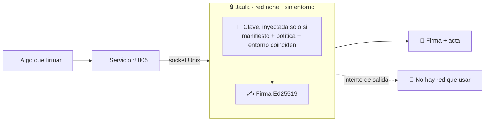
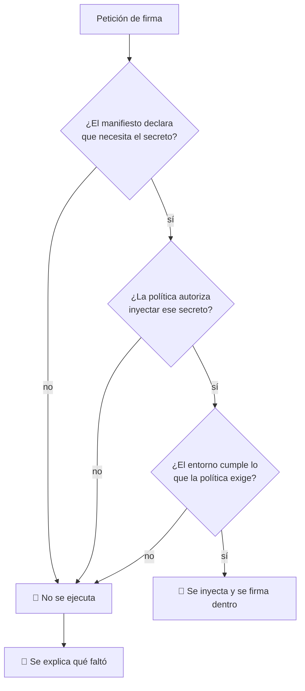

# 05 · Custodia de claves y firma

> **En una frase, para cualquiera:** una clave de firma es como la llave de una
> caja fuerte: si alguien la copia, ya no sirve de nada cambiar la cerradura de
> golpe. Este caso hace que la llave entre en una habitación sin ventanas, firme
> allí dentro, y que no haya ningún camino por donde sacarla.

**Estado real:** 🟡 `building` · **Carpeta:** [`cases/05-smart-contracts/`](../../cases/05-smart-contracts) · **Puerto:** `8805`

---

## Por qué se realiza este caso

Casi todos los secretos se pueden rotar barato: cambias la contraseña y sigues.
Una **clave de firma** no. Con ella se han emitido documentos, transacciones o
paquetes que otros ya aceptaron como auténticos. Si se filtra, no solo hay que
cambiarla: hay que revisar todo lo firmado desde que se filtró, y decidir qué
sigue valiendo.

Lo que basta para perderla:

| Situación | Cómo se pierde la clave |
|---|---|
| El proceso que firma tiene red | Una línea de código la envía fuera |
| La clave está en una variable de entorno | Cualquier volcado de error la imprime |
| La clave está en un fichero del proyecto | Acaba en el repositorio, y de ahí no se borra |
| El proceso que firma también hace otras cosas | Cualquier fallo de esas otras cosas la alcanza |
| Los registros incluyen el cuerpo de la petición | La clave queda escrita en texto plano |

## La idea que enseña, y que ningún otro caso enseña

**El secreto entra solo si tres cosas coinciden**: el manifiesto de la carga
declara que lo necesita, la política autoriza inyectarlo, y el entorno cumple lo
que la política exige. Si falla cualquiera de las tres, **no se ejecuta**: falla
cerrada y dice qué faltó.

Y dentro, no hay por dónde sacarla:

- La red es `none`. No hay socket que abrir.
- La comunicación es por **socket Unix**, no por puerto: no se alcanza desde
  fuera del equipo.
- La clave no aparece en el entorno, ni en los argumentos —que se ven en `ps`—,
  ni en los registros.
- Hay una **prueba de exfiltración**: un proceso que intenta sacarla y falla, y
  ese fallo se comprueba en cada commit.

> [!WARNING]
> Todas las claves de este caso son **de demostración, generadas en local y
> desechables**. El proyecto no contiene, ni contendrá, claves de producción.

## Casos de uso reales

- Firmar artefactos de una construcción para que quien los instale pueda
  verificarlos.
- Firmar transacciones sin que el servicio que las prepara vea la clave.
- Emitir certificados o credenciales verificables.
- Sellar registros de auditoría para que una alteración posterior se note.
- Firmar la propia evidencia de este proyecto — que es exactamente lo que hace
  [el formato de evidencia](../EVIDENCE_FORMAT.md).

## Cómo funciona



### La comprobación de tres llaves



Ese «no se ejecuta» es deliberado. La alternativa —ejecutar con menos controles
de los pedidos— es la que produce sistemas que **parecen** seguros.

## Esquemas

### Entrada — `POST /api/sign`

```json
{ "payload": { "to": "cuenta-b", "amount": 1250, "currency": "CLP" } }
```

### Salida

```json
{
  "signature": "base64…",
  "algorithm": "ed25519",
  "publicKey": "base64…",
  "keyFingerprint": "sha256:…",
  "signedAt": "2026-08-07T03:00:00Z",
  "controls": { "network": "none", "transport": "unix-socket", "environment": "cleared" }
}
```

La clave privada **no aparece en ningún campo de ninguna respuesta**. Lo que sale
es la firma, la clave pública y una huella para poder identificar qué clave se
usó sin revelarla.

### Comprobaciones auxiliares

| Endpoint | Qué devuelve |
|---|---|
| `GET /api/status` | En qué modo está: con clave cargada o solo planificando |
| `GET /api/egress` | El resultado de intentar salir a la red desde dentro: debe fallar |

## Software necesario

| Componente | Versión | Para qué | ¿Obligatorio? |
|---|---|---|---|
| **Rust** | 1.75+ | `ed25519-dalek` para la firma, y `sandboxctl` | Sí |
| **Python** | 3.11+ | El servicio | Sí |
| **`bubblewrap`** | 0.6+ | La jaula sin red | Sí |
| **Linux o WSL2** | kernel 5.10+ | Namespaces y sockets Unix | Sí |

## Instalación

```bash
sudo apt install bubblewrap util-linux python3
cargo build --release
cargo run -p sandboxctl -- doctor
```

La clave de demostración se genera sola la primera vez, en
`.sandbox-data/keys/`, con permisos `0600`. **Esa carpeta está fuera del control
de versiones y debe seguir estándolo.**

## Cómo se ejecuta

```bash
cargo run -p sandboxctl -- service up smart-contracts
```

Y la verificación de que la evidencia firmada se sostiene:

```bash
cargo run -p sandboxctl -- evidence verify
```

## Procesos que se crean

```text
sandboxctl service up smart-contracts
  │
  ├─ systemd --user scope
  │   └─ bwrap                   ← red none, entorno vacío, sin dispositivos
  │       └─ python3 app.py      ← firma, escuchando en socket Unix
  │
  └─ sandboxctl service forward  ← puente TCP :8805 ↔ socket Unix
```

Que el transporte sea un socket Unix no es un detalle de implementación: es **el
control**. Un socket Unix vive en el sistema de ficheros, no en la red, así que
no se alcanza desde otra máquina ni aunque el equipo esté expuesto.

## Tiempo de carga

| Operación | Coste típico |
|---|---|
| `service up` hasta que `/health` responde | 0,5–2 s |
| Generar la clave de demostración (una sola vez) | < 10 ms |
| Una firma Ed25519 | < 1 ms |
| Verificar una firma | < 1 ms |
| Prueba de exfiltración (`/api/egress`) | < 50 ms, y debe fallar |

## Estado real y qué falta

**Construido:** la firma Ed25519 dentro de la jaula, la red `none`, el transporte
por socket Unix, la clave con permisos restringidos fuera del repositorio, y la
firma de la evidencia del propio proyecto, encadenada y verificable con
`evidence verify` en cada commit.

**Falta, y empieza por dividirlo en dos:** este caso mezcla hoy dos ideas
distintas. La custodia y la firma se quedan aquí, como
`05-key-custody-and-signing`. La **ejecución determinista** —presupuesto por
instrucciones, sin reloj, resultados reproducibles— es otra idea y se va al
[caso 07](07-runtime-determinista-de-contratos.md).

**Falta también:** límites de monto por firma, política de autorizaciones,
rotación y revocación de claves.

## Si algo falla

| Síntoma | Causa | Cómo se soluciona |
|---|---|---|
| `mode: plan` en vez de `live` | No hay clave cargada, así que el servicio muestra la petición que haría en vez de firmar | Es el modo previsto sin secreto. Para firmar de verdad, dejar que se genere la clave de demostración en `.sandbox-data/keys/` — se crea sola en el primer arranque |
| La firma no se ejecuta y dice que falta algo | Una de las tres llaves no coincide: manifiesto, política o entorno | El mensaje dice cuál. Corregir el manifiesto de la carga o la política. **No quitar el modo estricto para que pase**: eso es exactamente lo que el caso enseña a no hacer |
| `/api/egress` **no** falla | El sandbox tiene red cuando no debería | 1. Comprobar que la política dice `network: none`. 2. Ejecutar `cargo run -p sandboxctl -- escape`: si la sonda de red también sale, el problema es del entorno y no del caso |
| Permiso denegado al leer la clave | Tiene modo `0600` y pertenece a otro usuario | Borrarla y dejar que se regenere. **No abrirla a más usuarios**: una clave de firma legible por varios ya no prueba quién firmó |
| `evidence verify` dice que el hash de la política cambió | El código o la política cambiaron desde aquella ejecución | No es corrupción: es un acta vieja diciendo con razón que ya no describe el código de hoy. Volver a ejecutar para generar evidencia del estado actual |
| La clave privada aparece en un registro o en una respuesta | Fallo grave | Rotar la clave —borrarla y regenerarla— y abrir una incidencia. Nada del proyecto debe exponerla, y hay una prueba de exfiltración precisamente para detectar esto |

Los fallos que afectan a **cualquier** caso —no se puede crear el sandbox, no hay
cgroups, un puerto ocupado, procesos huérfanos, la compilación en Windows— están
resueltos uno a uno en **[Cuando algo falla](../SOLUCION-DE-PROBLEMAS.md)**.

---

**Ver también:** [Catálogo completo](../CATALOGO.md) · [Formato de evidencia](../EVIDENCE_FORMAT.md) · [Estado del proyecto](../ESTADO.md)
