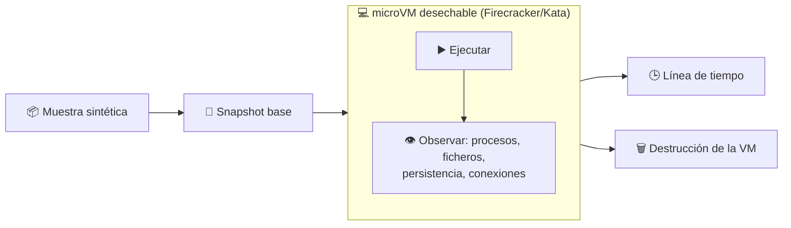

# 06 · Detonación en microVM

> **En una frase, para cualquiera:** hay cosas que no se pueden mirar de cerca
> sin correr riesgo. Para eso se usa una máquina desechable: se enciende, se
> observa qué hace la muestra, y se destruye la máquina entera.

**Estado real:** 🔴 `planned` — **no hay código todavía**

---

## Por qué se realiza este caso

Los demás casos técnicos usan **namespaces**: la muestra corre en el mismo
núcleo del sistema que todo lo demás, solo que con una vista recortada. Eso basta
para código desconocido, pero no para código que **intenta activamente escapar**.

Un núcleo compartido tiene cientos de puntos de entrada. Si la muestra encuentra
un fallo en uno solo, la vista recortada deja de existir. Cuando lo que se
analiza está diseñado para buscar ese fallo, la frontera tiene que ser **una
máquina, no una vista**.

Y hay una segunda razón, distinta: para **observar comportamiento** hay que
dejar que la muestra actúe. No se trata de impedirle escribir ficheros, se trata
de dejarla escribirlos y anotar cuáles.

> [!WARNING]
> **El repositorio no contiene ni contendrá malware real.** Todas las muestras
> son sintéticas e inofensivas: imitan el comportamiento —crear ficheros,
> intentar persistir, abrir conexiones— sin hacer daño. Para muestras reales, un
> equipo dedicado y desconectado, nunca el equipo de trabajo.

## La idea que enseña

**Cuándo el namespace ya no basta.** Este caso existe para marcar el límite
superior del resto del proyecto: enseña qué se gana con una máquina virtual
—núcleo propio, superficie de ataque mucho menor, destrucción total— y qué se
paga por ello en tiempo de arranque y en complejidad.

## Casos de uso reales

- Un equipo de seguridad que recibe un adjunto sospechoso y necesita saber qué
  hace antes de decidir.
- Analizar una actualización de un proveedor antes de desplegarla.
- Reproducir un incidente para entender por dónde entró.
- Formación: ver el comportamiento de una muestra sin riesgo.

## Cómo funcionará



## Esquemas

### Entrada

```json
{ "sample": "<binario o archivo>", "timeoutSeconds": 60, "network": "simulated" }
```

### Salida — la línea de tiempo

```json
{
  "timeline": [
    { "t": 0.12, "kind": "process", "detail": "exec /tmp/muestra" },
    { "t": 0.31, "kind": "file",    "detail": "crea /home/u/.config/autostart/x.desktop" },
    { "t": 0.33, "kind": "persistence", "detail": "intento de arranque automático" },
    { "t": 1.04, "kind": "network", "detail": "conexión a 203.0.113.10:443 (simulada, no salió)" }
  ],
  "verdict": "comportamiento de persistencia observado",
  "vmDestroyed": true
}
```

## Software necesario

| Componente | Para qué | ¿Obligatorio? |
|---|---|---|
| **KVM** | Virtualización por hardware | Sí |
| **Firecracker** o **Kata Containers** | La microVM | Sí |
| **Un kernel y un rootfs** preparados | Lo que arranca dentro | Sí |
| **Rust** 1.75+ | El supervisor | Sí |
| **Linux** | WSL2 **no expone KVM anidado por defecto** | Sí |

Este es el único caso del proyecto que **no funciona en WSL2 sin configuración
adicional**, y por eso su runtime está marcado como `manual` en el catálogo.

## Instalación

```bash
ls /dev/kvm                       # si no existe, este caso no puede correr aquí
sudo apt install firecracker      # o el paquete de Kata Containers
cargo run -p sandboxctl -- doctor # dirá si el runtime está disponible
```

## Procesos que se crearán

```text
sandboxctl detonate <muestra>
  │
  ├─ jailer                ← acota al propio Firecracker antes de arrancar la VM
  │   └─ firecracker       ← el hipervisor
  │       └─ [kernel invitado]
  │           └─ la muestra
  │
  └─ colector de eventos   ← fuera de la VM: recoge la línea de tiempo
```

El colector vive **fuera** de la máquina virtual a propósito: si viviera dentro,
la muestra podría alterarlo.

## Tiempo de carga estimado

| Operación | Coste esperado |
|---|---|
| Arranque de una microVM Firecracker | 100–200 ms |
| Restaurar desde snapshot | 20–50 ms |
| Ejecución observada | lo que dure, con techo |
| Destrucción de la VM | < 50 ms |

Compárese con los **5–15 ms** de una jaula `bwrap`: la máquina virtual cuesta un
orden de magnitud más, y esa es exactamente la decisión que este caso enseña a
tomar.

## Qué hace falta para construirlo

1. Adaptador de runtime para Firecracker en el compilador de políticas.
2. Kernel y rootfs mínimos reproducibles.
3. Instrumentación de procesos, ficheros y red dentro del invitado.
4. Red simulada que registre las conexiones sin dejarlas salir.
5. Muestras sintéticas con comportamiento documentado.

## Si algo falla

Este caso **todavía no tiene código**. Lo que sigue son los fallos que el diseño
tiene que resolver, y cómo va a resolverlos — escrito antes de la primera línea,
que es cuando sirve de algo:

| Situación | Causa | Cómo se resuelve |
|---|---|---|
| `/dev/kvm` no existe | Sin virtualización por hardware no hay microVM | 1. En WSL2, activar la virtualización anidada en `.wslconfig` (`nestedVirtualization=true`). 2. Comprobar que el BIOS tiene VT-x o AMD-V. 3. Si aun así no aparece, el caso **no se ejecuta aquí** y `doctor` lo dice en vez de fingir |
| La VM no arranca | Kernel o rootfs mal construidos | El kernel y el rootfs se generan de forma reproducible y se verifican por checksum antes de arrancar. Si el checksum no coincide, no se arranca |
| La muestra no hace nada observable | Detecta que está en un entorno de análisis, o necesita más tiempo | 1. Subir el techo de tiempo. 2. Es un resultado en sí mismo: «la muestra no actuó» se anota en la línea de tiempo, no se oculta |
| La VM no se destruye | Un fallo del supervisor deja la máquina viva | La destrucción va en el camino de salida pase lo que pase, y hay un barrido equivalente al de `service down --all`. Una VM huérfana con una muestra dentro es el peor fallo posible de este caso |
| El colector no recoge nada | Vive fuera de la VM a propósito, y perdió la conexión | Los eventos se escriben a un canal persistente, no a memoria: lo recogido antes de la desconexión se conserva |

Los fallos que afectan a **cualquier** caso —no se puede crear el sandbox, no hay
cgroups, un puerto ocupado, procesos huérfanos, la compilación en Windows— están
resueltos uno a uno en **[Cuando algo falla](../SOLUCION-DE-PROBLEMAS.md)**.

---

**Ver también:** [Catálogo completo](../CATALOGO.md) · [Comparativa de fronteras](../COMPARATIVA.md) · [Caso 03](03-procesamiento-seguro-de-archivos.md)
