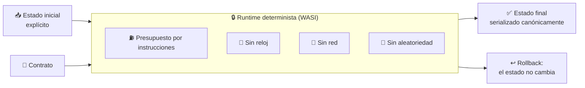
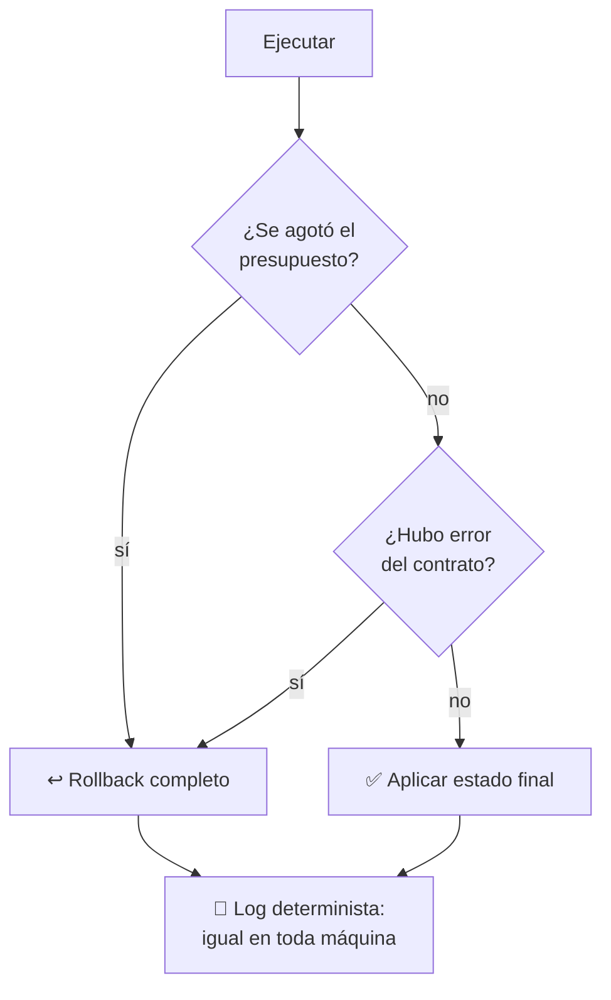

# 07 · Runtime determinista de contratos

> **En una frase, para cualquiera:** si ejecutas el mismo programa con los
> mismos datos dos veces, debería salir exactamente lo mismo. Suena obvio, y
> casi nunca es cierto: basta un reloj o un número al azar para que no lo sea.

**Estado real:** 🔴 `planned` — **no hay código todavía**

---

## Por qué se realiza este caso

Hay sistemas donde varias máquinas ejecutan el mismo programa por separado y
tienen que **llegar al mismo resultado**, porque si no coinciden no hay acuerdo
posible. Un contrato inteligente es el ejemplo conocido, pero no el único: una
liquidación que se recalcula, una auditoría que reproduce un cierre, un peritaje
que tiene que llegar a la misma cifra que el sistema original.

Lo que rompe el determinismo casi nunca es lo que uno espera:

| Fuente de indeterminación | Por qué rompe el acuerdo |
|---|---|
| El reloj | Dos máquinas nunca lo leen en el mismo instante |
| Aleatoriedad | Por definición |
| El orden de recorrer un diccionario | Depende de la memoria, no del programa |
| Coma flotante | Distinto resultado según el procesador |
| Cualquier lectura de red o de disco | El mundo cambió entre una ejecución y otra |
| Un tiempo máximo | La máquina lenta corta donde la rápida siguió |

Ese último es el más engañoso: **acotar por tiempo destruye el determinismo**. Si
la ejecución se corta a los 5 segundos, el resultado depende de qué máquina lo
ejecutó.

## La idea que enseña, y que ningún otro caso enseña

**Medir el trabajo, no el tiempo.** El presupuesto se cuenta en **instrucciones**
—o en «gas»—, no en segundos. La máquina lenta y la rápida ejecutan el mismo
número de instrucciones y se detienen en el mismo punto exacto.

Y con ello, un cambio de perspectiva sobre qué es aislar: los demás casos
restringen **lo que el código puede tocar**; este restringe **lo que el código
puede saber**. Sin reloj, sin aleatoriedad, sin entorno, sin mundo exterior.

## Casos de uso reales

- Un contrato inteligente que varias partes ejecutan y comparan.
- Recalcular un cierre contable y obtener el mismo número que el día que se hizo.
- Reglas de negocio que un regulador tiene que poder reproducir.
- Un motor de reglas donde el mismo expediente debe dar siempre la misma
  decisión.
- Reproducir un incidente ejecutando el mismo estado inicial.

## Cómo funcionará





## Esquemas

### Entrada

```json
{
  "contract": "<módulo WASM>",
  "initialState": { "saldo": 1000 },
  "input": { "accion": "transferir", "monto": 250 },
  "gasLimit": 1000000
}
```

### Salida

```json
{
  "outcome": "applied",
  "finalState": { "saldo": 750 },
  "stateHash": "sha256:…",
  "gasUsed": 41230,
  "logs": ["transferencia registrada"],
  "deterministic": true
}
```

`stateHash` es la pieza clave: dos máquinas que ejecuten lo mismo tienen que
producir **el mismo hash**, y comparar hashes es cómo se comprueba el acuerdo sin
comparar estados enteros.

## Software necesario

| Componente | Para qué | ¿Obligatorio? |
|---|---|---|
| **`wasmtime`** | El motor WASI con contador de instrucciones | Sí |
| **Rust** 1.75+ | El supervisor y la serialización canónica | Sí |
| Un compilador a WASM | Para escribir los contratos de ejemplo | Solo para los ejemplos |

WASI se prefiere a una máquina virtual propia por una razón concreta: **ya no
tiene reloj ni red salvo que se los concedas**. El determinismo es el punto de
partida, no algo que haya que recortar.

## Instalación

```bash
curl https://wasmtime.dev/install.sh -sSf | bash
cargo build --release
cargo run -p sandboxctl -- doctor   # dirá si el runtime wasi está disponible
```

## Procesos que se crearán

```text
sandboxctl contract run <módulo>
  │
  └─ wasmtime            ← un proceso, sin hijos
      └─ el módulo WASM  ← sin acceso a nada que no se le entregue
```

Es el caso con **menos procesos de todo el proyecto**, y no por casualidad: cada
proceso adicional es una fuente potencial de indeterminación.

## Tiempo de carga estimado

| Operación | Coste esperado |
|---|---|
| Cargar y compilar el módulo WASM | 5–30 ms |
| Ejecución hasta agotar 1 000 000 de instrucciones | 10–50 ms |
| Serialización canónica del estado | < 5 ms |
| Rollback | inmediato: no se aplicó nada |

## Qué hace falta para construirlo

1. Adaptador de runtime WASI con medición de instrucciones.
2. Serialización canónica: un mismo estado, una misma representación en bytes.
3. Estado inicial explícito y verificable por hash.
4. Rollback ante fallo o presupuesto agotado.
5. Contratos de ejemplo, incluido uno que intente leer el reloj y falle.

## Si algo falla

Este caso **todavía no tiene código**. Lo que sigue son los fallos que el diseño
tiene que resolver, y cómo va a resolverlos — escrito antes de la primera línea,
que es cuando sirve de algo:

| Situación | Causa | Cómo se resuelve |
|---|---|---|
| Dos máquinas dan `stateHash` distinto | Se coló una fuente de indeterminación | Es el fallo que este caso existe para detectar. Se busca en el orden habitual: reloj, aleatoriedad, orden de recorrido de un diccionario, coma flotante. Los cuatro están cerrados por diseño; si aparece, es que uno se escapó |
| `gasUsed` llega al límite y no termina | El contrato necesita más presupuesto, o tiene un bucle | 1. Subir `gasLimit`. 2. Si sube sin fin, es un bucle: **el rollback ya dejó el estado intacto**, que es lo que importa |
| El contrato intenta leer el reloj o la red | WASI no se los concede | Falla dentro del contrato, de forma determinista y en todas las máquinas por igual. Se corrige el contrato, no el runtime |
| `wasmtime` no está | Falta el motor | `curl https://wasmtime.dev/install.sh -sSf \| bash`. `doctor` dirá si el runtime `wasi` está disponible antes de intentar nada |
| El estado final no se puede serializar igual dos veces | La serialización no es canónica | Es un fallo del runtime, no del contrato: la representación en bytes de un mismo estado tiene que ser única. Sin eso, comparar hashes no significa nada |

Los fallos que afectan a **cualquier** caso —no se puede crear el sandbox, no hay
cgroups, un puerto ocupado, procesos huérfanos, la compilación en Windows— están
resueltos uno a uno en **[Cuando algo falla](../SOLUCION-DE-PROBLEMAS.md)**.

---

**Ver también:** [Catálogo completo](../CATALOGO.md) · [Caso 05](05-custodia-de-claves-y-firma.md) · [Comparativa de fronteras](../COMPARATIVA.md)
