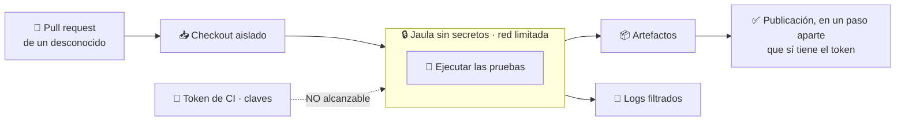
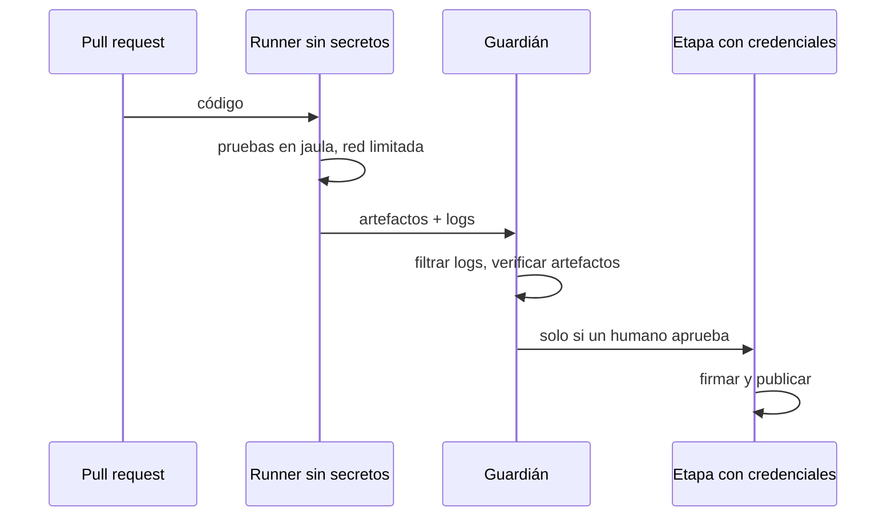

# 09 · Runner de CI con pull request externo

> **En una frase, para cualquiera:** cuando un desconocido propone un cambio a
> tu proyecto, tu sistema de integración continua **ejecuta su código
> automáticamente**, en una máquina que tiene las llaves para publicar. Este caso
> separa esas dos cosas.

**Estado real:** 🟡 `building` — hay código y **7 comprobaciones automáticas**, sin levantarse bajo `bwrap` en CI · **Carpeta:** [`cases/09-ci-untrusted-pr/`](../../cases/09-ci-untrusted-pr) · **Puerto:** `8809`

---

## Por qué se realiza este caso

Es el sitio donde ejecutar código de desconocidos está **institucionalizado**.
Alguien abre un pull request y, sin que nadie lo lea, arrancan las pruebas. Esas
pruebas son código del pull request.

Y la máquina que las ejecuta suele tener, en su entorno:

- El token que permite escribir en el repositorio.
- Las credenciales de despliegue.
- Las claves de firma de los paquetes que se publican.
- Acceso a la caché compartida entre ejecuciones.

Un fallo aquí no compromete un equipo: compromete **el repositorio y todo lo que
despliega**, y a través de él a todo el que lo instale.

| Lo que el pull request puede intentar | Consecuencia |
|---|---|
| Imprimir las variables de entorno en el registro | Los secretos quedan en un log público |
| Modificar el fichero de configuración de CI | Su propio código decide qué permisos tiene |
| Escribir en la caché compartida | La siguiente ejecución, de otra rama, usa lo que dejó |
| Conectarse a un servidor propio | Exfiltrar lo que encuentre |
| Firmar un artefacto | Publicar algo que otros aceptarán como auténtico |

## La idea que enseña, y que ningún otro caso enseña

**El código no puede alcanzar la credencial que lo ejecuta.** No es aislar el
sistema de ficheros ni la red: es que **el secreto no esté en el mismo sitio que
el código no confiable**, ni en el entorno, ni en un fichero, ni en un agente
accesible.

## Casos de uso reales

- Un proyecto de código abierto que acepta contribuciones de cualquiera.
- Una empresa que recibe pull requests de proveedores externos.
- Un concurso de programación donde se ejecuta el código de los participantes.
- Un sistema de revisión automática que ejecuta las pruebas del propio cambio.

## Cómo funcionará



La forma del diagrama es el diseño: **dos etapas**. La que ejecuta código ajeno
no tiene llaves; la que tiene llaves no ejecuta código ajeno.



## Esquemas

### Configuración de la ejecución

```json
{
  "pullRequest": 1234,
  "trusted": false,
  "secrets": [],
  "network": { "mode": "allowlist", "hosts": ["registry.ejemplo.com:443"] },
  "artifacts": { "path": "dist/", "maxBytes": 52428800 }
}
```

`"secrets": []` no es un valor por defecto: es **lo único posible** cuando
`trusted` es `false`. Si una configuración pide secretos con `trusted: false`, la
ejecución no ocurre.

### Acta

```json
{
  "outcome": "passed",
  "secretsPresent": false,
  "networkAttempts": [
    { "host": "registry.ejemplo.com:443", "outcome": "permitido" },
    { "host": "203.0.113.7:443", "outcome": "bloqueado por lista de permitidos" }
  ],
  "artifacts": [{ "name": "dist/app.tar.gz", "sha256": "…" }]
}
```

## Software necesario

| Componente | Para qué |
|---|---|
| **Rust** 1.75+ | El supervisor de la ejecución |
| **`bubblewrap`** 0.6+ | La jaula del runner |
| El **proxy de salida con lista de permitidos** | Ya construido: es lo que limita la red |
| **`git`** | Checkout aislado |
| **Linux o WSL2** | Namespaces sin privilegios |

## Instalación

```bash
sudo apt install bubblewrap git
cargo build --release
```

## Procesos que se crearán

```text
sandboxctl ci run --pr 1234
  │
  ├─ checkout aislado          ← carpeta temporal, sin acceso al resto
  ├─ proxy de salida           ← registra cada conexión intentada
  │
  ├─ systemd --user scope      ← límites de memoria, CPU y procesos
  │   └─ bwrap                 ← entorno VACÍO: ni un secreto
  │       └─ las pruebas del pull request
  │
  └─ recolector de artefactos  ← fuera de la jaula
```

## Tiempo de carga estimado

| Operación | Coste esperado |
|---|---|
| Checkout aislado | segundos, según el repositorio |
| Arranque de la jaula | 5–15 ms |
| Ejecución de las pruebas | lo que tarden, con techo por política |
| Filtrado de logs | proporcional al tamaño del log |

## Qué hace falta para construirlo

1. Checkout aislado que no toque el árbol de trabajo real.
2. Entorno vacío verificado: una sonda que compruebe que no hay secretos dentro.
3. Red por lista de permitidos, con registro de cada intento.
4. Recolección de artefactos con checksum, fuera de la jaula.
5. Filtrado de logs para que un secreto no llegue al registro ni por accidente.
6. Separación en dos etapas, con aprobación humana entre ellas.

## Si algo falla

El caso **ya tiene código**: el núcleo en `core.py` y el servicio en `app.py`.
Lo que sigue son sus fallos, la causa y la salida:

| Situación | Causa | Cómo se resuelve |
|---|---|---|
| Las pruebas del pull request necesitan un secreto | Con `trusted: false` **no hay secretos**, y no es configurable | Se parte el flujo: la etapa que ejecuta código ajeno no tiene llaves; la que tiene llaves no ejecuta código ajeno, y entre las dos hay aprobación humana |
| Las pruebas fallan por falta de red | La lista de permitidos no incluye lo que necesitan | Añadir el destino concreto a `network.hosts`. **Nunca abrir la red entera**: el registro de intentos es lo que da valor al caso |
| Un secreto aparece en el log | El filtrado falló, o el secreto llegó por otra vía | 1. **Rotar el secreto de inmediato**, un log público no se borra. 2. Comprobar que el entorno del runner estaba realmente vacío con la sonda de entorno |
| El checkout toca el árbol de trabajo real | Se aisló mal | El checkout va a una carpeta temporal montada solo dentro de la jaula. Si el árbol real cambió, es un fallo del supervisor y tumba el build |
| Un artefacto no llega a la etapa de publicación | La recolección se hace fuera de la jaula | Comprobar tamaño frente a `artifacts.maxBytes` y el checksum. Un artefacto sin checksum no se publica |

Los fallos que afectan a **cualquier** caso —no se puede crear el sandbox, no hay
cgroups, un puerto ocupado, procesos huérfanos, la compilación en Windows— están
resueltos uno a uno en **[Cuando algo falla](../SOLUCION-DE-PROBLEMAS.md)**.

## Cómo se comprueba

```bash
node scripts/verify-cases.mjs
```

Llama al núcleo del caso con situaciones concretas y comprueba **qué hizo con
ellas**, no cómo está escrito. Son 7 comprobaciones, y corren en cada
commit.

```bash
cargo run -p sandboxctl -- service up ci-untrusted-pr
```

Levanta el caso como producto en `127.0.0.1:8809`. `POST /api/run` acepta el
cuerpo que describen los esquemas de arriba.

> **Sigue en `building`, no en `functional`.** El núcleo se comprueba, pero el
> servicio **no se levanta bajo `bwrap` dentro de CI** y el caso no emite
> evidencia firmada. La regla completa está en el [ROADMAP](../../ROADMAP.md).

---

**Ver también:** [Catálogo completo](../CATALOGO.md) · [Caso 10 · construcción de paquetes](10-construccion-de-paquetes.md) · [Referencia de políticas](../POLICY_REFERENCE.md)
