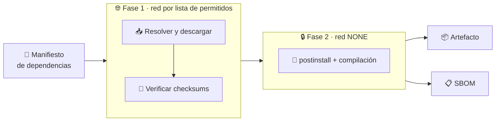
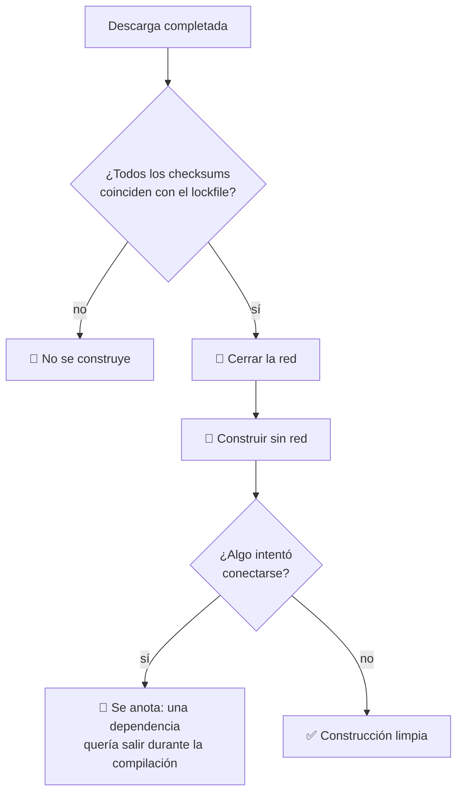

# 10 · Construcción de paquetes de terceros

> **En una frase, para cualquiera:** compilar un programa descarga y ejecuta
> código de cientos de personas que nunca verás. Este caso deja la red abierta
> mientras se descarga y **la cierra mientras se compila**.

**Estado real:** 🔴 `planned` — **no hay código todavía**

---

## Por qué se realiza este caso

Construir software moderno tiene dos fases que se suelen confundir en una:

1. **Resolver dependencias** — descargar lo que hace falta. Necesita red.
2. **Compilar** — ejecutar los scripts de construcción de todo eso. **No
   necesita red**, y sin embargo casi siempre la tiene.

Esa segunda fase ejecuta código arbitrario de cada dependencia, con tus permisos.
Si además tiene red abierta, tiene todo lo necesario para sacar lo que encuentre.

| Momento | Lo que corre | ¿Necesita red? | ¿La tiene normalmente? |
|---|---|:--:|:--:|
| Resolución | El gestor de paquetes | Sí | Sí |
| `postinstall` | Scripts de cada dependencia | No | **Sí** |
| Compilación | Compiladores y generadores | No | **Sí** |
| Empaquetado | Herramientas de empaquetado | No | **Sí** |

## La idea que enseña, y que ningún otro caso enseña

**Cerrar la red a mitad del proceso.** No es un control binario aplicado al
principio: es un control que **cambia durante la ejecución**, cuando se ha
obtenido lo necesario y ya no hay motivo legítimo para seguir conectado.

Es un control barato —el momento del cambio está perfectamente definido— y casi
nadie lo aplica.

## Casos de uso reales

- Construir una imagen de aplicación a partir de un manifiesto de dependencias.
- Compilar una biblioteca de terceros antes de incorporarla.
- Reproducir una construcción antigua para comprobar que da lo mismo.
- Generar el listado de materiales (SBOM) de lo que se está publicando.

## Cómo funcionará





Ese `¿Algo intentó conectarse?` es información valiosa por sí sola: una
dependencia que intenta salir a internet **mientras compila** es una señal, la
construcción funcione o no.

## Esquemas

### Entrada

```json
{
  "manifest": "package.json",
  "lockfile": "pnpm-lock.yaml",
  "resolveAllowlist": ["registry.npmjs.org:443"],
  "buildNetwork": "none"
}
```

### Salida

```json
{
  "outcome": "built",
  "sbom": [{ "name": "left-pad", "version": "1.3.0", "sha256": "…" }],
  "buildNetworkAttempts": [
    { "from": "postinstall de paquete-x", "host": "203.0.113.9:443", "outcome": "sin red: fallo de resolución" }
  ],
  "cacheHit": true
}
```

## Software necesario

| Componente | Para qué |
|---|---|
| **Rust** 1.75+ | El supervisor de las dos fases |
| **`bubblewrap`** 0.6+ | Jaulas distintas para cada fase |
| El **proxy de salida con lista de permitidos** | Ya construido: la red de la fase 1 |
| **pnpm** 9+ / **cargo** / el gestor que aplique | La resolución real |
| **Linux o WSL2** | Namespaces sin privilegios |

> Este proyecto usa **pnpm**, nunca `npm`, y conserva sus ficheros de bloqueo.
> Un `Cargo.lock` o un `pnpm-lock.yaml` versionado es lo que hace posible
> verificar checksums antes de cerrar la red.

## Instalación

```bash
sudo apt install bubblewrap
corepack enable pnpm
cargo build --release
```

## Procesos que se crearán

```text
sandboxctl build <proyecto>
  │
  ├─ FASE 1
  │   ├─ proxy de salida         ← lista de permitidos: solo el registro
  │   └─ bwrap → gestor de paquetes
  │
  └─ FASE 2
      └─ bwrap → scripts de construcción   ← SIN red, caché montada de solo lectura
```

Son **dos jaulas distintas**, no una que cambia. Es más simple de razonar y no
deja ninguna ventana en la que la red siga abierta por descuido.

## Tiempo de carga estimado

| Operación | Coste esperado |
|---|---|
| Fase 1 con caché caliente | segundos |
| Fase 1 sin caché | lo que tarde la descarga |
| Cambio de fase | 5–15 ms: es arrancar la segunda jaula |
| Fase 2 | lo que tarde el compilador |

## Qué hace falta para construirlo

1. Orquestación de las dos fases con jaulas separadas.
2. Verificación de checksums contra el fichero de bloqueo antes de cerrar la red.
3. Caché compartida montada de solo lectura en la fase 2.
4. Generación de SBOM a partir de lo resuelto.
5. Registro de intentos de red durante la compilación.

---

**Ver también:** [Catálogo completo](../CATALOGO.md) · [Caso 15 · cadena de suministro](15-instalacion-de-cadena-de-suministro.md) · [Caso 09 · CI](09-runner-de-ci-con-pull-request-externo.md)
