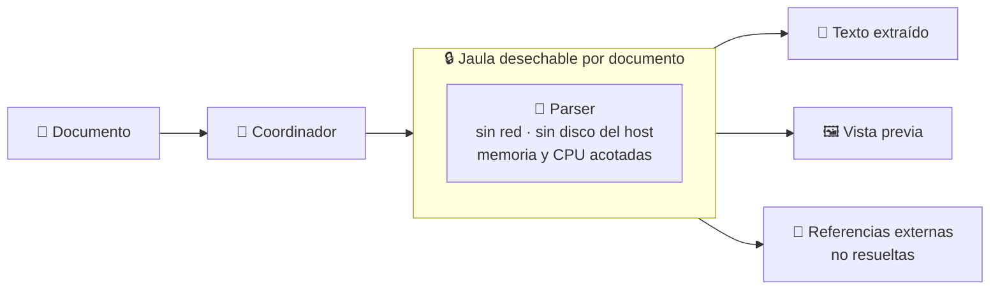
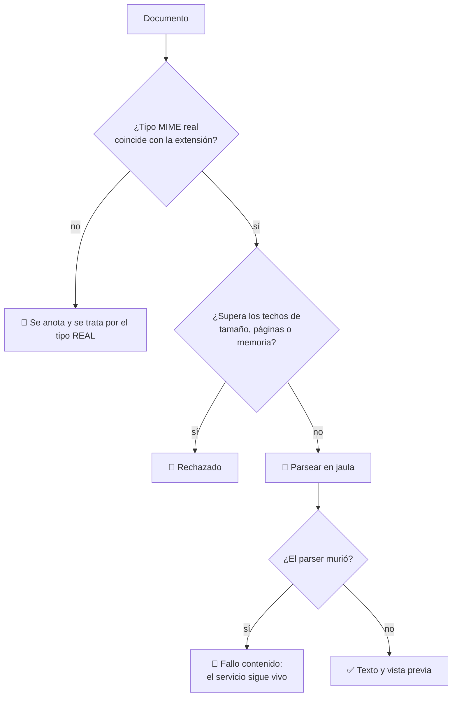

# 11 · Renderizado de documentos

> **En una frase, para cualquiera:** abrir un PDF que te mandaron es entregarle
> un fichero muy complicado a un programa muy antiguo. Ese programa lleva
> décadas siendo la forma favorita de entrar en los ordenadores ajenos.

**Estado real:** 🔴 `planned` — **no hay código todavía**

---

## Por qué se realiza este caso

Un PDF no es una hoja de papel: es **un formato con lenguaje propio**, tipografías
embebidas, imágenes comprimidas de seis maneras distintas y, en muchos lectores,
JavaScript. Los programas que lo interpretan están escritos en C por razones de
rendimiento, y llevan treinta años acumulando esquinas.

Lo mismo vale para los documentos ofimáticos, las imágenes y las tipografías.

| El fichero trae | Lo que puede provocar |
|---|---|
| Una imagen con dimensiones absurdas | Reserva de memoria descontrolada |
| Una tipografía manipulada | Un fallo de memoria en el intérprete de fuentes |
| Un objeto que se referencia a sí mismo | Un bucle infinito en el parser |
| Una referencia a un fichero externo | Que el lector abra algo tuyo |
| Metadatos con rutas | Escritura fuera del destino previsto |
| Un documento de 4 KB que ocupa 4 GB al descomprimir | Agotar la memoria |

**El documento no tiene que parecer malicioso.** Basta con que el parser tenga un
fallo, y los tiene.

## La idea que enseña, y que ningún otro caso enseña

**Aislar el parser, no el fichero.** En los demás casos lo desconocido es el
código; aquí el código es **tuyo** —una biblioteca conocida y respetable— y lo
desconocido son los datos. La conclusión incómoda es que hay que aislar tu propio
software, porque el fallo va a estar ahí.

## Casos de uso reales

- Un portal que genera vistas previas de los documentos que suben los usuarios.
- Un gestor documental que extrae texto para poder buscarlo.
- Un sistema de facturación que lee facturas en PDF de proveedores.
- Una plataforma que convierte formatos ofimáticos.
- Un correo que muestra el adjunto sin descargarlo.

## Cómo funcionará





## Esquemas

### Entrada

El documento en crudo, más los techos aplicables:

```json
{ "maxBytes": 26214400, "maxPages": 500, "memoryLimitMb": 256, "timeoutSeconds": 30 }
```

### Salida

```json
{
  "detectedType": "application/pdf",
  "declaredType": "image/png",
  "pages": 12,
  "text": "…",
  "previewPng": "base64…",
  "externalReferences": [
    { "target": "file:///etc/passwd", "outcome": "no resuelta: el parser no tiene disco" }
  ],
  "parserCrashed": false,
  "resources": { "peakMemoryMb": 84, "elapsedMs": 1240 }
}
```

`detectedType` frente a `declaredType` es el primer dato útil: un fichero que
dice ser una imagen y es un PDF ya merece atención antes de abrirlo.

## Software necesario

| Componente | Para qué | ¿Obligatorio? |
|---|---|---|
| **Rust** 1.75+ | El coordinador y los límites | Sí |
| **`bubblewrap`** 0.6+ | La jaula por documento | Sí |
| **`systemd`** modo usuario | `memory.max` es **el** control aquí | Muy recomendado |
| Una biblioteca de parseo (`pdfium`, `poppler`, `libvips`…) | Interpretar el formato | Sí |
| **Linux o WSL2** | Namespaces sin privilegios | Sí |

## Instalación

```bash
sudo apt install bubblewrap poppler-utils libvips-tools
cargo build --release
cargo run -p sandboxctl -- doctor   # comprueba que hay cgroups para memory.max
```

Si `doctor` dice que no hay cgroups, este caso **debería negarse a ejecutar** con
política estricta: sin techo de memoria, una imagen de dimensiones absurdas se
lleva por delante el equipo, y prometer un control que no se aplica está
prohibido por la regla central del proyecto.

## Procesos que se crearán

```text
sandboxctl render <documento>
  │
  └─ systemd --user scope      ← memory.max: el control que importa
      └─ bwrap                 ← sin red, sin disco del host, sin dispositivos
          └─ el parser         ← uno por documento, desechable
```

Un parser por documento, y desechable. Si revienta con el documento número
cuarenta, los treinta y nueve anteriores ya terminaron y el cuarenta y uno
arranca limpio.

## Tiempo de carga estimado

| Operación | Coste esperado |
|---|---|
| Arranque de la jaula | 5–15 ms |
| Envoltura en cgroup | 30–80 ms |
| PDF de pocas páginas | 100–500 ms |
| Documento grande | segundos, con techo por política |
| Muerte por `memory.max` | inmediata al alcanzar el techo |

## Qué hace falta para construirlo

1. Detección de tipo MIME real, por contenido y no por extensión.
2. Adaptador para al menos un parser de PDF y uno de imagen.
3. Techos de memoria y CPU obligatorios bajo política estricta.
4. Registro de referencias externas no resueltas.
5. Un corpus de documentos sintéticos hostiles: bomba de descompresión,
   referencia externa, tipografía manipulada, anidamiento profundo.

---

**Ver también:** [Catálogo completo](../CATALOGO.md) · [Caso 01 · contenido no confiable](01-contenido-web-no-confiable.md) · [Caso 03 · archivos comprimidos](03-procesamiento-seguro-de-archivos.md)
