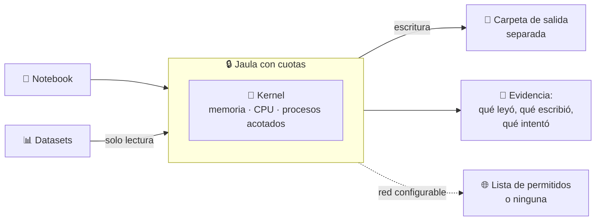
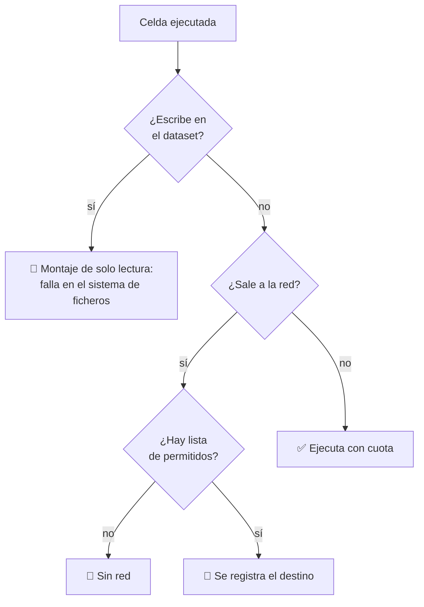

# 12 · Notebooks de ciencia de datos

> **En una frase, para cualquiera:** un cuaderno de análisis es un programa que
> se ejecuta trozo a trozo, con acceso a los datos de verdad, y que a menudo lo
> ejecuta alguien que no lo escribió.

**Estado real:** 🟡 `building` — hay código y **6 comprobaciones automáticas**, sin levantarse bajo `bwrap` en CI · **Carpeta:** [`cases/12-notebook-sandbox/`](../../cases/12-notebook-sandbox) · **Puerto:** `8812`

---

## Por qué se realiza este caso

Un notebook parece un documento y es **código arbitrario**. Se comparte por
correo, se copia de internet, se hereda de quien se fue del equipo. Y se ejecuta
sobre los datos reales, que suelen ser lo más sensible que tiene la
organización.

| Lo que pasa habitualmente | Consecuencia |
|---|---|
| El notebook escribe sobre el dataset de origen | Se corrompen los datos para todo el mundo |
| Una celda hace una petición a internet | Los datos salen sin que nadie lo decidiera |
| Se instala una dependencia desde la celda | Código nuevo, sin revisión, con acceso a todo |
| El notebook consume toda la memoria | El servidor compartido se cae para los demás |
| Los resultados se mezclan con los datos de entrada | Nadie sabe qué es original y qué es derivado |

## La idea que enseña, y que ningún otro caso enseña

**Datos de entrada de solo lectura, salida en otro sitio.** Es un control que no
aparece en ningún otro caso porque en los demás lo desconocido es el programa;
aquí lo valioso son los datos, y protegerlos consiste en que **el análisis no
pueda modificar aquello que analiza**.

Con un efecto secundario que la gente agradece más que la seguridad: se vuelve
imposible «arruinar el dataset sin querer».

## Casos de uso reales

- Un equipo de análisis que comparte notebooks sobre los mismos datos.
- Formación con datos reales anonimizados.
- Un notebook heredado que hay que ejecutar para entender qué hacía.
- Reproducir un análisis publicado.
- Un concurso de modelos donde cada participante ejecuta su código.

## Cómo funcionará





## Esquemas

### Configuración de la sesión

```json
{
  "notebook": "analisis.ipynb",
  "datasets": [{ "path": "datos/ventas.parquet", "mode": "ro" }],
  "output": { "path": "salida/", "maxBytes": 1073741824 },
  "network": "none",
  "limits": { "memoryMb": 4096, "cpuQuota": "200%", "pids": 64, "timeoutSeconds": 3600 },
  "gpu": false
}
```

### Acta de la sesión

```json
{
  "cellsExecuted": 42,
  "datasetsRead": ["datos/ventas.parquet"],
  "writeAttemptsOnReadOnly": [{ "path": "datos/ventas.parquet", "outcome": "solo lectura" }],
  "outputsProduced": ["salida/informe.png"],
  "peakMemoryMb": 2810,
  "networkAttempts": []
}
```

## Software necesario

| Componente | Para qué | ¿Obligatorio? |
|---|---|---|
| **Python** 3.11+ con Jupyter | El kernel | Sí |
| **Rust** 1.75+ | El supervisor y las cuotas | Sí |
| **`bubblewrap`** 0.6+ | Montajes de solo lectura y separación de salida | Sí |
| **`systemd`** modo usuario | `memory.max`, `cpu.max`, `pids.max` | Sí: sin cuotas, este caso no tiene sentido |
| **GPU + contenedor con drivers** | Opcional, para cargas que la necesiten | No |
| **Linux o WSL2** | Namespaces sin privilegios | Sí |

## Instalación

```bash
sudo apt install bubblewrap python3 python3-pip
pip install jupyter
cargo build --release
cargo run -p sandboxctl -- doctor
```

## Procesos que se crearán

```text
sandboxctl notebook run analisis.ipynb
  │
  ├─ systemd --user scope        ← memory.max, cpu.max, pids.max
  │   └─ bwrap                   ← datasets ro, salida rw, red según política
  │       └─ jupyter kernel
  │           └─ los procesos que lance el notebook (acotados por pids.max)
  │
  └─ sandboxctl service forward  ← solo si se quiere interfaz web
```

`pids.max` importa más de lo que parece: un notebook que hace paralelismo puede
lanzar un proceso por núcleo por celda, y sin techo eso se convierte en una bomba
de procesos sin ninguna mala intención.

## Tiempo de carga estimado

| Operación | Coste esperado |
|---|---|
| Arranque del kernel de Jupyter | 1–3 s |
| Arranque de la jaula | 5–15 ms |
| Envoltura en cgroup | 30–80 ms |
| Montar datasets de solo lectura | < 10 ms |
| Ejecución de una celda | lo que tarde, con techo global |

## Qué hace falta para construirlo

1. Montajes de solo lectura por dataset, declarados en la configuración.
2. Carpeta de salida separada, con cuota de tamaño.
3. Cuotas obligatorias de memoria, CPU y procesos.
4. Registro de intentos de escritura sobre datos de solo lectura.
5. Limpieza garantizada al terminar la sesión.

## Si algo falla

El caso **ya tiene código**: el núcleo en `core.py` y el servicio en `app.py`.
Lo que sigue son sus fallos, la causa y la salida:

| Situación | Causa | Cómo se resuelve |
|---|---|---|
| Una celda falla al escribir en el dataset | El montaje es de solo lectura | Es el control central del caso. Escribir en la carpeta de salida declarada. **Nunca montar el dataset como escribible «solo esta vez»** |
| El kernel muere a mitad de la sesión | Se alcanzó `memory.max` | Subir `limits.memoryMb`, o procesar por lotes. La evidencia guarda `peakMemoryMb`, que dice cuánto hacía falta de verdad |
| `Cannot allocate memory` al paralelizar | Se alcanzó `pids.max` | Subir `limits.pids`. Un notebook que lanza un proceso por núcleo y por celda agota el techo sin ninguna mala intención |
| Una celda no puede instalar un paquete | `network: none` | 1. Declarar las dependencias en la imagen del kernel. 2. Si hace falta, `network` con lista de permitidos, y queda registrado qué se descargó |
| La salida no aparece al terminar | Se escribió fuera de la carpeta declarada y desapareció con la sesión | Escribir en `output.path`. La limpieza al terminar es parte del caso, no un efecto secundario |
| La cuota de salida se agota | `output.maxBytes` | Subirla, o revisar si el notebook está escribiendo intermedios que no necesita conservar |

Los fallos que afectan a **cualquier** caso —no se puede crear el sandbox, no hay
cgroups, un puerto ocupado, procesos huérfanos, la compilación en Windows— están
resueltos uno a uno en **[Cuando algo falla](../SOLUCION-DE-PROBLEMAS.md)**.

## Cómo se comprueba

```bash
node scripts/verify-cases.mjs
```

Llama al núcleo del caso con situaciones concretas y comprueba **qué hizo con
ellas**, no cómo está escrito. Son 6 comprobaciones, y corren en cada
commit.

```bash
cargo run -p sandboxctl -- service up notebook-sandbox
```

Levanta el caso como producto en `127.0.0.1:8812`. `POST /api/run` acepta el
cuerpo que describen los esquemas de arriba.

> **Sigue en `building`, no en `functional`.** El núcleo se comprueba, pero el
> servicio **no se levanta bajo `bwrap` dentro de CI** y el caso no emite
> evidencia firmada. La regla completa está en el [ROADMAP](../../ROADMAP.md).

---

**Ver también:** [Catálogo completo](../CATALOGO.md) · [Referencia de políticas](../POLICY_REFERENCE.md) · [Caso 02 · código generado](02-codigo-generado-por-ia.md)
