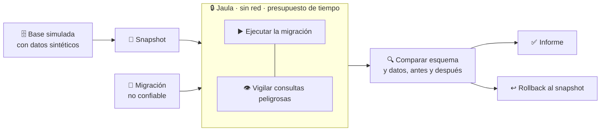
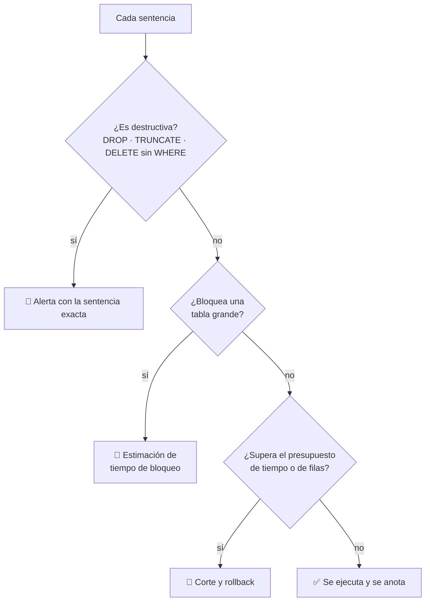

# 13 · Migraciones de base de datos

> **En una frase, para cualquiera:** una migración es un programa que cambia la
> forma de tus datos. Se ejecuta una vez, en producción, y si sale mal los datos
> anteriores ya no existen.

**Estado real:** 🟡 `building` — hay código y **6 comprobaciones automáticas**, sin levantarse bajo `bwrap` en CI · **Carpeta:** [`cases/13-db-migration/`](../../cases/13-db-migration) · **Puerto:** `8813`

---

## Por qué se realiza este caso

Casi todo el software se puede probar ejecutándolo otra vez. Una migración no:
**se ejecuta una vez sobre datos que solo existen una vez**. Y llega escrita por
alguien que no conoce el estado real de la base, a menudo generada por una
herramienta.

| Lo que puede hacer una migración | Consecuencia |
|---|---|
| `DROP COLUMN` en una tabla con datos | La columna y su contenido desaparecen |
| Un `UPDATE` sin `WHERE` | Toda la tabla toma el mismo valor |
| Bloquear una tabla grande durante la escritura | El servicio se detiene mientras dura |
| Cambiar un tipo de dato | Truncamiento silencioso de lo que no cabe |
| Añadir una restricción sobre datos que no la cumplen | Falla a medias, dejando el esquema inconsistente |
| Tardar cuatro horas | Nadie lo sabía hasta que empezó |

## La idea que enseña, y que ningún otro caso enseña

**Snapshot y rollback como control de aislamiento.** En los demás casos el
aislamiento impide que algo salga; aquí impide que algo **quede**. La migración
se ejecuta de verdad, contra datos de verdad —copiados—, y si el resultado no
convence, el estado vuelve atrás como si no hubiera pasado.

Y con un producto que no es el «funcionó» o «falló»: **la comparación de esquema
y de datos antes y después**. Eso es lo que permite decidir con conocimiento en
lugar de con fe.

## Casos de uso reales

- Probar la migración de una nueva versión antes de desplegarla.
- Revisar una migración escrita por otra persona o generada por una herramienta.
- Estimar cuánto tardará y cuánto bloqueará antes de la ventana de mantenimiento.
- Reproducir una migración que falló, para entender por qué.

## Cómo funcionará





## Esquemas

### Entrada

```json
{
  "migration": "0042_add_index.sql",
  "snapshot": "base-antes",
  "budget": { "seconds": 300, "rowsTouched": 5000000 },
  "failOn": ["destructive-without-confirmation", "budget-exceeded"]
}
```

### Salida

```json
{
  "outcome": "rolled-back",
  "statements": [
    { "sql": "ALTER TABLE ventas ADD COLUMN …", "ms": 120, "rows": 0, "risk": "bajo" },
    { "sql": "UPDATE ventas SET estado = 'x'", "ms": 41200, "rows": 4800000, "risk": "alto: UPDATE sin WHERE" }
  ],
  "schemaDiff": { "added": ["ventas.estado"], "removed": [], "changed": [] },
  "dataDiff": { "rowsChanged": 4800000 },
  "budgetExceeded": false,
  "restoredFromSnapshot": true
}
```

## Software necesario

| Componente | Para qué | ¿Obligatorio? |
|---|---|---|
| **Rust** 1.75+ | El supervisor, el presupuesto y la comparación | Sí |
| Un motor de base de datos **embebido o efímero** (SQLite, PostgreSQL en carpeta temporal) | La base simulada | Sí |
| **`bubblewrap`** 0.6+ | La jaula: la migración no debe tener red | Sí |
| **Linux o WSL2** | Namespaces sin privilegios | Sí |

> Los datos son **sintéticos**. El proyecto no usa datos personales reales en
> ningún sitio, tampoco como datos de prueba.

## Instalación

```bash
sudo apt install bubblewrap sqlite3
cargo build --release
```

## Procesos que se crearán

```text
sandboxctl migrate <fichero.sql>
  │
  ├─ preparar snapshot          ← copia de la base sintética
  │
  ├─ systemd --user scope
  │   └─ bwrap                  ← sin red; solo ve la copia, nunca el original
  │       └─ motor de base de datos + la migración
  │
  └─ comparador de esquema      ← fuera de la jaula, sobre las dos copias
```

El comparador vive fuera a propósito: si la migración pudiera alcanzarlo, podría
alterar su propio informe.

## Tiempo de carga estimado

| Operación | Coste esperado |
|---|---|
| Crear el snapshot | proporcional al tamaño de la base sintética |
| Arranque de la jaula | 5–15 ms |
| Ejecución de la migración | lo que tarde, con presupuesto |
| Comparación de esquema | < 1 s en bases de prueba |
| Rollback | restaurar el snapshot: casi inmediato en bases pequeñas |

## Qué hace falta para construirlo

1. Base sintética con datos generados, reproducible por semilla.
2. Snapshot y restauración.
3. Detección de sentencias peligrosas antes de ejecutarlas.
4. Presupuesto por tiempo y por filas tocadas.
5. Comparación de esquema y de datos, antes y después.

## Si algo falla

El caso **ya tiene código**: el núcleo en `core.py` y el servicio en `app.py`.
Lo que sigue son sus fallos, la causa y la salida:

| Situación | Causa | Cómo se resuelve |
|---|---|---|
| La migración excede el presupuesto y hace rollback | Toca más filas o tarda más de lo permitido | Es el resultado útil: ahora sabes cuánto tarda **antes** de la ventana de mantenimiento. Subir `budget` para medir el coste real, o partir la migración |
| `destructive-without-confirmation` | Hay un `DROP`, un `TRUNCATE` o un `DELETE` sin `WHERE` | Se para y se muestra la sentencia exacta. Si es intencionada, confirmarla explícitamente. **Quitar la comprobación deja el caso sin sentido** |
| El rollback no restaura el estado | El snapshot se tomó mal o el motor no lo soporta | Se comprueba comparando esquema y datos contra el snapshot antes de dar el rollback por bueno. Si no coincide, se declara fallido en vez de suponerlo |
| El `schemaDiff` sale vacío pero la migración hizo algo | Solo cambiaron datos, no el esquema | Mirar `dataDiff.rowsChanged`. Son dos comparaciones distintas a propósito |
| La base simulada no se parece a la real | Los datos sintéticos no reproducen el volumen | Generar con la misma semilla y un volumen comparable: una migración que tarda 200 ms sobre mil filas puede tardar horas sobre diez millones |

Los fallos que afectan a **cualquier** caso —no se puede crear el sandbox, no hay
cgroups, un puerto ocupado, procesos huérfanos, la compilación en Windows— están
resueltos uno a uno en **[Cuando algo falla](../SOLUCION-DE-PROBLEMAS.md)**.

## Cómo se comprueba

```bash
node scripts/verify-cases.mjs
```

Llama al núcleo del caso con situaciones concretas y comprueba **qué hizo con
ellas**, no cómo está escrito. Son 6 comprobaciones, y corren en cada
commit.

```bash
cargo run -p sandboxctl -- service up db-migration
```

Levanta el caso como producto en `127.0.0.1:8813`. `POST /api/run` acepta el
cuerpo que describen los esquemas de arriba.

> **Sigue en `building`, no en `functional`.** El núcleo se comprueba, pero el
> servicio **no se levanta bajo `bwrap` dentro de CI** y el caso no emite
> evidencia firmada. La regla completa está en el [ROADMAP](../../ROADMAP.md).

---

**Ver también:** [Catálogo completo](../CATALOGO.md) · [Caso 07 · determinismo](07-runtime-determinista-de-contratos.md) · [CM-14 · resiliencia operacional](cm-14-resiliencia-operacional.md)
