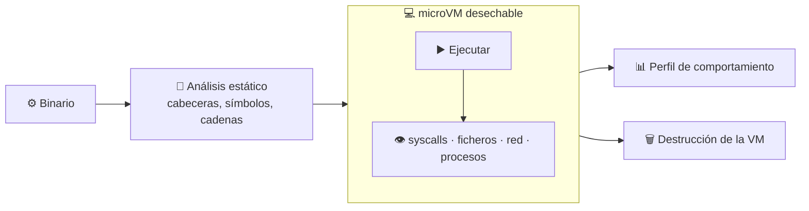

# 14 · Análisis de binarios de terceros

> **En una frase, para cualquiera:** un programa compilado no se puede leer. La
> única forma de saber qué hace es ejecutarlo y mirar — en una máquina que no te
> importe perder.

**Estado real:** 🟡 `building` — hay código y **6 comprobaciones automáticas**, sin levantarse bajo `bwrap` en CI · **Carpeta:** [`cases/14-binary-analysis/`](../../cases/14-binary-analysis) · **Puerto:** `8814`

---

## Por qué se realiza este caso

Con código fuente puedes leer antes de ejecutar. Con un binario no: es un
fichero de instrucciones de máquina. Puedes analizarlo estáticamente, y quien lo
escribió puede haberlo previsto —empaquetado, cifrado, con código que se genera
al vuelo.

Y a la vez, ejecutar binarios de terceros es completamente normal:

| Situación cotidiana | Qué se ejecuta sin poder leerlo |
|---|---|
| Un instalador descargado | Un binario con permisos de instalación |
| Un driver o una utilidad de fabricante | Código con acceso privilegiado |
| Un juego o una aplicación de escritorio | Cientos de megas de binario |
| Una herramienta de línea de comandos de un repositorio | Con tus permisos, sin revisión |

## La idea que enseña, y que ningún otro caso enseña

**Análisis dinámico con destrucción garantizada.** No se trata de impedir que el
binario actúe —entonces no se aprendería nada—, sino de dejarlo actuar en un
sitio donde **actuar no tiene consecuencias**, y quedarse con el registro.

Comparte frontera con el [caso 06](06-detonacion-en-microvm.md), pero la pregunta
es otra: allí se observa una **muestra sospechosa**, aquí se caracteriza un
**programa que probablemente quieras usar**. El resultado no es «peligroso o no»,
es «esto es lo que hace».

> [!WARNING]
> Las muestras del repositorio son **sintéticas e inofensivas**. Para binarios
> reales de origen dudoso: una máquina dedicada, desconectada y desechable, nunca
> el equipo de trabajo.

## Casos de uso reales

- Caracterizar una herramienta antes de aprobarla para toda la empresa.
- Saber a qué se conecta un programa que no documenta su red.
- Comprobar qué ficheros toca un instalador.
- Verificar que un binario reproducible hace lo mismo que su fuente.

## Cómo funcionará



## Esquemas

### Salida — el perfil

```json
{
  "static": {
    "format": "ELF x86-64",
    "linkedLibraries": ["libc.so.6", "libssl.so.3"],
    "suspiciousStrings": ["/etc/shadow"]
  },
  "dynamic": {
    "syscalls": { "openat": 240, "connect": 3, "execve": 1 },
    "filesRead": ["/etc/hosts"],
    "filesWritten": ["~/.config/app/config.toml"],
    "networkAttempts": [{ "host": "203.0.113.4:443", "outcome": "simulada, no salió" }],
    "processesSpawned": ["sh -c uname -a"]
  },
  "vmDestroyed": true
}
```

Los tres datos que más valen: **a qué se conecta**, **qué escribe fuera de su
carpeta** y **qué otros programas lanza**.

## Software necesario

| Componente | Para qué | ¿Obligatorio? |
|---|---|---|
| **KVM** | Virtualización por hardware | Sí |
| **Firecracker** o **Kata Containers** | La microVM desechable | Sí |
| **`strace`** / **eBPF** | Registro de llamadas al sistema dentro del invitado | Sí |
| Herramientas de análisis estático (`readelf`, `strings`) | La primera pasada, sin ejecutar | Recomendado |
| **Rust** 1.75+ | El supervisor y el perfil | Sí |
| **Linux** | WSL2 no expone KVM anidado por defecto | Sí |

## Instalación

```bash
ls /dev/kvm                    # si no existe, este caso no puede correr aquí
sudo apt install firecracker binutils
cargo build --release
cargo run -p sandboxctl -- doctor
```

## Procesos que se crearán

```text
sandboxctl analyze <binario>
  │
  ├─ análisis estático        ← sin ejecutar nada
  │
  ├─ jailer
  │   └─ firecracker
  │       └─ [kernel invitado]
  │           ├─ el binario
  │           └─ trazador de syscalls
  │
  └─ colector                 ← fuera de la VM
```

## Tiempo de carga estimado

| Operación | Coste esperado |
|---|---|
| Análisis estático | 50–500 ms |
| Arranque de la microVM | 100–200 ms |
| Ejecución observada | lo que dure, con techo |
| Destrucción de la VM | < 50 ms |

## Qué hace falta para construirlo

1. Reutilizar el adaptador de microVM del [caso 06](06-detonacion-en-microvm.md).
2. Análisis estático de cabeceras, bibliotecas enlazadas y cadenas.
3. Trazado de llamadas al sistema dentro del invitado.
4. Red simulada que registre destinos sin dejar salir tráfico.
5. Perfil comparable entre ejecuciones, para detectar cambios entre versiones.

## Si algo falla

El caso **ya tiene código**: el núcleo en `core.py` y el servicio en `app.py`.
Lo que sigue son sus fallos, la causa y la salida:

| Situación | Causa | Cómo se resuelve |
|---|---|---|
| `/dev/kvm` no existe | Igual que en el [caso 06](06-detonacion-en-microvm.md): sin virtualización por hardware no hay microVM | Activar la virtualización anidada, o ejecutar el caso en una máquina Linux con KVM. `doctor` lo dice antes de intentarlo |
| El binario no arranca dentro de la VM | Falta una biblioteca en el rootfs | `static.linkedLibraries` dice cuáles necesita. Se añaden al rootfs, que se genera de forma reproducible |
| No se registra ninguna llamada al sistema | El trazador no arrancó, o el binario terminó antes | 1. Comprobar que el trazador está en el rootfs. 2. Un binario que termina de inmediato es un dato: aparece en `syscalls.execve` y poco más |
| El perfil cambia entre dos ejecuciones del mismo binario | Puede ser legítimo —el binario usa el reloj o la red— o deliberado | Comparar los dos perfiles: un binario que se comporta distinto cuando cree que lo observan es exactamente lo que interesa detectar |
| La VM no se destruye | El peor fallo posible de este caso | La destrucción va en el camino de salida pase lo que pase, y hay barrido de huérfanas |

Los fallos que afectan a **cualquier** caso —no se puede crear el sandbox, no hay
cgroups, un puerto ocupado, procesos huérfanos, la compilación en Windows— están
resueltos uno a uno en **[Cuando algo falla](../SOLUCION-DE-PROBLEMAS.md)**.

## Cómo se comprueba

```bash
node scripts/verify-cases.mjs
```

Llama al núcleo del caso con situaciones concretas y comprueba **qué hizo con
ellas**, no cómo está escrito. Son 6 comprobaciones, y corren en cada
commit.

```bash
cargo run -p sandboxctl -- service up binary-analysis
```

Levanta el caso como producto en `127.0.0.1:8814`. `POST /api/run` acepta el
cuerpo que describen los esquemas de arriba.

> **Sigue en `building`, no en `functional`.** El núcleo se comprueba, pero el
> servicio **no se levanta bajo `bwrap` dentro de CI** y el caso no emite
> evidencia firmada. La regla completa está en el [ROADMAP](../../ROADMAP.md).

---

**Ver también:** [Catálogo completo](../CATALOGO.md) · [Caso 06 · detonación](06-detonacion-en-microvm.md) · [Caso 15 · cadena de suministro](15-instalacion-de-cadena-de-suministro.md)
