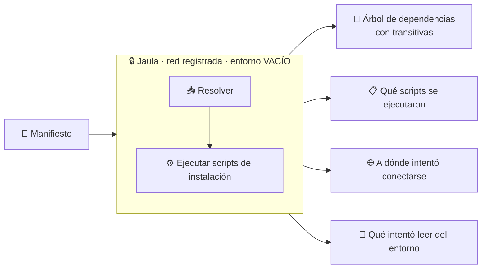
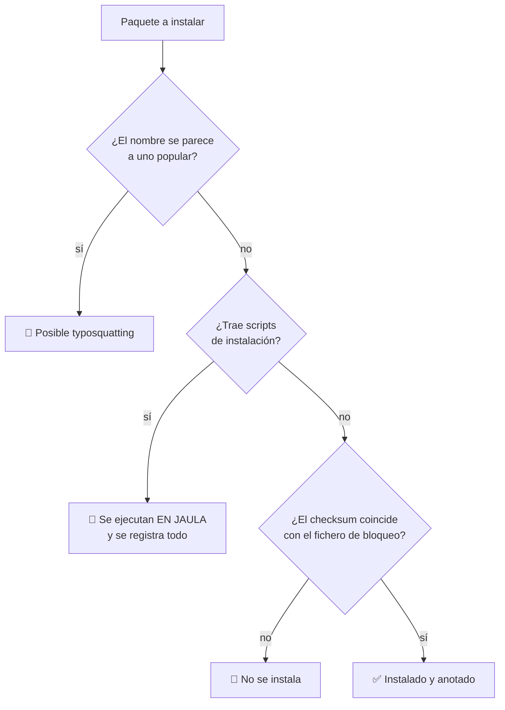

# 15 · Instalación de cadena de suministro

> **En una frase, para cualquiera:** instalar una biblioteca descarga y ejecuta
> código de cientos de personas que nunca verás, **antes de que hayas escrito una
> sola línea**. Este caso enseña qué ocurre exactamente en ese momento.

**Estado real:** 🔴 `planned` — **no hay código todavía**

---

## Por qué se realiza este caso

Instalar una dependencia no es copiar ficheros. En la mayoría de ecosistemas
**ejecuta scripts**: `postinstall`, `preinstall`, `build.rs`. Con tus permisos.
Antes de que nadie mire el código.

Y no instalas una biblioteca: instalas su árbol entero. Un paquete con cinco
dependencias directas puede arrastrar cuatrocientas transitivas, mantenidas por
gente que no se conoce entre sí.

| Vector | Cómo funciona |
|---|---|
| **Typosquatting** | Un paquete llamado casi igual que el que querías |
| **`postinstall` malicioso** | Se ejecuta al instalar, lee variables de entorno y las envía |
| **Toma de una cuenta de mantenedor** | El paquete de siempre, versión nueva, dueño distinto |
| **Dependencia transitiva** | El paquete honesto arrastra uno que no lo es |
| **Confusión de dependencias** | Un paquete público con el nombre de uno interno |
| **Versión inmutable que cambia** | Lo que descargas hoy no es lo que descargaste ayer |

## La idea que enseña, y que ningún otro caso enseña

**El momento de la instalación es una ejecución de código no confiable**, y casi
nadie lo trata como tal. Este caso lo hace visible: instala en una jaula, con la
red registrada, y entrega un informe de **qué se ejecutó, qué leyó y a dónde
intentó conectarse durante la instalación**.

## Casos de uso reales

- Revisar una dependencia nueva antes de añadirla al proyecto.
- Auditar qué ocurre al instalar el árbol completo de un proyecto existente.
- Formación: enseñar por qué `install` no es una operación inocente.
- Comprobar si una versión nueva de una dependencia cambió de comportamiento.

## Cómo funcionará





## Esquemas

### Salida — el informe de instalación

```json
{
  "direct": 5,
  "transitive": 412,
  "packagesWithInstallScripts": [
    { "name": "paquete-x", "version": "2.1.0", "script": "postinstall", "command": "node setup.js" }
  ],
  "environmentReads": [
    { "package": "paquete-x", "variable": "NPM_TOKEN", "outcome": "entorno vacío: no había nada que leer" }
  ],
  "networkAttempts": [
    { "package": "paquete-x", "host": "203.0.113.5:443", "outcome": "bloqueado por lista de permitidos" }
  ],
  "typosquattingSuspects": [{ "name": "reqeusts", "similarTo": "requests", "distance": 2 }],
  "checksumMismatches": []
}
```

`environmentReads` con `outcome: "entorno vacío"` es el punto pedagógico del
caso: el `postinstall` **hizo** el intento, y no encontró nada porque el entorno
se había vaciado entero.

## Software necesario

| Componente | Para qué | ¿Obligatorio? |
|---|---|---|
| **Rust** 1.75+ | El supervisor y el informe | Sí |
| **`bubblewrap`** 0.6+ | La jaula de instalación | Sí |
| El **proxy de salida con lista de permitidos** | Ya construido: registra cada conexión | Sí |
| **pnpm** 9+ / **cargo** / **pip** | El gestor real que se está observando | Sí |
| **Linux o WSL2** | Namespaces sin privilegios | Sí |

> **Los paquetes comprometidos de este caso son simulados**, publicados en un
> registro local del propio repositorio. No se usan paquetes maliciosos reales.

## Instalación

```bash
sudo apt install bubblewrap
corepack enable pnpm
cargo build --release
```

## Procesos que se crearán

```text
sandboxctl supply-chain install <manifiesto>
  │
  ├─ registro local simulado    ← los paquetes de ejemplo viven aquí
  ├─ proxy de salida            ← lista de permitidos + registro de intentos
  │
  └─ systemd --user scope
      └─ bwrap                  ← entorno VACÍO, disco temporal
          └─ el gestor de paquetes
              └─ los scripts postinstall de cada dependencia
```

El entorno vacío es el control central: es lo que convierte «el `postinstall` se
llevó tu token» en «el `postinstall` buscó un token y no había ninguno».

## Tiempo de carga estimado

| Operación | Coste esperado |
|---|---|
| Arranque de la jaula | 5–15 ms |
| Instalación de un árbol pequeño desde registro local | 1–5 s |
| Instalación de un árbol grande | decenas de segundos |
| Generación del informe | < 1 s |

## Qué hace falta para construirlo

1. Registro local con paquetes de ejemplo: honesto, typosquatting, `postinstall`
   curioso, dependencia transitiva comprometida.
2. Entorno vaciado y verificado antes de instalar.
3. Registro de cada intento de red durante la instalación.
4. Detección de nombres sospechosamente parecidos.
5. Verificación de checksums contra el fichero de bloqueo.

## Si algo falla

Este caso **todavía no tiene código**. Lo que sigue son los fallos que el diseño
tiene que resolver, y cómo va a resolverlos — escrito antes de la primera línea,
que es cuando sirve de algo:

| Situación | Causa | Cómo se resuelve |
|---|---|---|
| Un `postinstall` falla porque no encuentra una variable | El entorno está vacío | **Ese es el hallazgo**: aparece en `environmentReads` con `outcome: entorno vacío`. Si la variable es legítima, se declara una a una en la política, nunca heredando el entorno entero |
| La instalación falla por falta de red | La lista de permitidos no incluye el registro | Añadir el registro concreto. Todo lo demás queda registrado como intento bloqueado, que es el dato del caso |
| `checksumMismatches` no está vacío | Lo descargado no coincide con el fichero de bloqueo | **No se instala.** Puede ser una caché sucia o un paquete alterado bajo la misma versión. Investigar antes de regenerar el bloqueo |
| Un paquete legítimo sale como typosquatting | La detección por parecido de nombres tiene falsos positivos | Es una señal, no un veredicto: se revisa a mano. La lista de sospechosos incluye la distancia y el nombre parecido para poder juzgar |
| El árbol de dependencias sale más pequeño de lo esperado | La resolución usó una caché | Instalar en limpio para ver el árbol completo, incluidas las transitivas |

Los fallos que afectan a **cualquier** caso —no se puede crear el sandbox, no hay
cgroups, un puerto ocupado, procesos huérfanos, la compilación en Windows— están
resueltos uno a uno en **[Cuando algo falla](../SOLUCION-DE-PROBLEMAS.md)**.

---

**Ver también:** [Catálogo completo](../CATALOGO.md) · [Caso 10 · construcción de paquetes](10-construccion-de-paquetes.md) · [Caso 09 · CI](09-runner-de-ci-con-pull-request-externo.md)
