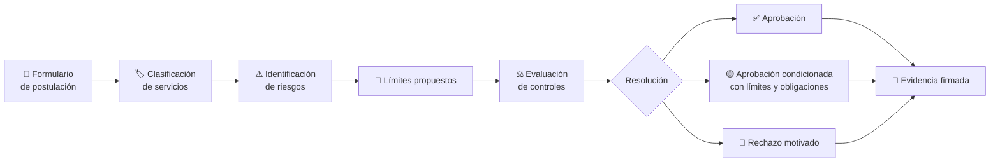
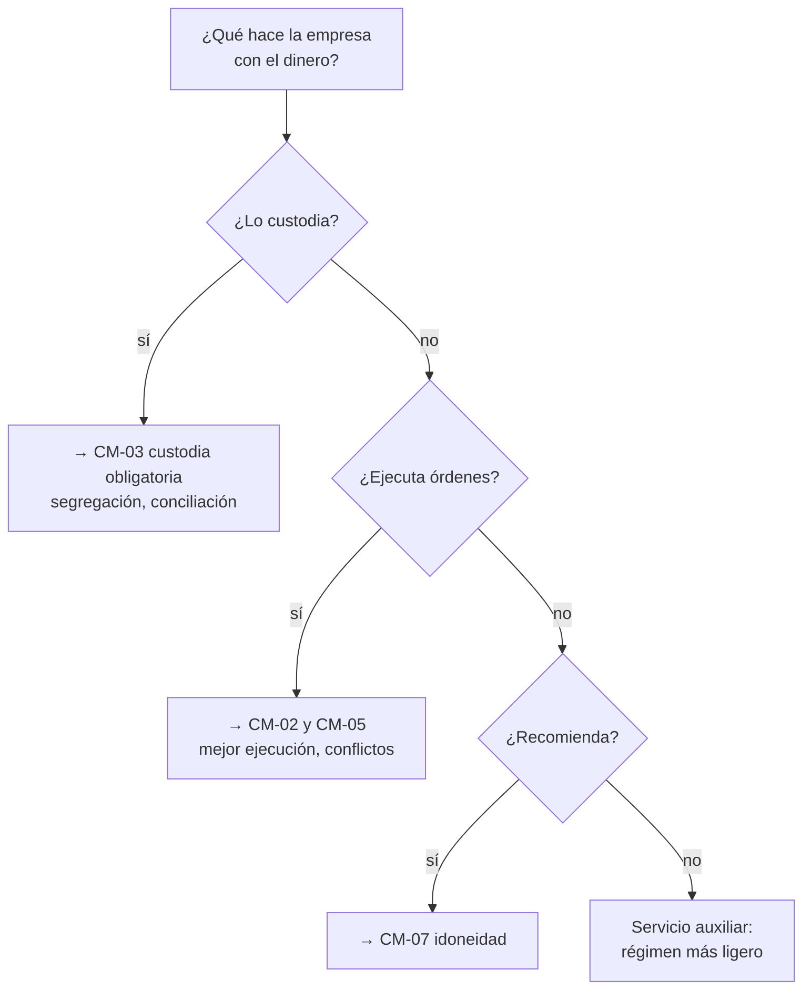

# CM-00 · Entrada al sandbox regulatorio

> **En una frase, para cualquiera:** antes de dejar que una empresa nueva maneje
> el dinero de otras personas, alguien tiene que mirar qué hace exactamente, qué
> puede salir mal y quién responde. Este caso es esa mirada, convertida en un
> procedimiento que se puede repetir.

**Estado real:** 🔴 `planned` — **no hay código todavía** · **Carpeta prevista:** `domains/capital-markets/cases/00-regulatory-entry`

> [!WARNING]
> **Sin dinero real, sin valores reales, sin credenciales reales y sin
> conectividad de producción.** Este simulador **no es una autorización
> regulatoria** de la CMF ni de ninguna otra autoridad, y nada de lo que produzca
> es una recomendación de inversión.

---

## Por qué se realiza este caso

Es **la puerta de entrada al resto de la familia**. Los otros veinte casos
prueban una actividad concreta; este decide **qué actividad es** y, por tanto,
qué reglas le aplican.

La pregunta que responde no es «¿es buena esta empresa?». Es más precisa y más
incómoda: **¿de quién es el dinero en cada momento, y qué pasa si la empresa
desaparece mañana?**

Casi todos los problemas regulatorios serios empiezan por una clasificación mal
hecha:

| Cómo se presenta | Lo que en realidad es |
|---|---|
| «Solo conectamos inversionistas con proyectos» | Intermediación, si toca el dinero |
| «Guardamos el saldo para tu comodidad» | Custodia, con todo lo que implica |
| «Recomendamos según tu perfil» | Asesoría, con deber de idoneidad |
| «Es una plataforma tecnológica» | Depende enteramente de qué hace con los fondos |

## La idea que enseña, y que ningún otro caso enseña

**Clasificar es decidir.** El resultado no es un informe: es una de tres
resoluciones —aprobación, aprobación condicionada o rechazo— **con los límites y
los controles asociados escritos**, de forma que los demás casos puedan
ejecutarse dentro de esos límites.

Una aprobación condicionada es la salida más interesante: dice «sí, pero con
tope de volumen, sin custodiar efectivo y reportando cada mes». Eso es política
como código, no una opinión.

## Casos de uso reales

- Una fintech que prepara su postulación y quiere ensayarla antes.
- Un equipo de supervisión que necesita evaluar solicitudes de forma comparable.
- Formación de analistas: mismos casos, mismos criterios, resultados contrastables.
- Un inversionista que evalúa el encaje regulatorio de una empresa.

## Cómo funcionará





## Qué debe incluir la postulación

| Bloque | Qué se pregunta | Por qué importa |
|---|---|---|
| Servicios ofrecidos | Qué hace exactamente | Determina el régimen entero |
| Beneficiarios | A quién sirve | Un inversionista no calificado exige más protección |
| Participantes | Quién más interviene | Cada uno añade un punto de fallo |
| Flujos de dinero | Por dónde pasa cada peso | **La pregunta central** |
| Instrumentos | Qué se negocia | Determina riesgo y liquidez |
| Proveedores | De quién se depende | Concentración y continuidad |
| Gobierno | Quién decide y quién responde | Sin esto no hay a quién exigir |
| Ciberseguridad | Cómo se protege | Ver la familia técnica de este mismo repositorio |
| Continuidad | Qué pasa si algo cae | CM-14 |
| Reclamos | Cómo se atiende al que pierde dinero | Lo primero que se descuida |
| **Salida ordenada** | Cómo se cierra devolviendo todo | CM-13. **Se pregunta al entrar, no al salir** |

Esa última fila es la que más sorprende y la más importante: **se exige el plan
de cierre antes de abrir**, porque quien no sabe explicar cómo devolvería el
dinero probablemente no ha separado bien de quién es.

## Esquemas

### Postulación

```json
{
  "applicant": "Fintech de ejemplo SpA",
  "jurisdiction": "CL",
  "services": ["custody", "order-routing"],
  "beneficiaries": ["retail"],
  "moneyFlows": [
    { "from": "cliente", "to": "cuenta segregada", "custodian": "banco simulado" }
  ],
  "instruments": ["acciones-simuladas"],
  "governance": { "board": true, "complianceOfficer": true },
  "windDownPlan": { "documented": true, "maxDays": 30 }
}
```

### Resolución

```json
{
  "outcome": "conditional",
  "classification": ["custody", "order-routing"],
  "risks": [
    { "id": "R-01", "risk": "mezcla de activos de clientes con los propios", "severity": "alta", "control": "CM-03 conciliación diaria" }
  ],
  "limits": { "maxClientFunds": { "minorUnits": 50000000000, "currency": "CLP" }, "maxClients": 500 },
  "obligations": ["reporte mensual CM-12", "plan de salida probado CM-13"],
  "rationale": "…",
  "notAnAuthorization": true
}
```

`notAnAuthorization: true` está en el esquema **a propósito y es obligatorio**:
ninguna salida de este simulador puede presentarse como una autorización.

## Software necesario

| Componente | Para qué | ¿Obligatorio? |
|---|---|---|
| **Rust** 1.75+ | El motor de clasificación y las reglas como código | Sí |
| **Node.js** 20+ y **pnpm** 9+ | El formulario en el panel de control | Solo para la interfaz |
| **`bubblewrap`** | **No hace falta**: no se ejecuta código no confiable | No |

Esta familia **no necesita aislamiento del sistema**: lo que se prueba son
reglas de negocio, no código ajeno. Corre en cualquier sistema con Rust,
Windows incluido.

## Instalación

```bash
cargo build --release
cargo run -p sandboxctl -- markets --help
```

## Procesos que se crearán

```text
sandboxctl markets entry --application postulacion.json
  │
  └─ un solo proceso           ← determinista, sin red, sin estado externo
      ├─ validación del esquema
      ├─ clasificación
      ├─ evaluación de controles
      └─ evidencia firmada
```

Un solo proceso y sin red **por diseño**: una evaluación regulatoria tiene que
poder reproducirse años después y dar exactamente el mismo resultado.

## Tiempo de carga estimado

| Operación | Coste esperado |
|---|---|
| Validar la postulación | < 10 ms |
| Clasificar y evaluar | < 50 ms |
| Firmar la evidencia | < 1 ms |

## Qué hace falta para construirlo

1. Esquema de postulación, validado en cada commit.
2. Motor de clasificación con reglas versionadas y con fecha de vigencia —**las
   reglas regulatorias cambian y no se codifican como verdad permanente**.
3. Catálogo de riesgos con el control que los mitiga y el caso que lo prueba.
4. Las tres resoluciones, con límites que los demás casos puedan leer.
5. Evidencia firmada de cada evaluación.

## Si algo falla

Este caso **todavía no tiene código**. Lo que sigue son los fallos que el diseño
tiene que resolver, y cómo va a resolverlos:

| Situación | Causa | Cómo se resuelve |
|---|---|---|
| La resolución sale `rejected` y el solicitante no entiende por qué | La clasificación detectó una actividad que el modelo de negocio no declaraba | El campo `rationale` cita la regla y el dato de la postulación que la activó. Se corrige la postulación o se corrige el modelo de negocio, no la regla |
| La misma postulación da resultados distintos en dos fechas | Una regla cambió de versión entre medias | Es correcto y está previsto: las reglas llevan **fecha de vigencia**. La resolución guarda qué versión la evaluó, para poder reconstruirla años después |
| El solicitante no sabe describir sus flujos de dinero | Suele significar que no ha decidido de quién es el dinero en cada momento | Es el hallazgo más útil del caso. Se responde con una aprobación condicionada que exija resolverlo antes de operar |
| Falta el plan de salida ordenada | Se pide al **entrar**, no al salir | No se aprueba sin él. Quien no sabe explicar cómo devolvería el dinero probablemente no lo ha separado bien |
| Alguien presenta la resolución como una autorización | Malentendido grave | Toda salida lleva `notAnAuthorization: true` en el esquema, y es obligatorio. Este simulador no autoriza nada |

Los fallos que afectan a **cualquier** caso —la compilación, el catálogo, la
evidencia— están resueltos uno a uno en
**[Cuando algo falla](../SOLUCION-DE-PROBLEMAS.md)**.

Esta familia **no necesita aislamiento del sistema**: no ejecuta código ajeno,
sino reglas de negocio deterministas. Por eso casi ningún fallo suyo viene del
entorno, y casi todos vienen de los datos.

---

**Ver también:** [Catálogo completo](../CATALOGO.md) · [CM-13 · salida ordenada](cm-13-salida-ordenada.md) · [CM-03 · custodia](cm-03-custodia-y-segregacion-de-activos.md)
