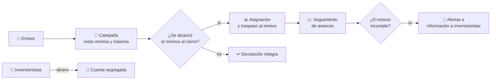
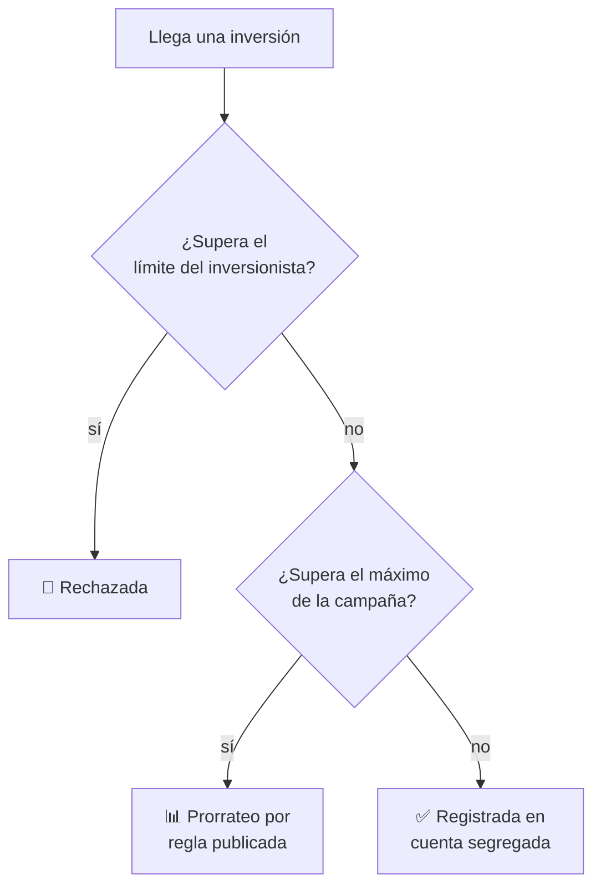

# CM-01 · Financiamiento colectivo

> **En una frase, para cualquiera:** mucha gente pone poco dinero en un proyecto
> que todavía no existe. La plataforma que junta ese dinero lo tiene en sus manos
> durante semanas, y tiene que devolverlo entero si la campaña no llega a su meta.

**Estado real:** 🟠 `prototype` — hay código y escenarios que se ejecutan, **sin verificación en un entorno real** · **Módulo:** [`crates/sandbox-markets/src/cases/crowdfunding.rs`](../../crates/sandbox-markets/src/cases/crowdfunding.rs)

> [!WARNING]
> **Dinero, emisores e inversionistas simulados.** No es una autorización
> regulatoria ni una recomendación de inversión.

---

## Por qué se realiza este caso

El financiamiento colectivo pone dinero de mucha gente poco experta en manos de
una empresa pequeña, durante un periodo en el que **el dinero ya no está en el
bolsillo del inversionista pero todavía no es del emisor**. Ese limbo es donde
ocurre casi todo lo que sale mal.

| Momento | Qué puede fallar |
|---|---|
| La campaña se publica | Información incompleta o contradictoria |
| Entra dinero | Se mezcla con el de la plataforma |
| Se supera la meta | ¿Quién entra y quién se queda fuera? |
| No se alcanza el mínimo | Hay que devolverlo **todo**, y a tiempo |
| Cambian las condiciones a mitad | Quien invirtió lo hizo con otras reglas |
| Después del cierre | El emisor deja de informar |

## La idea que enseña

**El dinero en tránsito tiene dueño.** Mientras la campaña está abierta, cada
peso sigue siendo del inversionista. La plataforma lo custodia, no lo posee. Y la
prueba de que eso es cierto es que **la devolución funciona**.

## Casos de uso reales

- Una plataforma de financiamiento colectivo de deuda o capital.
- Preventa de un producto con meta mínima.
- Financiamiento de facturas por varios inversionistas.
- Formación sobre por qué una meta mínima protege a quien invierte.

## Cómo funcionará





## Esquemas

```json
{
  "campaign": {
    "issuer": "emisor-simulado-1",
    "minTarget": { "minorUnits": 10000000, "currency": "CLP" },
    "maxTarget": { "minorUnits": 50000000, "currency": "CLP" },
    "closesAt": "2026-09-30T23:59:59Z",
    "allocationRule": "pro-rata"
  }
}
```

```json
{
  "outcome": "refunded",
  "raised": { "minorUnits": 7400000, "currency": "CLP" },
  "investorsRefunded": 118,
  "refundComplete": true,
  "ledgerBalanced": true
}
```

`ledgerBalanced` no es decorativo: se apoya en el libro de partida doble del
crate [`sandbox-markets`](../../crates/sandbox-markets), que **ya está
construido**, y significa que la devolución cuadra hasta el último peso.

## Escenarios que traerá

Información contradictoria · operación con parte relacionada · exceso de
inversión de un mismo inversionista · cambio de condiciones a mitad de campaña ·
campaña que no alcanza el mínimo · emisor que deja de reportar avances.

## Software necesario

| Componente | Para qué |
|---|---|
| **Rust** 1.75+ | Motor de campañas sobre `Money` y `Ledger` |
| **Node.js** 20+ / **pnpm** 9+ | Interfaz en el panel (opcional) |

No necesita `bubblewrap`: no se ejecuta código ajeno, se prueban reglas de
negocio. Funciona en cualquier sistema con Rust.

## Instalación

```bash
cargo build --release
cargo run -p sandboxctl -- markets --help
```

## Procesos que se crearán

```text
sandboxctl markets crowdfunding --scenario no-alcanza-minimo
  │
  └─ un proceso determinista, sin red
      ├─ reloj simulado (las campañas duran semanas)
      ├─ libro de partida doble
      └─ evidencia firmada
```

## Tiempo de carga estimado

| Operación | Coste esperado |
|---|---|
| Un escenario completo de campaña | < 100 ms |
| Simular 10 000 inversiones | < 1 s |
| Devolución íntegra y cuadre | < 50 ms |

## Qué hace falta para construirlo

1. Modelo de campaña con meta mínima, máxima y regla de asignación publicada.
2. Reloj simulado, para que semanas pasen en milisegundos.
3. Devolución íntegra verificada contra el libro contable.
4. Los seis escenarios listados arriba, cada uno con su hallazgo esperado.

## Si algo falla

El caso **ya tiene código y escenarios que se ejecutan**. Lo que sigue son sus
fallos con la causa y la salida:

| Situación | Causa | Cómo se resuelve |
|---|---|---|
| La devolución no cuadra al céntimo | Se usó coma flotante en algún punto, o hubo redondeo al prorratear | Todo el dinero son enteros en unidades mínimas. El resto del prorrateo se asigna con una regla publicada, no se pierde |
| Una campaña supera el máximo | Llegó más dinero del previsto | Se aplica `allocationRule`, publicada de antemano. Asignar por orden de llegada sin decirlo es lo que genera reclamaciones |
| Un inversionista supera su límite individual | Protección al inversionista no calificado | Se rechaza la inversión con motivo. Si el límite está mal, se cambia en la política, no en el caso |
| La campaña cierra sin alcanzar el mínimo y queda dinero sin devolver | Falló la devolución de algún inversionista | `refundComplete: false` **es un fallo de la plataforma, no del inversionista**. Se reintenta y se concilia contra el libro hasta que cuadre |
| El emisor deja de reportar avances | Incumplimiento post-cierre | Se generan alertas y se informa a quienes invirtieron. El caso no puede recuperar el dinero, pero sí dejar constancia de cuándo se supo |

Los fallos que afectan a **cualquier** caso —la compilación, el catálogo, la
evidencia— están resueltos uno a uno en
**[Cuando algo falla](../SOLUCION-DE-PROBLEMAS.md)**.

Esta familia **no necesita aislamiento del sistema**: no ejecuta código ajeno,
sino reglas de negocio deterministas. Por eso casi ningún fallo suyo viene del
entorno, y casi todos vienen de los datos.

## Cómo se comprueba

```bash
cargo run -p sandboxctl -- markets check --case CM-01
```

Ejecuta los escenarios de este caso y compara cada uno con lo que **declara de
antemano** que debe salir. Corre en cada commit: si el caso deja de detectar lo
que dice detectar, la integración continua se pone roja.

```bash
cargo test -p sandbox-markets crowdfunding
```

Los invariantes del módulo, incluidos los que ningún escenario de arriba cubre.

> **Sigue en `prototype`, no en `functional`.** Los escenarios se ejecutan y
> pasan, pero el caso **no emite evidencia firmada por ejecución** ni se ha
> usado contra datos que no sean los suyos. La regla completa está en el
> [ROADMAP](../../ROADMAP.md).

---

**Ver también:** [Catálogo completo](../CATALOGO.md) · [CM-03 · custodia](cm-03-custodia-y-segregacion-de-activos.md) · [CM-00 · entrada](cm-00-entrada-al-sandbox-regulatorio.md)
