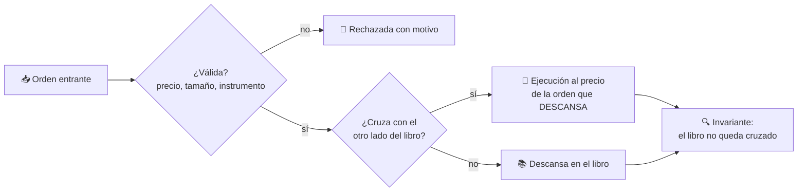
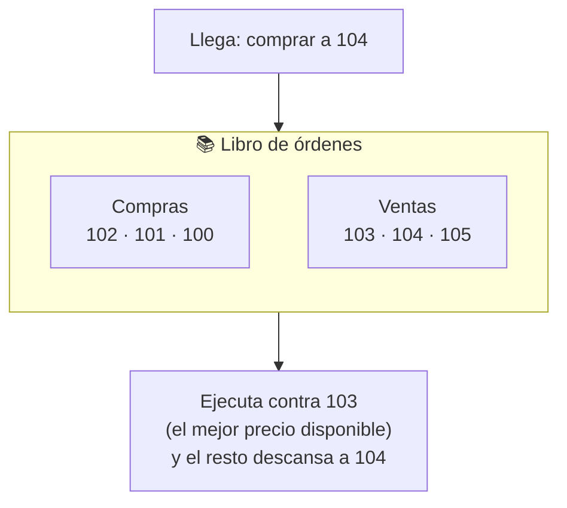

# CM-02 · Sistema alternativo de transacción

> **En una frase, para cualquiera:** un mercado es una cola con reglas. Quien
> ofrece mejor precio va delante; entre dos que ofrecen lo mismo, va delante el
> que llegó primero. Romper esa regla es la forma más simple de dar ventaja a
> alguien sin que se note.

**Estado real:** 🟠 `prototype` — hay código, faltan los escenarios · **Carpeta:** [`domains/capital-markets/cases/02-alternative-trading-system/`](../../domains/capital-markets/cases/02-alternative-trading-system)

> [!WARNING]
> **Instrumentos, órdenes y participantes simulados.** No es una autorización
> regulatoria ni una recomendación de inversión.

---

## Por qué se realiza este caso

Un libro de órdenes parece sencillo hasta que se escribe. Las reglas son pocas,
y cada una tiene una forma de romperse que no se ve desde fuera:

| Regla | Cómo se rompe sin que se note |
|---|---|
| Prioridad **precio**-tiempo | Una orden peor se ejecuta antes «por redondeo» |
| Prioridad precio-**tiempo** | El orden de llegada se pierde al reordenar internamente |
| El libro **nunca queda cruzado** | Queda una compra a 100 y una venta a 99 sin casar |
| La orden que **descansa** fija el precio | Se usa el precio de la que llega, y la diferencia se la queda alguien |
| Cancelar es inmediato | Se ejecuta una orden ya cancelada |

Ese cuarto punto es el más sutil y el más caro. Si compras a 105 y hay una venta
descansando a 100, la operación es **a 100**: el precio lo fija quien estaba
esperando. Aplicar el precio de la orden entrante mueve dinero de forma
sistemática hacia un lado.

## La idea que enseña, y que ningún otro caso enseña

**La prioridad como invariante comprobable.** No es una preferencia de diseño: es
una propiedad que se puede afirmar y verificar después de cada operación. El
libro se comprueba a sí mismo tras cada orden, y si alguna vez queda cruzado, el
motor está mal, no el mercado.

## Casos de uso reales

- Un sistema alternativo de transacción para instrumentos poco líquidos.
- El motor de casación interno de un intermediario.
- Un mercado de instrumentos tokenizados (ver [CM-08](cm-08-tokenizacion-de-instrumentos.md)).
- Formación: por qué el precio lo fija quien espera y no quien llega.

## Cómo funciona





## Esquemas

### Orden

```json
{
  "id": "ord-001",
  "instrument": "ACME-SIM",
  "side": "buy",
  "type": "limit",
  "price": { "minorUnits": 10400, "currency": "CLP" },
  "quantity": 100,
  "receivedAt": 1725000000
}
```

### Ejecución

```json
{
  "trades": [
    { "buy": "ord-001", "sell": "ord-987", "price": { "minorUnits": 10300, "currency": "CLP" }, "quantity": 60 }
  ],
  "resting": { "id": "ord-001", "remaining": 40 },
  "bookCrossed": false
}
```

Nótese el precio de la ejecución: **10300, el de la orden que descansaba**, no
10400. Ese es el invariante en acción.

## Software necesario

| Componente | Para qué | ¿Obligatorio? |
|---|---|---|
| **Rust** 1.75+ | El motor del libro y sus invariantes | Sí |
| **Node.js** 20+ / **pnpm** 9+ | Visualización de profundidad en el panel | No |

No necesita `bubblewrap` ni Linux: es lógica determinista. Corre en Windows,
macOS y Linux por igual.

## Instalación

```bash
cargo build --release
cargo test -p sandbox-markets      # ejecuta los invariantes del libro
```

## Procesos que se crean

```text
cargo test -p sandbox-markets
  │
  └─ un proceso determinista
      ├─ sin red
      ├─ sin reloj del sistema (el tiempo es un número de secuencia)
      └─ mismo resultado en cualquier máquina
```

Que el tiempo sea **un número de secuencia y no el reloj** es deliberado: el
reloj del sistema haría que la prioridad temporal dependiera de la máquina.

## Tiempo de carga

| Operación | Coste medido |
|---|---|
| `cargo test -p sandbox-markets` | < 1 s |
| Una orden procesada | microsegundos |
| Comprobación del invariante tras cada orden | microsegundos |

## Estado real y qué falta

**Construido:** `OrderBook`, `Order`, `Trade` y `OrderError` en Rust, con **11
invariantes**: prioridad precio-tiempo, precio fijado por la orden que descansa,
libro nunca cruzado, ejecución parcial, cancelación y rechazo con motivo.

**Falta para llegar a `functional`:**

- Los siete escenarios que exige el prompt maestro: volatilidad, falta de
  liquidez, precio anómalo, duplicación, latencia, órdenes fuera de banda e
  interrupción de mercado.
- Órdenes de mercado además de limitadas, y modificación además de cancelación.
- Suspensión de instrumento y cierre de sesión.
- **Reconstrucción completa**: poder reproducir la sesión entera desde el
  registro de órdenes y obtener el mismo libro.

Esa última es la que convierte el caso en auditable, y es la que decide el salto
a `functional`.

---

**Ver también:** [Catálogo completo](../CATALOGO.md) · [CM-09 · vigilancia](cm-09-vigilancia-de-abuso-de-mercado.md) · [CM-04 · enrutamiento](cm-04-enrutamiento-inteligente-de-ordenes.md)
