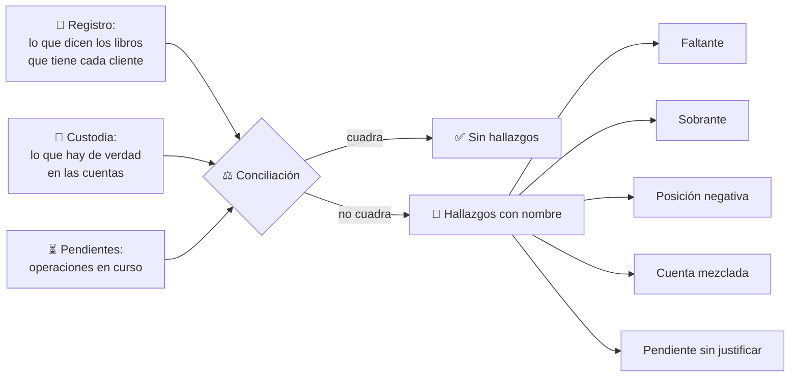
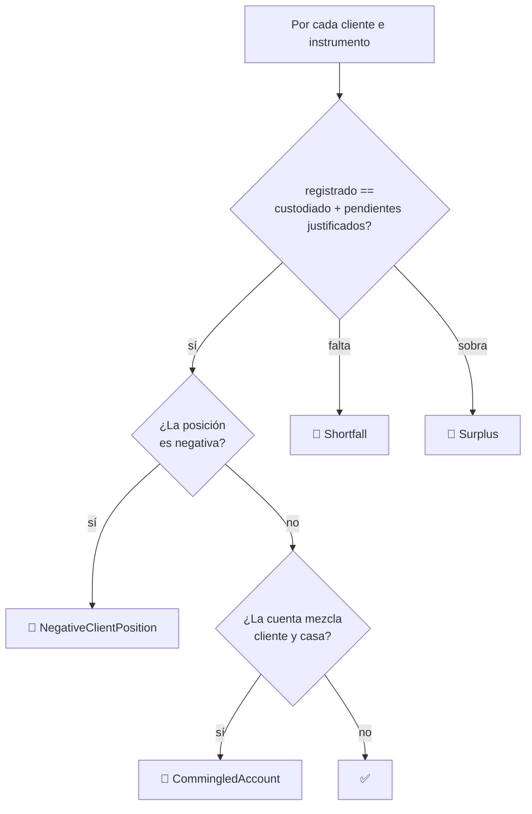

# CM-03 · Custodia y segregación de activos

> **En una frase, para cualquiera:** cuando una empresa que guarda dinero de sus
> clientes quiebra, la pregunta no es cuánto dinero había. Es **de quién era**. Y
> si se mezcló con el dinero de la empresa, esa pregunta ya no tiene respuesta.

**Estado real:** 🟢 `functional` — se ejecuta y hay prueba que lo demuestra · **Carpeta:** [`domains/capital-markets/cases/03-asset-custody/`](../../domains/capital-markets/cases/03-asset-custody)

> [!WARNING]
> **Cuentas, saldos e instrumentos simulados.** No es una autorización
> regulatoria ni una recomendación de inversión.

---

## Por qué se realiza este caso

Segregar los activos de los clientes suena a papeleo. No lo es: **es lo que
decide si un cliente recupera lo suyo cuando la empresa cae**.

Si el dinero de los clientes está en una cuenta separada, identificado como
suyo, no forma parte de la masa de la quiebra: es de ellos y se les devuelve. Si
se mezcló con el de la casa, se convierte en un crédito más contra una empresa
insolvente, y se cobra lo que quede, si queda algo.

El invariante que lo gobierna cabe en una línea:

```text
Activos de clientes registrados = Activos custodiados + Operaciones pendientes justificadas
```

Cuando esa igualdad se rompe, algo pasó. Y lo que pasó importa:

| Ruptura | Qué significa |
|---|---|
| **Faltante** | Hay menos custodiado que registrado. Alguien usó activos de clientes |
| **Sobrante** | Hay más de lo que debería. Suena bien y no lo es: indica registro incompleto |
| **Posición negativa de cliente** | Se entregó algo que el cliente no tenía |
| **Cuenta mezclada** | Activos de clientes y de la casa en el mismo sitio |
| **Pendiente sin justificar** | Un descuadre que se explica como «está en tránsito» sin operación que lo respalde |

Ese último es el favorito de los fraudes: un descuadre permanente disfrazado de
operación en curso.

## La idea que enseña, y que ningún otro caso enseña

**La conciliación como control ejecutable.** No es un informe mensual que alguien
revisa: es una función que se ejecuta y devuelve hallazgos con nombre. Y su
utilidad se mide de una forma concreta: **por cada tipo de descuadre existe un
escenario que lo produce, y la conciliación tiene que detectarlo**. Si deja de
detectarlo, la integración continua se pone roja.

## Casos de uso reales

- Un intermediario que custodia efectivo e instrumentos de sus clientes.
- Una billetera que guarda saldos de usuarios.
- Una plataforma de inversión con cuenta de dinero disponible.
- Un depósito centralizado de valores.
- Formación: por qué «tenemos el dinero» y «el dinero es de ellos» no son lo
  mismo.

## Cómo funciona





## Esquemas

### Libro de custodia

```json
{
  "positions": [
    { "owner": { "client": "cliente-1" }, "instrument": "CLP", "registered": 1500000, "custodied": 1500000 },
    { "owner": { "house": true },        "instrument": "CLP", "registered": 200000,  "custodied": 200000 }
  ],
  "pending": [
    { "owner": { "client": "cliente-1" }, "instrument": "CLP", "amount": -50000, "reason": "retiro en curso", "operationId": "op-77" }
  ]
}
```

Cada pendiente lleva `operationId`. Un pendiente **sin operación que lo respalde**
es en sí mismo un hallazgo, y esa es la trampa que este caso enseña a detectar.

### Hallazgos

```json
{
  "findings": [
    { "kind": "Shortfall", "owner": "cliente-1", "instrument": "CLP", "missing": 50000 },
    { "kind": "CommingledAccount", "account": "cuenta-unica", "detail": "cliente-2 y casa comparten cuenta" }
  ],
  "balanced": false
}
```

## Software necesario

| Componente | Versión | Para qué | ¿Obligatorio? |
|---|---|---|---|
| **Rust** | 1.75+ | El motor de custodia, `Money` y `Ledger` | Sí |
| **Node.js** 20+ / **pnpm** 9+ | — | Panel (opcional) | No |
| **`bubblewrap`**, Linux | — | **No hacen falta** | No |

Este caso corre en **cualquier sistema operativo**: no ejecuta código ajeno, así
que no necesita jaula. Es lógica determinista con enteros.

## Instalación

```bash
git clone https://github.com/vladimiracunadev-create/sandbox-labs
cd sandbox-labs
cargo build --release
```

## Cómo se ejecuta y cómo se comprueba

```bash
cargo run -p sandboxctl -- markets reconcile
```

Ese comando ejecuta **seis escenarios**, y cada uno declara de antemano el
hallazgo que **debe** producir. Corre en cada commit: si la conciliación deja de
detectar lo que declara, la integración continua se pone roja.

| Escenario | Hallazgo esperado |
|---|---|
| Todo cuadra | ninguno |
| Faltan activos custodiados | `Shortfall` |
| Hay más de lo registrado | `Surplus` |
| Un cliente queda en negativo | `NegativeClientPosition` |
| Cliente y casa en la misma cuenta | `CommingledAccount` |
| Un pendiente sin operación que lo justifique | `UnexplainedPending` |

## Procesos que se crean

```text
sandboxctl markets reconcile
  │
  └─ un proceso determinista
      ├─ sin red
      ├─ sin reloj
      ├─ enteros en unidades mínimas: nunca coma flotante
      └─ mismo resultado en cualquier máquina y en cualquier momento
```

**Por qué enteros y no decimales.** Un `f64` no puede representar 0,10 de forma
exacta. Sumar diez veces 0,10 no da 1,00. En un libro contable eso es un
descuadre que aparece tarde, en producción, y que nadie sabe explicar. Aquí el
dinero son enteros en unidades mínimas —pesos, centavos— con la moneda pegada al
importe: pesos y dólares **no se suman porque no compila**.

## Tiempo de carga

| Operación | Coste medido |
|---|---|
| `cargo run -p sandboxctl -- markets reconcile` | < 1 s, incluida la carga del binario |
| Conciliar un libro de miles de posiciones | milisegundos |
| Una operación en el libro de partida doble | microsegundos |

## Estado real y qué falta

**Construido y verificado:** el invariante de custodia, los cinco tipos de
hallazgo, los seis escenarios, el libro de partida doble con reversas e
idempotencia, y la comprobación automática en cada commit.

**Falta:** dividendos, bloqueos, garantías, transferencias entre custodios, y el
escenario de **insolvencia del custodio**, que es donde el invariante deja de ser
un ejercicio y se convierte en la única pregunta que importa.

## Si algo falla

| Situación | Causa | Cómo se resuelve |
|---|---|---|
| `Shortfall` | Hay menos custodiado que registrado | Alguien usó activos de clientes. Se localiza el movimiento que lo produjo en el libro append-only y se repone. **Es el hallazgo más grave del caso** |
| `Surplus` | Hay más de lo registrado | Suena bien y no lo es: significa registro incompleto. Buscar la operación que no se anotó |
| `UnexplainedPending` | Un pendiente sin `operationId` que lo respalde | Es el disfraz favorito de un descuadre permanente. Todo pendiente tiene que apuntar a una operación real, con fecha |
| `CommingledAccount` | Activos de clientes y de la casa en la misma cuenta | Separar las cuentas. No hay arreglo contable posible: la segregación es física o no es |
| `NegativeClientPosition` | Se entregó algo que el cliente no tenía | Revisar el orden de las operaciones: casi siempre es una entrega liquidada antes de que llegara el activo |
| `markets reconcile` falla en CI tras tocar el motor | La conciliación dejó de detectar lo que declara | El escenario que falla dice qué hallazgo esperaba. **Arreglar la conciliación, no el escenario** |
| Los importes no cuadran por céntimos | Se usó coma flotante en algún punto | `Money` son enteros en unidades mínimas y la moneda va pegada al importe. Si aparece un `f64` manejando dinero, eso es el fallo |

Los fallos que afectan a **cualquier** caso —la compilación, el catálogo, la
evidencia— están resueltos uno a uno en
**[Cuando algo falla](../SOLUCION-DE-PROBLEMAS.md)**.

Esta familia **no necesita aislamiento del sistema**: no ejecuta código ajeno,
sino reglas de negocio deterministas. Por eso casi ningún fallo suyo viene del
entorno, y casi todos vienen de los datos.

---

**Ver también:** [Catálogo completo](../CATALOGO.md) · [CM-10 · liquidación](cm-10-compensacion-y-liquidacion.md) · [CM-13 · salida ordenada](cm-13-salida-ordenada.md) · [Estado del proyecto](../ESTADO.md)
