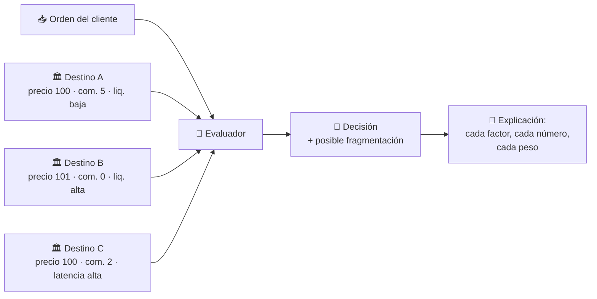
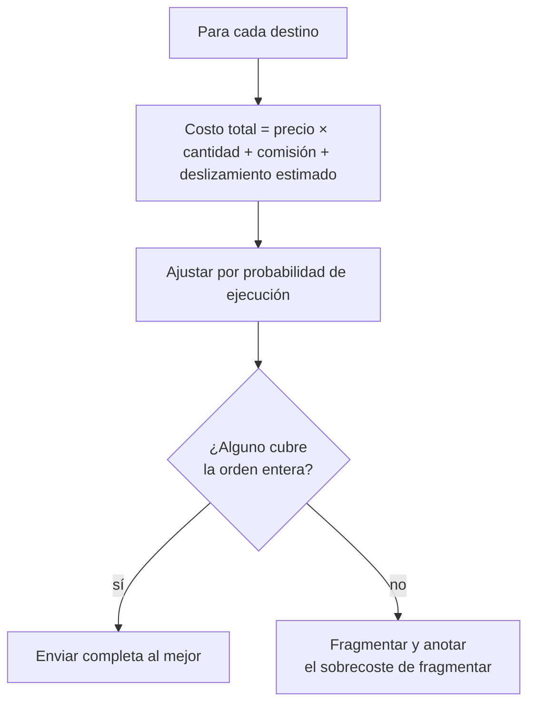

# CM-04 · Enrutamiento inteligente de órdenes

> **En una frase, para cualquiera:** si el mismo instrumento se negocia en varios
> sitios, alguien decide a cuál mandar tu orden. Esa decisión te cuesta o te
> ahorra dinero, y casi nunca te la explican.

**Estado real:** 🟠 `prototype` — hay código y escenarios que se ejecutan, **sin verificación en un entorno real** · **Módulo:** [`crates/sandbox-markets/src/cases/routing.rs`](../../crates/sandbox-markets/src/cases/routing.rs)

> [!WARNING]
> **Mercados, precios y latencias simulados.** No es una autorización regulatoria
> ni una recomendación de inversión.

---

## Por qué se realiza este caso

«Mejor ejecución» no significa «mejor precio». Significa el mejor resultado
considerando todo, y ese *todo* tiene partes que se compensan entre sí:

| Factor | Por qué puede cambiar la decisión |
|---|---|
| Precio | El más obvio, y no siempre el que decide |
| Comisión | Un precio mejor con comisión mayor puede salir peor |
| Liquidez | Un precio excelente para 10 acciones no sirve para 10 000 |
| Latencia | El precio que ves puede no existir cuando llegue tu orden |
| Probabilidad de ejecución | Un mercado barato donde no se ejecuta nada no es barato |
| Tamaño y fragmentación | Partir la orden mejora el precio y multiplica comisiones |
| Deslizamiento | Tu propia orden mueve el precio en tu contra |

El conflicto de interés está siempre cerca: si un destino paga a quien le envía
órdenes, el enrutador tiene un motivo para elegirlo que no es el del cliente.

## La idea que enseña, y que ningún otro caso enseña

**Una decisión que no se puede explicar no es una decisión defendible.** Cada
enrutamiento produce el razonamiento completo: qué destinos se consideraron, con
qué números, cuánto pesó cada factor y por qué ganó el elegido. El producto del
caso no es la ejecución, es **la explicación**.

## Casos de uso reales

- Un intermediario que debe demostrar mejor ejecución ante un cliente o un
  supervisor.
- Comparar destinos antes de firmar un acuerdo de enrutamiento.
- Un cliente que pregunta por qué su orden fue a un mercado y no a otro.
- Detectar si el enrutador favorece sistemáticamente a un destino.

## Cómo funcionará





## Esquemas

```json
{
  "order": { "instrument": "ACME-SIM", "side": "buy", "quantity": 10000 },
  "venues": [
    { "id": "A", "price": 10000, "fee": 500, "displayedSize": 2000, "latencyMs": 3, "fillProbability": 0.9 },
    { "id": "B", "price": 10100, "fee": 0,   "displayedSize": 15000, "latencyMs": 12, "fillProbability": 0.99 }
  ]
}
```

```json
{
  "decision": [{ "venue": "B", "quantity": 10000 }],
  "explanation": {
    "consideredVenues": ["A", "B"],
    "totalCost": { "A": 101500000, "B": 101000000 },
    "why": "A ofrece mejor precio pero solo cubre 2000 unidades; fragmentar añade comisión y deslizamiento estimado superiores a la diferencia de precio",
    "conflictsDisclosed": []
  }
}
```

`conflictsDisclosed` es obligatorio en el esquema. Si un destino remunera el
flujo de órdenes, tiene que aparecer ahí.

## Software necesario

| Componente | Para qué |
|---|---|
| **Rust** 1.75+ | El evaluador y la explicación |
| **Node.js** 20+ / **pnpm** 9+ | Visualizar la comparación en el panel (opcional) |

No necesita jaula ni Linux: lógica determinista sobre datos simulados.

## Instalación

```bash
cargo build --release
```

## Procesos que se crearán

```text
sandboxctl markets route --order orden.json --venues destinos.json
  │
  └─ un proceso determinista, sin red
      └─ mercados simulados con latencia y liquidez sintéticas
```

Los destinos son **simulados**: sin conectividad de producción, que es una regla
innegociable de esta familia.

## Tiempo de carga estimado

| Operación | Coste esperado |
|---|---|
| Evaluar 10 destinos | < 1 ms |
| Generar la explicación | < 5 ms |
| Simular una sesión de 10 000 órdenes | segundos |

## Qué hace falta para construirlo

1. Modelo de destino con precio, comisión, liquidez, latencia y probabilidad.
2. Función de costo total, con pesos configurables y **versionados**.
3. Explicación estructurada, obligatoria en cada decisión.
4. Declaración de conflictos de interés por destino.
5. Escenarios: destino que paga por el flujo, precio obsoleto, liquidez fantasma.

## Si algo falla

El caso **ya tiene código y escenarios que se ejecutan**. Lo que sigue son sus
fallos con la causa y la salida:

| Situación | Causa | Cómo se resuelve |
|---|---|---|
| La decisión no se puede explicar | Falta el bloque `explanation` | Una decisión sin explicación no es defendible ante un cliente ni ante un supervisor. El esquema la hace obligatoria: sin ella no se emite la decisión |
| Siempre gana el mismo destino | Puede ser correcto, o puede ser un sesgo del cálculo | Revisar los pesos de la función de costo, que van **versionados**. Y comprobar `conflictsDisclosed`: si ese destino remunera el flujo, hay que declararlo |
| El precio del destino ya no existe al llegar la orden | Latencia | Se pondera por `fillProbability`. Un destino barato donde no se ejecuta nada no es barato, y el cálculo tiene que reflejarlo |
| Fragmentar sale más caro que no fragmentar | Cada trozo paga comisión y mueve el precio | El cálculo incluye el sobrecoste de fragmentar. Si aun así fragmenta, la explicación dice con qué números lo decidió |

Los fallos que afectan a **cualquier** caso —la compilación, el catálogo, la
evidencia— están resueltos uno a uno en
**[Cuando algo falla](../SOLUCION-DE-PROBLEMAS.md)**.

Esta familia **no necesita aislamiento del sistema**: no ejecuta código ajeno,
sino reglas de negocio deterministas. Por eso casi ningún fallo suyo viene del
entorno, y casi todos vienen de los datos.

## Cómo se comprueba

```bash
cargo run -p sandboxctl -- markets check --case CM-04
```

Ejecuta los escenarios de este caso y compara cada uno con lo que **declara de
antemano** que debe salir. Corre en cada commit: si el caso deja de detectar lo
que dice detectar, la integración continua se pone roja.

```bash
cargo test -p sandbox-markets routing
```

Los invariantes del módulo, incluidos los que ningún escenario de arriba cubre.

> **Sigue en `prototype`, no en `functional`.** Los escenarios se ejecutan y
> pasan, pero el caso **no emite evidencia firmada por ejecución** ni se ha
> usado contra datos que no sean los suyos. La regla completa está en el
> [ROADMAP](../../ROADMAP.md).

---

**Ver también:** [Catálogo completo](../CATALOGO.md) · [CM-05 · intermediación](cm-05-intermediacion-financiera.md) · [CM-02 · libro de órdenes](cm-02-sistema-alternativo-de-transaccion.md)
