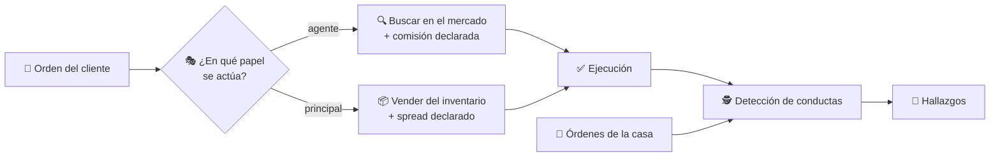
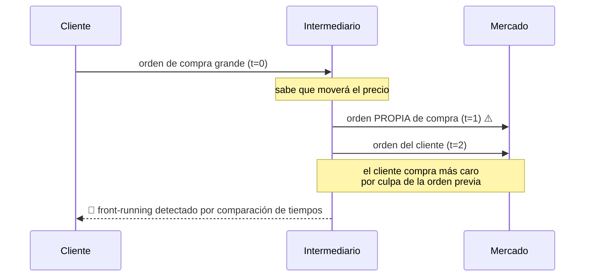

# CM-05 · Intermediación financiera

> **En una frase, para cualquiera:** cuando compras algo a través de un
> intermediario, hay dos posibilidades muy distintas: que salga a buscarlo por ti,
> o que te lo venda de lo que él ya tenía. En la segunda, sus intereses y los
> tuyos apuntan en direcciones opuestas.

**Estado real:** 🔴 `planned` · **Carpeta prevista:** `domains/capital-markets/cases/05-financial-intermediation`

> [!WARNING]
> **Operaciones, inventario y clientes simulados.** No es una autorización
> regulatoria ni una recomendación de inversión.

---

## Por qué se realiza este caso

La distinción entre **agente** y **principal** es la que más consecuencias tiene
y la que peor se explica al cliente:

| | Como agente | Como principal |
|---|---|---|
| Qué hace | Busca en el mercado por ti | Te vende de su propio inventario |
| De dónde gana | Comisión, explícita | Diferencia de precio (*spread*), casi nunca visible |
| Su interés | Alineado contigo | **Opuesto**: cuanto peor tu precio, mejor su margen |
| Qué debe declarar | La comisión | Que actúa por cuenta propia |

De ahí salen las conductas que este caso detecta:

| Conducta | Qué es |
|---|---|
| **Front-running** | Ejecutar la orden propia antes que la del cliente, sabiendo que la del cliente moverá el precio |
| Ejecución propia prioritaria | La orden de la casa se cuela delante en la cola |
| Comisión no informada | El cliente no supo lo que pagaba |
| Confirmación falsa | Se confirma una ejecución que no ocurrió como se dice |
| Venta sin disponibilidad | Se vende algo que no se tiene ni se ha asegurado |

## La idea que enseña, y que ningún otro caso enseña

**El conflicto de interés es estructural, no moral.** No depende de que alguien
sea deshonesto: depende de en qué papel actúa. Por eso el control no es un código
de conducta, es **la trazabilidad del papel en cada operación** y la comparación
de tiempos entre la orden del cliente y la de la casa.

## Casos de uso reales

- Un intermediario que opera como agente y también con inventario propio.
- Un creador de mercado que además atiende clientes.
- Una revisión de conducta sobre operaciones históricas.
- Formación: por qué «sin comisión» puede salir más caro.

## Cómo funcionará





## Esquemas

```json
{
  "execution": {
    "clientOrderId": "cli-100",
    "capacity": "principal",
    "price": { "minorUnits": 10250, "currency": "CLP" },
    "referencePrice": { "minorUnits": 10200, "currency": "CLP" },
    "spread": { "minorUnits": 50, "currency": "CLP" },
    "commission": { "minorUnits": 0, "currency": "CLP" },
    "disclosedToClient": true
  }
}
```

```json
{
  "findings": [
    { "kind": "FrontRunning", "houseOrder": "casa-9", "clientOrder": "cli-100", "deltaMs": 40, "priceImpact": 50 },
    { "kind": "UndisclosedCommission", "clientOrder": "cli-101" }
  ]
}
```

## Software necesario

| Componente | Para qué |
|---|---|
| **Rust** 1.75+ | Motor de operaciones y detección de conductas |
| **Node.js** 20+ / **pnpm** 9+ | Panel (opcional) |

Sin jaula ni Linux: lógica determinista sobre operaciones simuladas.

## Instalación

```bash
cargo build --release
```

## Procesos que se crearán

```text
sandboxctl markets intermediation --scenario front-running
  │
  └─ un proceso determinista
      ├─ reloj simulado con marcas de secuencia
      └─ libro de partida doble para comisiones y spread
```

## Tiempo de carga estimado

| Operación | Coste esperado |
|---|---|
| Un escenario de conducta | < 100 ms |
| Analizar 100 000 operaciones | segundos |

## Qué hace falta para construirlo

1. Modelo de operación con `capacity` (agente/principal) obligatorio.
2. Inventario propio, separado del de clientes ([CM-03](cm-03-custodia-y-segregacion-de-activos.md)).
3. Detección por comparación temporal entre órdenes de casa y de cliente.
4. Declaración obligatoria de comisión y spread al cliente.
5. Los cinco escenarios de conducta listados arriba.

---

**Ver también:** [Catálogo completo](../CATALOGO.md) · [CM-09 · vigilancia](cm-09-vigilancia-de-abuso-de-mercado.md) · [CM-04 · enrutamiento](cm-04-enrutamiento-inteligente-de-ordenes.md)
