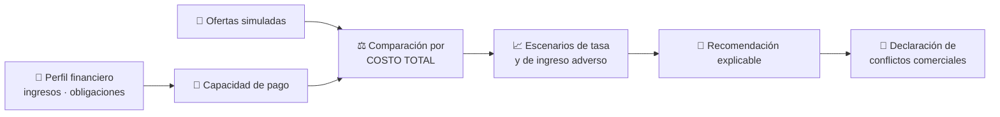
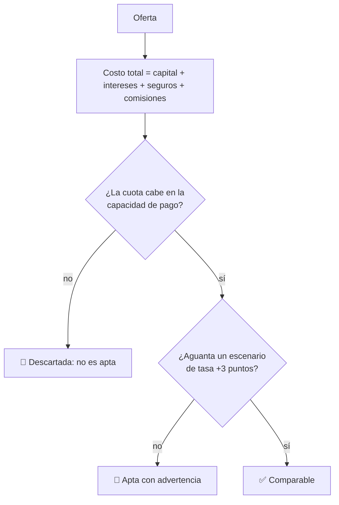

# CM-06 · Asesoría crediticia

> **En una frase, para cualquiera:** dos créditos con la misma cuota mensual
> pueden costar el doble uno que otro. La diferencia está en cosas que no
> aparecen en el anuncio.

**Estado real:** 🔴 `planned` · **Carpeta prevista:** `domains/capital-markets/cases/06-credit-advisory`

> [!WARNING]
> **Perfiles, ofertas y tasas simulados. Sin datos personales reales.** No es una
> autorización regulatoria ni asesoría financiera real.

---

## Por qué se realiza este caso

El crédito se vende por la cuota, y la cuota es el peor indicador posible: se
puede bajar alargando el plazo, y alargar el plazo casi siempre encarece el total.

| Lo que se compara habitualmente | Lo que decide el costo real |
|---|---|
| La cuota mensual | El **costo total** a lo largo de la vida del crédito |
| La tasa anunciada | La tasa efectiva con seguros y comisiones incluidos |
| El plazo | Cuánto se paga de intereses por alargarlo |
| — | Si la tasa es variable y qué pasa si sube |
| — | Si la capacidad de pago aguanta un mal año |

Y hay un conflicto que rara vez se declara: **quien recomienda suele cobrar del
que presta**, y no siempre lo mismo por cada producto.

## La idea que enseña, y que ningún otro caso enseña

**Recomendar obliga a explicar y a declarar de qué se vive.** La recomendación
tiene que venir con el costo total, con el escenario adverso, y con quién paga a
quien recomienda. Sin esos tres datos, una recomendación es publicidad.

## Casos de uso reales

- Un comparador de créditos que cobra de las entidades que lista.
- Un asesor que ayuda a reestructurar deudas.
- Una entidad que ofrece varios de sus propios productos.
- Formación en educación financiera: cuota frente a costo total.

## Cómo funcionará





## Esquemas

```json
{
  "profile": {
    "monthlyIncome": { "minorUnits": 900000, "currency": "CLP" },
    "monthlyObligations": { "minorUnits": 300000, "currency": "CLP" },
    "stabilityMonths": 24
  },
  "offers": [
    { "id": "of-1", "principal": 5000000, "annualRate": 0.18, "months": 36, "insurance": 45000, "fees": 30000, "rateType": "fixed" }
  ]
}
```

```json
{
  "ranked": [
    { "offer": "of-1", "monthlyPayment": 180500, "totalCost": 6498000, "effectiveRate": 0.213, "affordable": true }
  ],
  "stress": [{ "offer": "of-1", "scenario": "tasa +3pp", "monthlyPayment": 189200, "stillAffordable": true }],
  "recommendation": "of-1",
  "why": "menor costo total entre las ofertas que caben en la capacidad de pago y resisten el escenario adverso",
  "commercialConflicts": [{ "offer": "of-1", "disclosure": "el comparador recibe comisión del emisor" }],
  "notFinancialAdvice": true
}
```

`notFinancialAdvice: true` es obligatorio en el esquema. Este simulador no emite
asesoría financiera real.

## Software necesario

| Componente | Para qué |
|---|---|
| **Rust** 1.75+ | Cálculo de costo total, capacidad de pago y escenarios |
| **Node.js** 20+ / **pnpm** 9+ | Formulario y comparación visual (opcional) |

Sin jaula ni Linux. **Aritmética con enteros en unidades mínimas**: los intereses
con coma flotante producen diferencias de céntimos que, acumuladas, no cuadran.

## Instalación

```bash
cargo build --release
```

## Procesos que se crearán

```text
sandboxctl markets credit --profile perfil.json --offers ofertas.json
  │
  └─ un proceso determinista, sin red
      └─ mismos datos → misma recomendación, siempre
```

## Tiempo de carga estimado

| Operación | Coste esperado |
|---|---|
| Comparar 20 ofertas con escenarios | < 10 ms |
| Generar la explicación | < 5 ms |

## Qué hace falta para construirlo

1. Cálculo de costo total y tasa efectiva con seguros y comisiones.
2. Capacidad de pago con margen y estabilidad de ingresos.
3. Escenarios de tasa y de caída de ingreso.
4. Explicación obligatoria y declaración de conflictos.
5. Perfiles sintéticos: **nunca datos personales reales**.

## Si algo falla

Este caso **todavía no tiene código**. Lo que sigue son los fallos que el diseño
tiene que resolver, y cómo va a resolverlos:

| Situación | Causa | Cómo se resuelve |
|---|---|---|
| La oferta con la cuota más baja no es la recomendada | Alargar el plazo baja la cuota y sube el costo total | Es el punto del caso. La explicación dice el costo total de cada una, que es la comparación honesta |
| Ninguna oferta sale `affordable` | La capacidad de pago no da | No relajar el margen para que salga alguna: el resultado correcto es «ninguna de estas ofertas cabe» |
| El escenario de tasa adversa tumba la recomendación | Tasa variable | Se marca como apta con advertencia, no se oculta. Quien decide tiene que ver el escenario malo |
| Los totales no cuadran por céntimos | Intereses con coma flotante | Aritmética con enteros en unidades mínimas. Un céntimo por cuota son varios euros a lo largo del crédito |
| Alguien toma la salida como asesoría real | Malentendido grave | `notFinancialAdvice: true` es obligatorio en el esquema. Este simulador no emite asesoría financiera |

Los fallos que afectan a **cualquier** caso —la compilación, el catálogo, la
evidencia— están resueltos uno a uno en
**[Cuando algo falla](../SOLUCION-DE-PROBLEMAS.md)**.

Esta familia **no necesita aislamiento del sistema**: no ejecuta código ajeno,
sino reglas de negocio deterministas. Por eso casi ningún fallo suyo viene del
entorno, y casi todos vienen de los datos.

---

**Ver también:** [Catálogo completo](../CATALOGO.md) · [CM-07 · robo-advisor](cm-07-robo-advisor.md) · [CM-20 · gobierno de modelos](cm-20-gobierno-de-modelos-e-ia-financiera.md)
