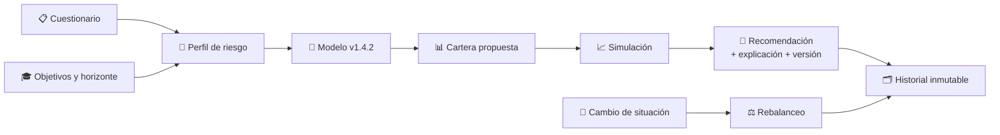
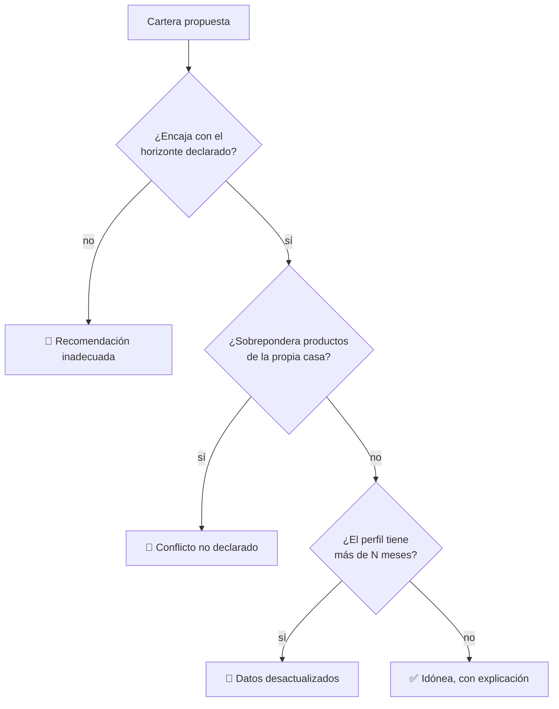

# CM-07 · Robo-advisor

> **En una frase, para cualquiera:** un cuestionario de diez preguntas decide
> dónde va tu dinero durante los próximos veinte años. Este caso examina si esa
> decisión es defendible y si sigue siéndolo cuando tu vida cambia.

**Estado real:** 🔴 `planned` · **Carpeta prevista:** `domains/capital-markets/cases/07-robo-advisor`

> [!WARNING]
> **Carteras, rendimientos y clientes simulados. Sin datos personales reales.** No
> es una autorización regulatoria ni una recomendación de inversión.

---

## Por qué se realiza este caso

Automatizar la asesoría no elimina el deber de idoneidad: lo hace **auditable a
escala**. Si el modelo se equivoca, se equivoca con todos los clientes a la vez.

| Riesgo | Cómo se manifiesta |
|---|---|
| Recomendación inadecuada | Cartera agresiva a alguien con horizonte de un año |
| Producto propio favorecido | El modelo siempre elige fondos de la casa |
| Datos desactualizados | El perfil es de hace cinco años; la persona ya se jubiló |
| Modelo no versionado | Nadie puede reproducir por qué se recomendó aquello |
| Discriminación injustificada | Una variable correlacionada produce trato distinto sin justificación |

Ese último es el más difícil: el modelo no necesita usar una variable prohibida
para discriminar, le basta con usar una que la aproxime.

## La idea que enseña, y que ningún otro caso enseña

**Una recomendación tiene que poder reconstruirse años después.** Eso exige tres
cosas que casi nunca se guardan: la versión exacta del modelo, los datos del
perfil en ese momento, y el razonamiento. Sin las tres, no hay forma de responder
a un cliente que reclama.

## Casos de uso reales

- Una plataforma de inversión automatizada.
- Un banco que recomienda fondos por perfil.
- Una revisión de idoneidad sobre recomendaciones pasadas.
- Formación: por qué el horizonte importa más que la tolerancia declarada.

## Cómo funcionará





## Esquemas

```json
{
  "client": "cli-sintetico-1",
  "questionnaire": { "riskTolerance": "media", "horizonYears": 3, "goal": "compra de vivienda" },
  "profiledAt": "2026-08-07T00:00:00Z",
  "modelVersion": "1.4.2"
}
```

```json
{
  "portfolio": [
    { "asset": "renta-fija-sim", "weight": 0.7 },
    { "asset": "renta-variable-sim", "weight": 0.3 }
  ],
  "suitability": { "ok": true, "why": "horizonte de 3 años: se limita la exposición variable al 30%" },
  "houseProductShare": 0.15,
  "modelVersion": "1.4.2",
  "reproducible": true,
  "notFinancialAdvice": true
}
```

## Software necesario

| Componente | Para qué |
|---|---|
| **Rust** 1.75+ | Perfilado, construcción de cartera y simulación determinista |
| **Node.js** 20+ / **pnpm** 9+ | Cuestionario y visualización (opcional) |

Sin jaula ni Linux. La simulación usa **semilla explícita**: mismos datos y misma
semilla, mismo resultado.

## Instalación

```bash
cargo build --release
```

## Procesos que se crearán

```text
sandboxctl markets advise --client perfil.json --seed 42
  │
  └─ un proceso determinista, sin red
      ├─ modelo versionado y registrado
      └─ historial append-only de cada recomendación
```

## Tiempo de carga estimado

| Operación | Coste esperado |
|---|---|
| Perfilar y proponer cartera | < 10 ms |
| Simulación de 20 años con semilla | 50–300 ms |
| Reconstruir una recomendación histórica | < 10 ms |

## Qué hace falta para construirlo

1. Cuestionario y perfilado con datos **sintéticos**.
2. Registro de versión de modelo en cada recomendación ([CM-20](cm-20-gobierno-de-modelos-e-ia-financiera.md)).
3. Comprobación de idoneidad frente al horizonte y al objetivo.
4. Medición del sesgo hacia productos propios.
5. Historial inmutable que permita reconstruir cualquier recomendación pasada.

---

**Ver también:** [Catálogo completo](../CATALOGO.md) · [CM-20 · gobierno de modelos](cm-20-gobierno-de-modelos-e-ia-financiera.md) · [CM-06 · asesoría crediticia](cm-06-asesoria-crediticia.md)
