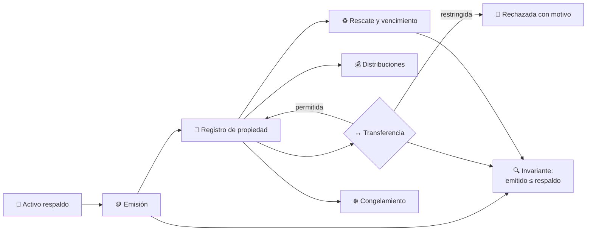
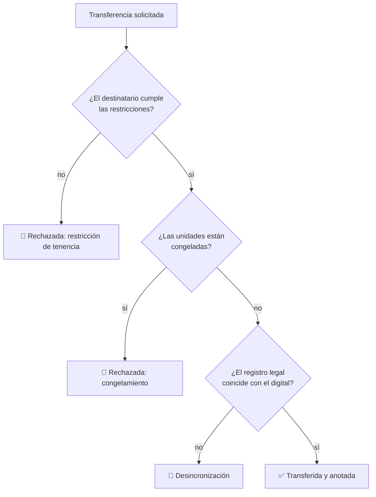

# CM-08 · Tokenización de instrumentos

> **En una frase, para cualquiera:** convertir un activo en fichas digitales
> permite venderlo en trozos pequeños. El problema es asegurarse de que la suma
> de las fichas no supere nunca lo que hay detrás.

**Estado real:** 🔴 `planned` · **Carpeta prevista:** `domains/capital-markets/cases/08-tokenized-securities`

> [!WARNING]
> **Emisiones, respaldos y registros simulados. Sin cadena de bloques real ni
> valores reales.** No es una autorización regulatoria ni una recomendación de
> inversión.

---

## Por qué se realiza este caso

La tokenización promete fraccionar, transferir rápido y registrar de forma
inalterable. Cada una de esas promesas tiene una forma de romperse:

| Riesgo | Qué pasa |
|---|---|
| **Sobreemisión** | Se emiten más unidades de las que respalda el activo |
| **Doble representación** | El mismo activo tokenizado dos veces, en dos sitios |
| Transferencia no permitida | Una restricción legal —solo inversionistas calificados— que el token no conoce |
| **Desincronización legal** | El registro digital dice una cosa y el registro legal otra |
| Errores en eventos corporativos | Un dividendo o un split que no se aplica a los tenedores |

La desincronización es la más peligrosa porque **el token no es el activo**: es
una anotación. Si el registro legal dice que el dueño es otro, el token no gana
la discusión.

## La idea que enseña, y que ningún otro caso enseña

**El respaldo es un invariante, no una promesa.** `unidades emitidas ≤ respaldo
registrado`, comprobado en cada emisión, transferencia y rescate. Es hermano del
invariante de [CM-03](cm-03-custodia-y-segregacion-de-activos.md), y por la misma
razón: cuando se rompe, alguien tiene un papel que no vale lo que dice.

## Casos de uso reales

- Fraccionar un inmueble o un fondo entre muchos inversionistas.
- Representar digitalmente instrumentos de deuda.
- Un registro de propiedad con transferencias sujetas a restricciones.
- Formación: por qué un token no es el activo.

## Cómo funcionará





## Esquemas

```json
{
  "issuance": {
    "instrument": "INMUEBLE-SIM-1",
    "backing": { "appraised": { "minorUnits": 500000000, "currency": "CLP" }, "registryRef": "sim-legal-001" },
    "unitsIssued": 5000,
    "unitValue": { "minorUnits": 100000, "currency": "CLP" },
    "restrictions": ["qualified-investors-only"]
  }
}
```

```json
{
  "findings": [
    { "kind": "OverIssuance", "instrument": "INMUEBLE-SIM-1", "issued": 5200, "maxByBacking": 5000 },
    { "kind": "LegalDesync", "instrument": "INMUEBLE-SIM-1", "digitalOwner": "cli-3", "legalOwner": "cli-7" }
  ]
}
```

## Software necesario

| Componente | Para qué |
|---|---|
| **Rust** 1.75+ | Registro de propiedad, invariantes y eventos |
| **Node.js** 20+ / **pnpm** 9+ | Panel (opcional) |

**No usa cadena de bloques real** ni conectividad externa: el registro es un
libro append-only local. Sin jaula ni Linux.

## Instalación

```bash
cargo build --release
```

## Procesos que se crearán

```text
sandboxctl markets tokenize --scenario sobreemision
  │
  └─ un proceso determinista, sin red
      ├─ registro append-only
      └─ invariante comprobado tras cada operación
```

## Tiempo de carga estimado

| Operación | Coste esperado |
|---|---|
| Una emisión con comprobación de invariante | < 1 ms |
| 100 000 transferencias | segundos |
| Aplicar un evento corporativo a todos los tenedores | milisegundos |

## Qué hace falta para construirlo

1. Registro de propiedad append-only, con reconstrucción completa.
2. Invariante `emitido ≤ respaldo`, comprobado tras cada operación.
3. Restricciones de tenencia y transferencia, declarativas.
4. Congelamiento, rescate y vencimiento.
5. Conciliación entre registro digital y registro legal simulado.
6. Integración con [CM-17](cm-17-eventos-corporativos.md) para distribuciones.

## Si algo falla

Este caso **todavía no tiene código**. Lo que sigue son los fallos que el diseño
tiene que resolver, y cómo va a resolverlos:

| Situación | Causa | Cómo se resuelve |
|---|---|---|
| `OverIssuance` | Se emitieron más unidades de las que respalda el activo | Se bloquea la emisión. El invariante `emitido ≤ respaldo` se comprueba tras cada operación, no al cierre del día |
| `LegalDesync` | El registro digital y el legal no coinciden | **Gana el registro legal**: el token es una anotación, no el activo. Se corrige el digital y se investiga cómo divergieron |
| Una transferencia legítima se rechaza | El destinatario no cumple una restricción de tenencia | Es lo previsto. Si la restricción está mal, se cambia en la emisión y queda registrado el cambio |
| Las unidades no cuadran tras un evento corporativo | El evento no se aplicó a todos los tenedores | Se aplica de forma atómica: a todos o a ninguno. Ver [CM-17](cm-17-eventos-corporativos.md) |
| Alguien espera una cadena de bloques real | No la hay | El registro es un libro append-only local. No hay conectividad con ninguna red pública, y no la habrá |

Los fallos que afectan a **cualquier** caso —la compilación, el catálogo, la
evidencia— están resueltos uno a uno en
**[Cuando algo falla](../SOLUCION-DE-PROBLEMAS.md)**.

Esta familia **no necesita aislamiento del sistema**: no ejecuta código ajeno,
sino reglas de negocio deterministas. Por eso casi ningún fallo suyo viene del
entorno, y casi todos vienen de los datos.

---

**Ver también:** [Catálogo completo](../CATALOGO.md) · [CM-03 · custodia](cm-03-custodia-y-segregacion-de-activos.md) · [CM-17 · eventos corporativos](cm-17-eventos-corporativos.md)
