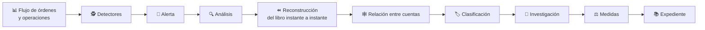
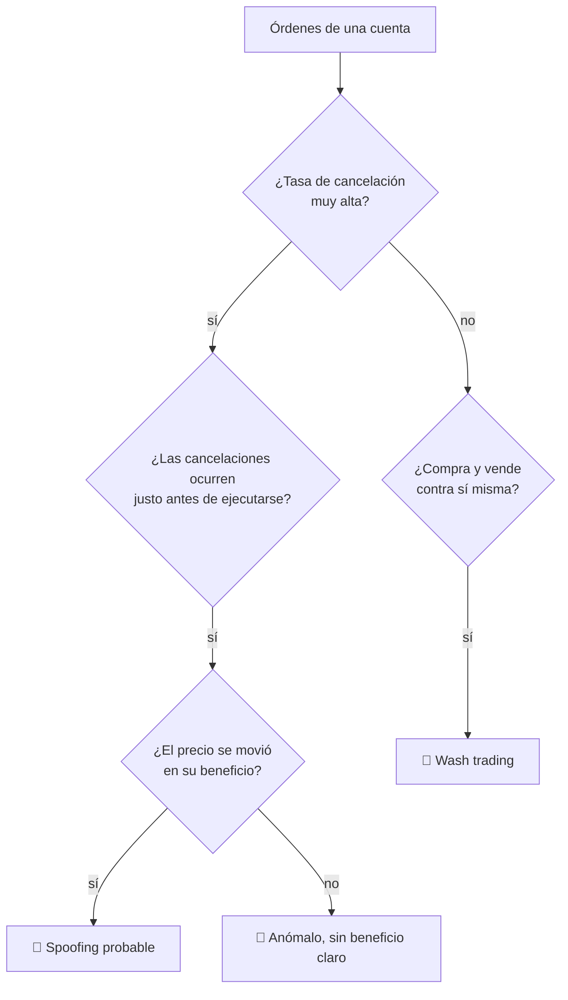

# CM-09 · Vigilancia de abuso de mercado

> **En una frase, para cualquiera:** hay formas de mover un precio sin comprar
> ni vender de verdad. Consisten en aparentar interés y retirarlo justo antes de
> que alguien lo acepte.

**Estado real:** 🔴 `planned` · **Carpeta prevista:** `domains/capital-markets/cases/09-market-surveillance`

> [!WARNING]
> **Órdenes, cuentas y operaciones simuladas. Sin datos personales reales.** No es
> una autorización regulatoria.

---

## Por qué se realiza este caso

Cada operación por separado puede ser perfectamente legal. El abuso está **en el
patrón**, y el patrón solo se ve mirando muchas operaciones juntas, a menudo de
cuentas distintas que actúan coordinadas.

| Patrón | En qué consiste |
|---|---|
| **Wash trading** | Comprar y vender contra uno mismo: volumen falso, precio inventado |
| **Spoofing** | Poner órdenes grandes sin intención de ejecutarlas, para mover el precio, y cancelarlas |
| **Layering** | Varias capas de órdenes falsas a distintos precios, para simular profundidad |
| Manipulación del cierre | Concentrar operaciones en los últimos segundos, cuando el precio de cierre se fija |
| Cuentas coordinadas | Varias cuentas actuando como una, para no superar límites individuales |
| Volumen anómalo | Actividad inexplicable justo antes de una noticia |
| Uso de información privilegiada | Operar sabiendo algo que el mercado no sabe |

## La idea que enseña, y que ningún otro caso enseña

**Detectar es solo el principio.** Una alerta no es una conclusión: es el
comienzo de un expediente. Y el expediente exige **reconstruir la sesión
completa** —qué se veía en el libro en cada instante— porque sin eso no se puede
distinguir una orden cancelada de mala fe de una cancelada por un cambio legítimo.

De ahí la dependencia: este caso necesita que
[CM-02](cm-02-sistema-alternativo-de-transaccion.md) sepa reconstruir su sesión.

## Casos de uso reales

- El área de vigilancia de un mercado o de un intermediario.
- Una investigación sobre actividad sospechosa en un instrumento.
- Formación de analistas con patrones etiquetados.
- Probar si un algoritmo propio produce, sin querer, patrones sospechosos.

## Cómo funcionará





## Esquemas

```json
{
  "alert": {
    "kind": "Spoofing",
    "account": "acc-sim-12",
    "instrument": "ACME-SIM",
    "window": { "fromSeq": 10420, "toSeq": 10980 },
    "evidence": {
      "ordersPlaced": 42,
      "ordersCancelled": 40,
      "cancelRate": 0.95,
      "avgTimeToCancelMs": 180,
      "priceImpact": { "minorUnits": 120, "currency": "CLP" }
    },
    "severity": "alta"
  }
}
```

```json
{
  "case": {
    "id": "exp-2026-001",
    "alerts": ["alert-1", "alert-2"],
    "relatedAccounts": [{ "a": "acc-sim-12", "b": "acc-sim-31", "reason": "mismo patrón temporal y contraparte recurrente" }],
    "classification": "manipulación de mercado",
    "measures": ["suspensión cautelar de la cuenta"],
    "reconstructedBook": true
  }
}
```

## Software necesario

| Componente | Para qué |
|---|---|
| **Rust** 1.75+ | Detectores, reconstrucción de sesión y expediente |
| **Node.js** 20+ / **pnpm** 9+ | Visualización de la línea de tiempo del libro (recomendado) |

Sin jaula ni Linux. **Sin datos personales reales**: las cuentas son sintéticas.

## Instalación

```bash
cargo build --release
```

## Procesos que se crearán

```text
sandboxctl markets surveil --session sesion.jsonl
  │
  └─ un proceso determinista, sin red
      ├─ reconstrucción del libro por número de secuencia
      ├─ detectores en paralelo sobre la misma sesión
      └─ expediente append-only
```

## Tiempo de carga estimado

| Operación | Coste esperado |
|---|---|
| Reconstruir una sesión de 100 000 eventos | 1–5 s |
| Ejecutar todos los detectores sobre ella | 1–3 s |
| Generar un expediente | < 100 ms |

## Qué hace falta para construirlo

1. Que [CM-02](cm-02-sistema-alternativo-de-transaccion.md) sepa reconstruir su
   sesión completa. **Es un requisito previo, no una mejora.**
2. Detectores para los ocho patrones, cada uno con escenario etiquetado.
3. Grafo de relación entre cuentas.
4. Expediente append-only con las medidas adoptadas.
5. Escenarios sintéticos con el patrón conocido de antemano, para poder medir
   falsos positivos y falsos negativos.

## Si algo falla

Este caso **todavía no tiene código**. Lo que sigue son los fallos que el diseño
tiene que resolver, y cómo va a resolverlos:

| Situación | Causa | Cómo se resuelve |
|---|---|---|
| Demasiadas alertas | Los umbrales están mal calibrados | Se ajustan con escenarios **etiquetados**: se sabe de antemano cuáles son abuso y cuáles no, así que se puede medir falsos positivos en vez de adivinar |
| Una alerta no se puede investigar | Falta la reconstrucción del libro | Es requisito previo, y hoy [CM-02](cm-02-sistema-alternativo-de-transaccion.md) todavía no la tiene. Sin saber qué se veía en cada instante no se distingue una cancelación de mala fe de una legítima |
| Un patrón conocido no se detecta | El detector tiene un hueco | El escenario etiquetado lo demuestra. Se corrige el detector y el escenario queda como prueba de regresión |
| Cuentas relacionadas no se agrupan | El grafo de relación se quedó corto | Se relacionan por patrón temporal y contraparte recurrente, no solo por titular: coordinarse a través de titulares distintos es justamente el objetivo |
| Una medida se toma sin expediente | Fallo de proceso | Ninguna medida sin expediente: alerta, análisis, reconstrucción, clasificación e investigación. El expediente es append-only |

Los fallos que afectan a **cualquier** caso —la compilación, el catálogo, la
evidencia— están resueltos uno a uno en
**[Cuando algo falla](../SOLUCION-DE-PROBLEMAS.md)**.

Esta familia **no necesita aislamiento del sistema**: no ejecuta código ajeno,
sino reglas de negocio deterministas. Por eso casi ningún fallo suyo viene del
entorno, y casi todos vienen de los datos.

---

**Ver también:** [Catálogo completo](../CATALOGO.md) · [CM-02 · libro de órdenes](cm-02-sistema-alternativo-de-transaccion.md) · [CM-05 · intermediación](cm-05-intermediacion-financiera.md)
