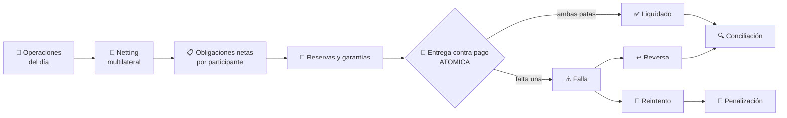
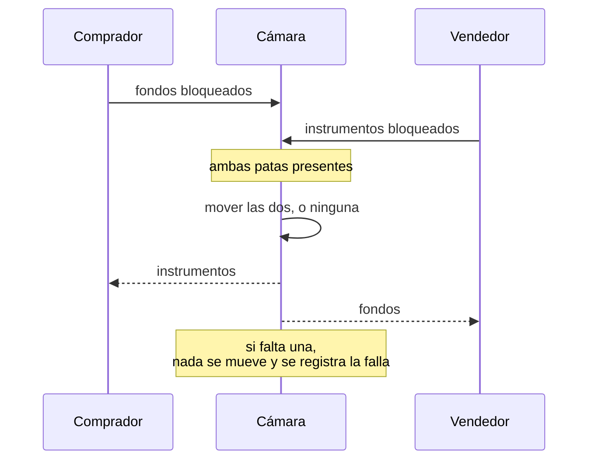

# CM-10 · Compensación y liquidación

> **En una frase, para cualquiera:** cerrar el trato y cumplirlo son dos momentos
> distintos. Entre uno y otro pasan horas o días, y en ese hueco es donde alguien
> puede no aparecer con su parte.

**Estado real:** 🔴 `planned` · **Carpeta prevista:** `domains/capital-markets/cases/10-clearing-settlement`

> [!WARNING]
> **Obligaciones, fondos e instrumentos simulados.** No es una autorización
> regulatoria ni una recomendación de inversión.

---

## Por qué se realiza este caso

Cuando dos partes acuerdan una operación, todavía no ha pasado nada: hay una
promesa por cada lado. La liquidación es el momento en que las promesas se
convierten en hechos, y ahí aparece el riesgo que le da nombre al caso:

**Riesgo de principal**: si yo entrego primero y tú no pagas, lo he perdido todo.
No parte, todo.

| Escenario | Qué ocurre |
|---|---|
| El comprador no tiene fondos | La operación falla y hay que decidir qué se hace con el instrumento |
| El vendedor no tiene los instrumentos | Igual, del otro lado |
| Liquidación duplicada | Se entrega dos veces lo mismo |
| Cae un participante | Sus obligaciones con todos los demás quedan colgando |
| Desfase entre activo y dinero | Uno se mueve y el otro no |

## La idea que enseña, y que ningún otro caso enseña

**Entrega contra pago**: las dos patas se mueven **en la misma operación
atómica**, o no se mueve ninguna. Es el mismo principio que una transacción de
base de datos, aplicado a dos activos distintos que a menudo viven en sistemas
distintos.

Y junto a él, el **netting**: si A le debe 100 a B y B le debe 80 a A, solo tiene
que moverse 20. Reduce el dinero que hace falta y, con él, el riesgo — a cambio
de que el cálculo tiene que ser impecable.

## Casos de uso reales

- Una cámara de compensación con varios participantes.
- Liquidación de operaciones bursátiles a T+2.
- Un sistema de pagos con compensación multilateral.
- Probar qué pasa cuando un participante grande incumple.

## Cómo funcionará





## Esquemas

```json
{
  "netting": {
    "date": "2026-08-07",
    "obligations": [
      { "participant": "P1", "cash": { "minorUnits": -2000000, "currency": "CLP" }, "instruments": { "ACME-SIM": 150 } },
      { "participant": "P2", "cash": { "minorUnits": 2000000, "currency": "CLP" }, "instruments": { "ACME-SIM": -150 } }
    ],
    "netsToZero": true
  }
}
```

`netsToZero: true` es un invariante: **la suma de todas las obligaciones netas
tiene que ser cero**. Si no lo es, el cálculo de compensación está mal y no se
liquida nada.

```json
{
  "settlement": {
    "outcome": "failed",
    "reason": "P1 sin fondos suficientes",
    "cashMoved": false,
    "instrumentsMoved": false,
    "atomic": true,
    "penalty": { "minorUnits": 50000, "currency": "CLP" },
    "retryScheduled": "2026-08-08"
  }
}
```

`cashMoved: false` **y** `instrumentsMoved: false` juntos son la prueba de la
atomicidad: la falla no dejó a nadie a medias.

## Software necesario

| Componente | Para qué |
|---|---|
| **Rust** 1.75+ | Netting, atomicidad y libro de partida doble |
| **Node.js** 20+ / **pnpm** 9+ | Panel (opcional) |

Sin jaula ni Linux. Se apoya en `Money` y `Ledger` del crate
[`sandbox-markets`](../../crates/sandbox-markets), **ya construidos**.

## Instalación

```bash
cargo build --release
```

## Procesos que se crearán

```text
sandboxctl markets settle --scenario comprador-sin-fondos
  │
  └─ un proceso determinista, sin red
      ├─ netting multilateral
      ├─ liquidación atómica (todo o nada)
      └─ conciliación contra CM-03
```

## Tiempo de carga estimado

| Operación | Coste esperado |
|---|---|
| Netting de 100 000 operaciones | < 1 s |
| Una liquidación atómica | microsegundos |
| Conciliación posterior | milisegundos |

## Qué hace falta para construirlo

1. Netting multilateral con el invariante de suma cero.
2. Liquidación atómica de las dos patas.
3. Fallas, reintentos, reversas y penalizaciones.
4. Los cinco escenarios listados arriba, incluido **la caída de un participante**.
5. Conciliación con [CM-03](cm-03-custodia-y-segregacion-de-activos.md) tras cada
   ciclo.

## Si algo falla

Este caso **todavía no tiene código**. Lo que sigue son los fallos que el diseño
tiene que resolver, y cómo va a resolverlos:

| Situación | Causa | Cómo se resuelve |
|---|---|---|
| `netsToZero: false` | El cálculo de compensación está mal | **No se liquida nada.** La suma de obligaciones netas tiene que ser cero; si no lo es, alguien saldría ganando o perdiendo dinero inventado |
| Una liquidación falla y una pata se movió | Se rompió la atomicidad | Es el peor fallo del caso: alguien entregó y no cobró. Las dos patas se mueven en la misma operación o no se mueve ninguna |
| El comprador no tiene fondos | Escenario previsto | La operación falla entera, se registra, se penaliza y se reintenta. Nadie queda a medias |
| Cae un participante | Sus obligaciones con todos quedan colgando | Se activan reservas y garantías ([CM-18](cm-18-margen-garantias-y-riesgo.md)). Es el escenario que justifica que existan |
| Liquidación duplicada | Falta idempotencia | El libro de partida doble es idempotente por operación: repetir la misma no la aplica dos veces |

Los fallos que afectan a **cualquier** caso —la compilación, el catálogo, la
evidencia— están resueltos uno a uno en
**[Cuando algo falla](../SOLUCION-DE-PROBLEMAS.md)**.

Esta familia **no necesita aislamiento del sistema**: no ejecuta código ajeno,
sino reglas de negocio deterministas. Por eso casi ningún fallo suyo viene del
entorno, y casi todos vienen de los datos.

---

**Ver también:** [Catálogo completo](../CATALOGO.md) · [CM-03 · custodia](cm-03-custodia-y-segregacion-de-activos.md) · [CM-18 · margen y garantías](cm-18-margen-garantias-y-riesgo.md)
