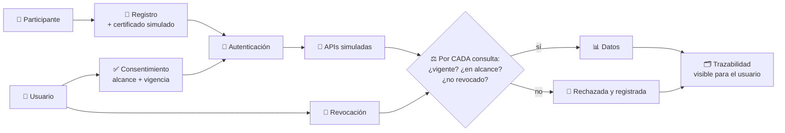
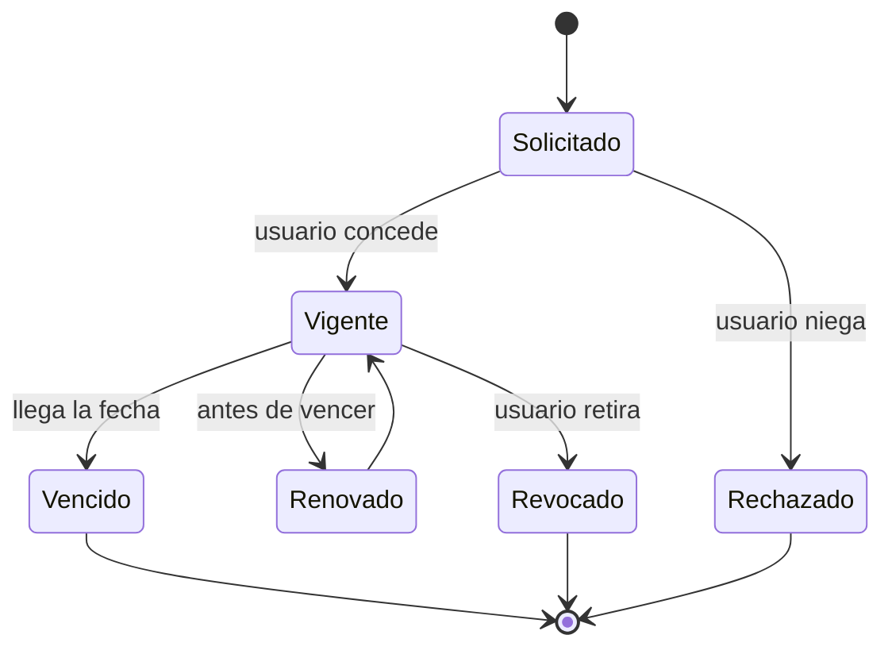

# CM-11 · Finanzas abiertas y consentimiento

> **En una frase, para cualquiera:** das permiso a una aplicación para ver los
> datos de tu banco. La pregunta que casi nadie hace es: ¿qué datos, por cuánto
> tiempo, y cómo se lo quitas?

**Estado real:** 🔴 `planned` · **Carpeta prevista:** `domains/capital-markets/cases/11-open-finance-consent`

> [!WARNING]
> **Participantes, certificados, APIs y datos simulados. Sin credenciales reales
> ni datos personales reales.** No es una autorización regulatoria.

---

## Por qué se realiza este caso

Las finanzas abiertas se apoyan enteramente en el consentimiento: es lo único que
separa «un servicio que te ayuda» de «un tercero con acceso permanente a tu vida
financiera».

Y el consentimiento se rompe de formas discretas:

| Fallo | Qué significa |
|---|---|
| **Consentimiento vencido** | Se sigue consultando después de la fecha |
| **Alcance incorrecto** | Diste permiso para saldos y leen movimientos |
| **Consulta excesiva** | Diez mil consultas diarias para un servicio que necesita una |
| **Token revocado** | Lo quitaste y sigue funcionando |
| Duplicación | El mismo consentimiento registrado dos veces, y revocas uno |
| Indisponibilidad | La API cae y el servicio finge tener datos frescos |
| **Filtración** | Los datos llegan a un cuarto que nunca estuvo en el trato |

## La idea que enseña, y que ningún otro caso enseña

**El consentimiento es un objeto con ciclo de vida, no una casilla.** Nace con un
alcance y una fecha, se puede renovar, se puede revocar, y **cada consulta tiene
que comprobarlo en el momento**. Si el sistema solo lo comprueba al conceder, la
revocación no significa nada.

Y de ahí la trazabilidad: la persona tiene que poder ver **quién consultó qué y
cuándo**, sin excepción.

## Casos de uso reales

- Una aplicación de finanzas personales que agrega cuentas de varios bancos.
- Un iniciador de pagos que opera sobre la cuenta del usuario.
- Un evaluador de crédito que consulta ingresos con permiso.
- Formación: por qué revocar tiene que ser tan fácil como conceder.

## Cómo funcionará





## Esquemas

```json
{
  "consent": {
    "id": "cons-001",
    "user": "usuario-sintetico-1",
    "participant": "app-sim-1",
    "scope": ["accounts:balances"],
    "grantedAt": "2026-08-07T00:00:00Z",
    "expiresAt": "2026-11-07T00:00:00Z",
    "status": "vigente"
  }
}
```

```json
{
  "findings": [
    { "kind": "ExpiredConsent", "consent": "cons-001", "queriedAt": "2026-12-01T10:00:00Z" },
    { "kind": "ScopeViolation", "consent": "cons-002", "requested": "accounts:transactions", "granted": ["accounts:balances"] },
    { "kind": "ExcessiveQuerying", "participant": "app-sim-2", "queriesPerDay": 9840, "expected": 24 }
  ]
}
```

## Software necesario

| Componente | Para qué |
|---|---|
| **Rust** 1.75+ | Ciclo de vida del consentimiento y APIs simuladas |
| **Node.js** 20+ / **pnpm** 9+ | Pantalla de consentimiento y trazabilidad para el usuario |

Sin jaula ni Linux. **Los certificados son simulados y generados en local**; el
proyecto no almacena credenciales reales en ningún sitio, tampoco en fixtures.

## Instalación

```bash
cargo build --release
```

## Procesos que se crearán

```text
sandboxctl markets consent --scenario token-revocado
  │
  └─ un proceso determinista, sin red
      ├─ reloj simulado (los consentimientos duran meses)
      ├─ APIs simuladas en proceso
      └─ registro append-only de cada consulta
```

Reloj simulado y sin red: se pueden probar tres meses de vigencia en
milisegundos, y sin llamar a ningún sistema externo.

## Tiempo de carga estimado

| Operación | Coste esperado |
|---|---|
| Conceder o revocar un consentimiento | < 1 ms |
| Comprobar una consulta contra el consentimiento | microsegundos |
| Simular tres meses de consultas | segundos |

## Qué hace falta para construirlo

1. Modelo de consentimiento con alcance, vigencia y estado.
2. Comprobación **en cada consulta**, no solo al conceder.
3. Revocación efectiva e inmediata, con escenario que lo demuestre.
4. Registro de trazabilidad visible para el usuario.
5. Detección de consulta excesiva, alcance incorrecto y duplicación.
6. Escenario de indisponibilidad: la API cae y el sistema **no finge**.

## Si algo falla

Este caso **todavía no tiene código**. Lo que sigue son los fallos que el diseño
tiene que resolver, y cómo va a resolverlos:

| Situación | Causa | Cómo se resuelve |
|---|---|---|
| Una consulta funciona después de revocar | **El fallo más grave del caso** | El consentimiento se comprueba **en cada consulta**, no solo al conceder. Si se comprueba únicamente al conceder, revocar no significa nada |
| `ScopeViolation` | El participante pide más de lo que se le concedió | Se rechaza y se registra. No se amplía el alcance sin volver a pedírselo al usuario |
| `ExcessiveQuerying` | Miles de consultas para un servicio que necesita unas pocas | Puede ser un fallo del participante o una recolección encubierta. Se limita y se le pide explicación |
| La API simulada no responde | Escenario de indisponibilidad | El sistema **no finge tener datos frescos**: devuelve el fallo. Servir datos viejos como actuales es peor que no servir nada |
| El usuario no sabe quién consultó sus datos | Falta trazabilidad | Cada consulta queda registrada y es visible **para el usuario**, no solo para auditoría interna |

Los fallos que afectan a **cualquier** caso —la compilación, el catálogo, la
evidencia— están resueltos uno a uno en
**[Cuando algo falla](../SOLUCION-DE-PROBLEMAS.md)**.

Esta familia **no necesita aislamiento del sistema**: no ejecuta código ajeno,
sino reglas de negocio deterministas. Por eso casi ningún fallo suyo viene del
entorno, y casi todos vienen de los datos.

---

**Ver también:** [Catálogo completo](../CATALOGO.md) · [CM-19 · fraude](cm-19-fraude-y-toma-de-cuentas.md) · [Caso 08 · agentes de IA](08-sandbox-de-herramientas-de-agente-ia.md)
