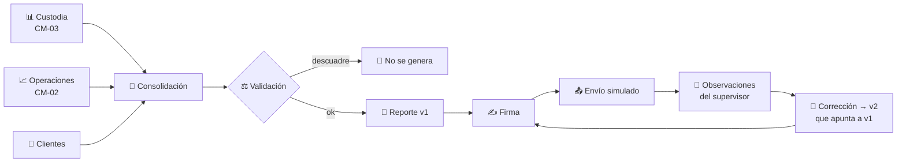
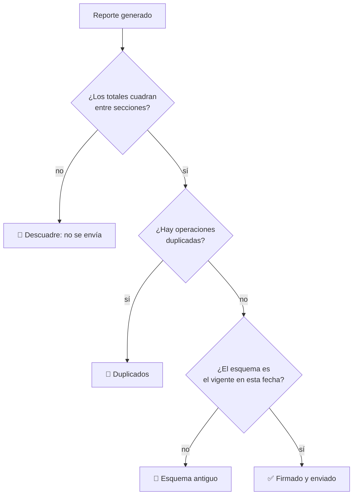

# CM-12 · Reportería regulatoria y SupTech

> **En una frase, para cualquiera:** cada cierto tiempo hay que enviarle al
> supervisor un resumen de todo. Si las cifras no cuadran entre sí, o si un
> número de hace tres meses cambia sin dejar rastro, el problema deja de ser
> administrativo.

**Estado real:** 🔴 `planned` · **Carpeta prevista:** `domains/capital-markets/cases/12-regulatory-reporting`

> [!WARNING]
> **Reportes, envíos y observaciones simulados.** No es una autorización
> regulatoria ni constituye un envío real a ninguna autoridad.

---

## Por qué se realiza este caso

Un reporte regulatorio consolida datos de todos los demás sistemas. Es, por
tanto, donde se hacen visibles las inconsistencias que cada sistema por separado
no notaba:

| Problema | Qué revela |
|---|---|
| **Cifras descuadradas** | Dos sistemas internos no coinciden |
| Reporte incompleto | Falta una parte y nadie lo detectó al generarlo |
| **Duplicados** | La misma operación contada dos veces |
| Atraso | El plazo venció |
| Esquema antiguo | El formato cambió y se sigue enviando el anterior |
| **Alteración histórica** | Un dato ya enviado se modifica sin dejar rastro |

Ese último es el más grave con diferencia. Corregir es legítimo —hay
observaciones y hay correcciones— pero **corregir sin dejar rastro no lo es**: si
la versión anterior desaparece, nadie puede saber qué se dijo la primera vez.

## La idea que enseña, y que ningún otro caso enseña

**Corregir sí, reescribir la historia no.** Cada reporte es una versión firmada.
Una corrección genera una versión nueva que apunta a la anterior. La cadena
completa se conserva y se puede verificar.

Es exactamente el mismo mecanismo que usa la
[evidencia de este proyecto](../EVIDENCE_FORMAT.md) —firma, huella y
encadenamiento— aplicado a reportes en vez de a ejecuciones. Esa pieza **ya está
construida**.

## Casos de uso reales

- Envíos periódicos de una entidad supervisada.
- Un supervisor que valida lo que recibe y emite observaciones.
- Reconstruir qué se reportó en una fecha concreta.
- Formación: por qué un reporte es un documento firmado y no una consulta.

## Cómo funcionará





## Esquemas

```json
{
  "report": {
    "id": "rep-2026-07",
    "period": "2026-07",
    "schemaVersion": "2.1",
    "version": 1,
    "previousVersion": null,
    "sections": { "custody": { "totalClientAssets": 12500000000 } },
    "signature": "base64…",
    "sha256": "…"
  }
}
```

```json
{
  "report": {
    "id": "rep-2026-07",
    "version": 2,
    "previousVersion": 1,
    "previousSha256": "…",
    "correctionReason": "observación OBS-14: faltaba la sección de garantías",
    "signature": "base64…"
  }
}
```

`previousSha256` es lo que hace la cadena verificable: alterar la versión 1
después de emitir la 2 rompe el enlace y se detecta.

## Software necesario

| Componente | Para qué | ¿Obligatorio? |
|---|---|---|
| **Rust** 1.75+ | Consolidación, validación y firma Ed25519 | Sí |
| **Node.js** 20+ / **pnpm** 9+ | Panel de envíos y observaciones | No |

Reutiliza la firma y el encadenamiento del
[formato de evidencia](../EVIDENCE_FORMAT.md), ya construido y verificado en cada
commit con `sandboxctl evidence verify`.

## Instalación

```bash
cargo build --release
cargo run -p sandboxctl -- evidence verify   # el mecanismo de firma que reutiliza
```

## Procesos que se crearán

```text
sandboxctl markets report --period 2026-07
  │
  └─ un proceso determinista, sin red
      ├─ consolidación desde los demás casos
      ├─ validación cruzada de totales
      ├─ firma Ed25519 con clave local desechable
      └─ envío SIMULADO (no sale nada a ninguna parte)
```

**El envío es simulado.** No hay conectividad de producción con ninguna
autoridad, y no la habrá.

## Tiempo de carga estimado

| Operación | Coste esperado |
|---|---|
| Consolidar un periodo | milisegundos a segundos según volumen |
| Validación cruzada | < 100 ms |
| Firma | < 1 ms |
| Verificar la cadena completa de versiones | < 50 ms |

## Qué hace falta para construirlo

1. Consolidación desde los casos que ya existen ([CM-03](cm-03-custodia-y-segregacion-de-activos.md)
   primero).
2. Validación cruzada de totales entre secciones.
3. Esquemas **con fecha de vigencia**: el formato cambia y el pasado no se
   reescribe.
4. Firma y encadenamiento de versiones.
5. Ciclo de observaciones y correcciones.
6. Detección de alteración histórica.

---

**Ver también:** [Catálogo completo](../CATALOGO.md) · [Formato de evidencia](../EVIDENCE_FORMAT.md) · [CM-03 · custodia](cm-03-custodia-y-segregacion-de-activos.md)
