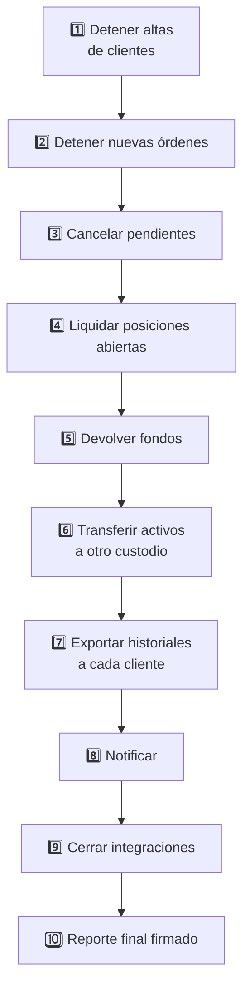
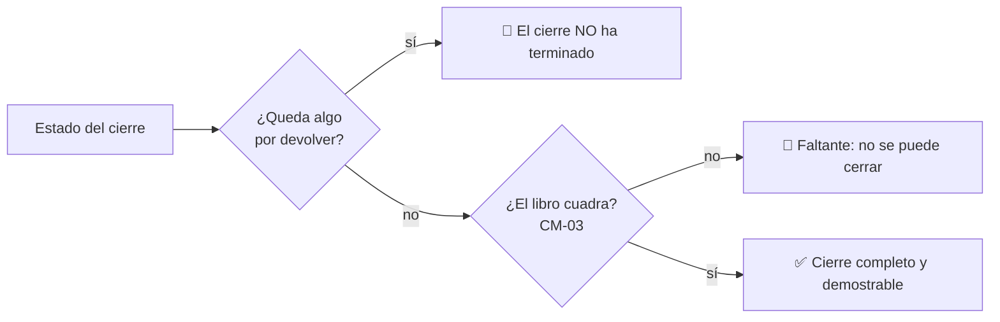

# CM-13 · Salida ordenada

> **En una frase, para cualquiera:** cerrar una empresa que maneja dinero ajeno
> no es apagar los servidores. Es devolver cada peso a su dueño, y poder
> demostrar que se devolvió.

**Estado real:** 🔴 `planned` · **Carpeta prevista:** `domains/capital-markets/cases/13-orderly-wind-down`

> [!WARNING]
> **Clientes, fondos y activos simulados.** No es una autorización regulatoria.

---

## Por qué se realiza este caso

El cierre es el momento donde se comprueba si todo lo anterior era verdad. Si los
activos estaban bien segregados, devolverlos es un procedimiento. Si estaban
mezclados, es una liquidación concursal.

Por eso [CM-00](cm-00-entrada-al-sandbox-regulatorio.md) **pide el plan de salida
al entrar**: quien no sabe explicar cómo devolvería el dinero probablemente no ha
separado bien de quién es.

Lo que sale mal cuando no hay plan:

| Fallo | Consecuencia |
|---|---|
| Se siguen aceptando clientes mientras se cierra | Más gente afectada |
| Quedan órdenes pendientes sin cancelar | Obligaciones nuevas después de decidir cerrar |
| Se devuelve por orden de llegada | Los primeros cobran todo, los últimos nada |
| No se exportan los historiales | Los clientes pierden la prueba de lo que tenían |
| Las integraciones siguen vivas | Terceros siguen operando contra un sistema que ya no atiende |

## La idea que enseña, y que ningún otro caso enseña

**Cerrar es un procedimiento con orden obligatorio.** No se pueden hacer los
pasos en cualquier secuencia: primero se detiene la entrada, después se cancela
lo pendiente, después se liquida, y solo entonces se devuelve. Saltarse el orden
crea obligaciones nuevas mientras se intenta cumplir las viejas.

## Casos de uso reales

- Una plataforma que decide cerrar y debe devolver los fondos.
- Un supervisor que exige acreditar un plan de salida probado.
- Un traspaso de cartera a otro custodio.
- Ensayar el cierre antes de necesitarlo, que es la única forma de saber si
  funciona.

## Cómo funcionará





## Esquemas

```json
{
  "windDown": {
    "startedAt": "2026-08-07T00:00:00Z",
    "steps": [
      { "step": "stop-onboarding", "status": "done" },
      { "step": "stop-new-orders", "status": "done" },
      { "step": "cancel-pending", "status": "done", "cancelled": 412 },
      { "step": "liquidate", "status": "in-progress" }
    ]
  }
}
```

```json
{
  "finalReport": {
    "clientsRepaid": 1840,
    "clientsPending": 0,
    "assetsTransferred": [{ "instrument": "ACME-SIM", "units": 90000, "toCustodian": "custodio-sim-2" }],
    "ledgerBalanced": true,
    "reconciliationFindings": [],
    "historiesExported": true,
    "signature": "base64…"
  }
}
```

`clientsPending: 0` **y** `reconciliationFindings: []` juntos son la definición
de cierre completo. Cualquier otra combinación significa que el cierre no ha
terminado, por mucho que los servidores estén apagados.

## Software necesario

| Componente | Para qué |
|---|---|
| **Rust** 1.75+ | Máquina de estados del cierre y reporte final firmado |
| **Node.js** 20+ / **pnpm** 9+ | Panel del progreso del cierre (recomendado) |

Sin jaula ni Linux. Se apoya en [CM-03](cm-03-custodia-y-segregacion-de-activos.md)
—ya construido— para comprobar que el libro cuadra al final.

## Instalación

```bash
cargo build --release
```

## Procesos que se crearán

```text
sandboxctl markets wind-down --scenario cierre-con-faltante
  │
  └─ un proceso determinista, sin red
      ├─ máquina de estados con orden OBLIGATORIO
      ├─ conciliación CM-03 al final
      └─ reporte final firmado
```

## Tiempo de carga estimado

| Operación | Coste esperado |
|---|---|
| Ejecutar el cierre completo de una cartera simulada | < 1 s |
| Conciliación final | milisegundos |
| Reporte final firmado | < 10 ms |

## Qué hace falta para construirlo

1. Máquina de estados con el orden de los pasos como restricción, no como
   sugerencia.
2. Devolución con regla de reparto explícita, **no por orden de llegada**.
3. Transferencia a otro custodio simulado.
4. Exportación de historiales por cliente.
5. Reporte final firmado con conciliación incluida.
6. Escenario de cierre **con faltante**: qué se hace cuando no alcanza.

## Si algo falla

Este caso **todavía no tiene código**. Lo que sigue son los fallos que el diseño
tiene que resolver, y cómo va a resolverlos:

| Situación | Causa | Cómo se resuelve |
|---|---|---|
| El cierre termina y quedan clientes sin cobrar | `clientsPending > 0` | **El cierre no ha terminado**, por mucho que los servidores estén apagados. La definición de cierre completo son dos campos: `clientsPending: 0` y `reconciliationFindings: []` |
| Aparece un faltante al conciliar | No había tanto como decían los libros | Es el escenario que hay que ensayar antes de necesitarlo. Se reparte con la regla publicada, **nunca por orden de llegada** |
| Se ejecutan los pasos en otro orden | El orden es una restricción, no una sugerencia | La máquina de estados lo impide: cancelar pendientes antes de detener nuevas órdenes crea obligaciones mientras intentas cumplir las viejas |
| Los clientes no reciben su historial | Falta la exportación | Sin historial, el cliente pierde la prueba de lo que tenía. Es un paso obligatorio del cierre, no un extra |
| Nadie había probado el plan de cierre | Lo habitual | Por eso [CM-00](cm-00-entrada-al-sandbox-regulatorio.md) lo exige al entrar: un plan sin ensayar es un documento, no un plan |

Los fallos que afectan a **cualquier** caso —la compilación, el catálogo, la
evidencia— están resueltos uno a uno en
**[Cuando algo falla](../SOLUCION-DE-PROBLEMAS.md)**.

Esta familia **no necesita aislamiento del sistema**: no ejecuta código ajeno,
sino reglas de negocio deterministas. Por eso casi ningún fallo suyo viene del
entorno, y casi todos vienen de los datos.

---

**Ver también:** [Catálogo completo](../CATALOGO.md) · [CM-00 · entrada](cm-00-entrada-al-sandbox-regulatorio.md) · [CM-03 · custodia](cm-03-custodia-y-segregacion-de-activos.md)
