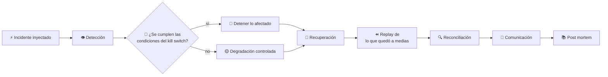
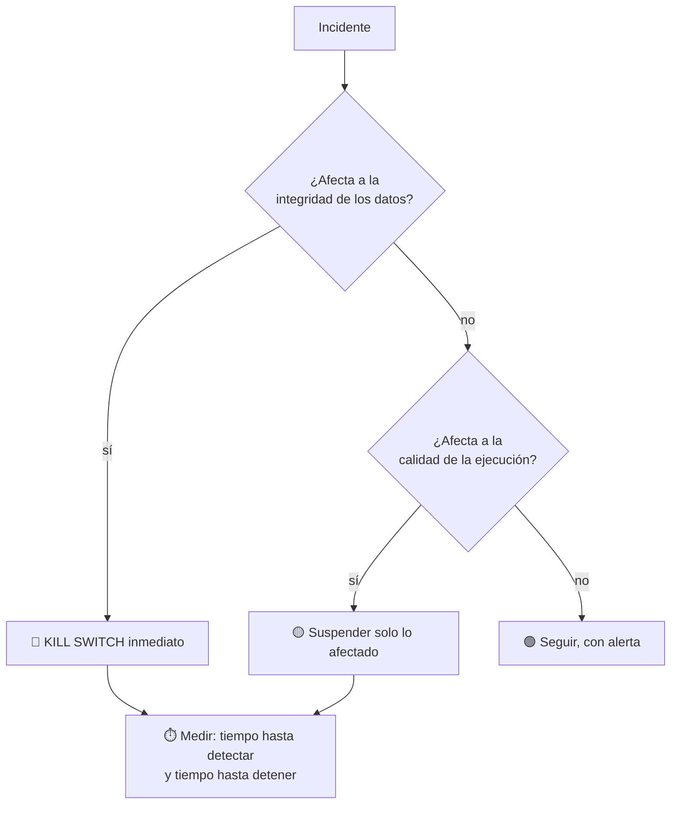

# CM-14 · Resiliencia operacional

> **En una frase, para cualquiera:** los sistemas se caen. La diferencia entre
> un susto y un desastre es si alguien había ensayado qué hacer, y si el sistema
> sabe pararse solo antes de hacer daño.

**Estado real:** 🔴 `planned` · **Carpeta prevista:** `domains/capital-markets/cases/14-operational-resilience`

> [!WARNING]
> **Incidentes, sistemas y datos simulados.** No es una autorización regulatoria.

---

## Por qué se realiza este caso

En un sistema financiero, seguir funcionando mal es **peor que detenerse**. Un
motor de órdenes con precios erróneos ejecuta operaciones reales a precios que no
existen, y deshacerlas después es caro, lento y a veces imposible.

| Incidente | Por qué es peligroso seguir |
|---|---|
| Base de datos caída | Se opera sobre un estado que no se puede persistir |
| Mensajes duplicados | La misma orden se ejecuta dos veces |
| Latencia alta | Se opera con precios de hace medio minuto |
| Motor de órdenes desconectado | Nadie sabe qué se ejecutó y qué no |
| **Precios erróneos** | Se ejecuta a precios inventados |
| Custodio indisponible | Se prometen entregas que no se pueden cumplir |
| Credenciales comprometidas | Cada segundo cuenta |
| Despliegue defectuoso | El fallo se multiplica por el volumen |

## La idea que enseña, y que ningún otro caso enseña

**Detenerse a tiempo es una función del sistema.** El *kill switch* no es un
botón de emergencia para humanos: es un control con condiciones definidas de
antemano —qué lo dispara, qué se detiene, qué sigue funcionando— y que se
**ensaya**.

Y junto a él, la degradación controlada: cuando algo falla, el sistema no elige
entre «todo» y «nada», sino que apaga por partes en un orden decidido antes.

## Casos de uso reales

- Ensayo de continuidad operacional exigido a una entidad supervisada.
- Un equipo que quiere saber si su kill switch funciona de verdad.
- Post mortem de un incidente real, reproducido.
- Formación: por qué degradar es mejor que caerse entero.

## Cómo funcionará





Esos dos tiempos —**detectar** y **detener**— son las métricas del caso. Todo lo
demás se deriva de ellas.

## Esquemas

```json
{
  "incident": {
    "kind": "stale-prices",
    "injectedAt": 1200,
    "affects": ["order-engine"],
    "severity": "alta"
  }
}
```

```json
{
  "response": {
    "detectedAtMs": 340,
    "killSwitchTriggeredAtMs": 380,
    "stopped": ["nuevas órdenes en ACME-SIM"],
    "keptRunning": ["consulta de saldos", "cancelaciones"],
    "replayed": 128,
    "reconciliationFindings": [],
    "dataIntegrityPreserved": true
  }
}
```

`keptRunning` importa tanto como `stopped`: **las cancelaciones siguen vivas**
durante un incidente. Impedir cancelar mientras el mercado se mueve es atrapar a
los clientes en sus posiciones.

## Software necesario

| Componente | Para qué |
|---|---|
| **Rust** 1.75+ | Inyección de incidentes, kill switch y replay |
| **Node.js** 20+ / **pnpm** 9+ | Panel de estado durante el incidente (recomendado) |

Sin jaula ni Linux: los incidentes se inyectan en un sistema simulado, no se
provocan fallos reales en el equipo.

## Instalación

```bash
cargo build --release
```

## Procesos que se crearán

```text
sandboxctl markets resilience --incident precios-obsoletos --seed 7
  │
  └─ un proceso determinista, sin red
      ├─ reloj simulado con inyección en un instante exacto
      ├─ registro append-only para poder hacer replay
      └─ conciliación posterior contra CM-03
```

La semilla y el reloj simulado hacen que **el mismo incidente se reproduzca
igual**, que es lo que permite comparar respuestas entre versiones del sistema.

## Tiempo de carga estimado

| Operación | Coste esperado |
|---|---|
| Un escenario de incidente completo | < 1 s |
| Replay de 100 000 eventos | segundos |
| Conciliación posterior | milisegundos |

## Qué hace falta para construirlo

1. Inyección de los ocho incidentes listados, en instantes exactos.
2. Kill switch con condiciones declarativas y ensayables.
3. Degradación controlada por partes, con orden definido.
4. Replay desde el registro append-only.
5. Conciliación posterior contra [CM-03](cm-03-custodia-y-segregacion-de-activos.md).
6. Post mortem generado con la línea de tiempo y las dos métricas.

---

**Ver también:** [Catálogo completo](../CATALOGO.md) · [CM-10 · liquidación](cm-10-compensacion-y-liquidacion.md) · [CM-16 · datos de mercado](cm-16-integridad-de-datos-de-mercado.md)
