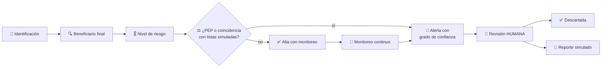
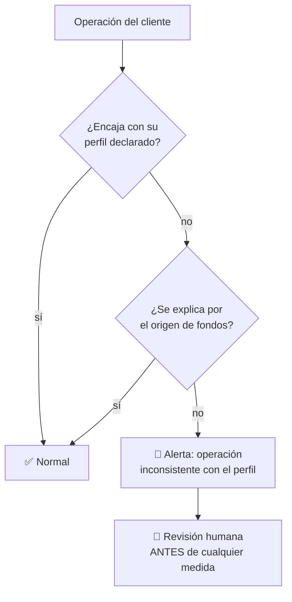

# CM-15 · KYC, AML y sanciones

> **En una frase, para cualquiera:** antes de aceptar el dinero de alguien hay
> que saber quién es y de dónde salió ese dinero. Hacerlo mal tiene dos costes
> opuestos: dejar pasar lo que no debía, o rechazar a gente honesta por parecerse
> a un nombre de una lista.

**Estado real:** 🟠 `prototype` — hay código y escenarios que se ejecutan, **sin verificación en un entorno real** · **Módulo:** [`crates/sandbox-markets/src/cases/kyc.rs`](../../crates/sandbox-markets/src/cases/kyc.rs)

> [!WARNING]
> **Identidades, listas de sanciones, alertas y reportes SIMULADOS.** **No se usan
> datos personales reales en ningún sitio, tampoco como datos de prueba.** No es
> una autorización regulatoria.

---

## Por qué se realiza este caso

Este caso tiene una particularidad que lo separa del resto: **el error tiene dos
direcciones y las dos hacen daño**.

| Error | A quién perjudica |
|---|---|
| Falso negativo | Entra dinero de origen ilícito. La entidad responde |
| **Falso positivo** | Se rechaza o se congela a una persona honesta, a veces sin explicación y sin recurso |

Los falsos positivos son mucho más frecuentes y casi nunca se cuentan. Un
apellido común basta para parecerse a un nombre de una lista, y las consecuencias
para quien las sufre son reales: cuentas cerradas, transferencias detenidas,
imposibilidad de operar.

Y hay una dificultad estructural: **el beneficiario final**. Una empresa
propiedad de otra empresa propiedad de un fideicomiso puede ocultar quién manda
de verdad, sin que ninguna capa sea ilegal por sí sola.

## La idea que enseña, y que ningún otro caso enseña

**Un riesgo es una hipótesis, no un veredicto.** Una coincidencia con una lista
es un motivo para mirar, no una conclusión. El diseño lo refleja: toda alerta
lleva su **grado de confianza**, su motivo, y **pasa por revisión humana** antes
de tener consecuencias para una persona.

## Casos de uso reales

- Alta de clientes en una entidad financiera.
- Monitoreo continuo de operaciones de clientes existentes.
- Revisión de estructuras societarias para hallar al beneficiario final.
- Formación: medir falsos positivos, no solo detecciones.

## Cómo funcionará





## Esquemas

```json
{
  "customer": {
    "id": "cli-sintetico-1",
    "type": "empresa",
    "ownershipChain": [
      { "level": 1, "entity": "empresa-sim-A", "share": 0.6 },
      { "level": 2, "entity": "persona-sintetica-1", "share": 1.0 }
    ],
    "ultimateBeneficialOwner": "persona-sintetica-1",
    "riskLevel": "medio",
    "pep": false
  }
}
```

```json
{
  "alert": {
    "kind": "SanctionsNameMatch",
    "customer": "cli-sintetico-1",
    "matchedAgainst": "lista-simulada-1",
    "confidence": 0.62,
    "matchType": "fonética",
    "requiresHumanReview": true,
    "automaticMeasureTaken": false
  }
}
```

`automaticMeasureTaken: false` es la regla del caso: **ninguna medida
automática** sobre una persona basada solo en una coincidencia.

## Software necesario

| Componente | Para qué |
|---|---|
| **Rust** 1.75+ | Perfilado de riesgo, coincidencia de nombres y monitoreo |
| **Node.js** 20+ / **pnpm** 9+ | Cola de revisión humana (recomendado) |

Sin jaula ni Linux. **Las listas de sanciones son sintéticas y viven en el
repositorio como datos de ejemplo**; no se descargan listas reales ni se usan
nombres de personas reales.

## Instalación

```bash
cargo build --release
```

## Procesos que se crearán

```text
sandboxctl markets kyc --scenario falso-positivo
  │
  └─ un proceso determinista, sin red
      ├─ listas sintéticas locales
      ├─ coincidencia con grado de confianza
      └─ cola de revisión humana (nada se decide solo)
```

Sin red **también por privacidad**: consultar listas externas con los datos de un
cliente es, en sí mismo, una transferencia de datos personales.

## Tiempo de carga estimado

| Operación | Coste esperado |
|---|---|
| Alta con comprobación completa | < 50 ms |
| Cotejo contra listas sintéticas | < 10 ms |
| Monitoreo de 100 000 operaciones | segundos |

## Qué hace falta para construirlo

1. Identidades y listas **sintéticas**, generadas y documentadas como tales.
2. Resolución del beneficiario final a través de cadenas societarias.
3. Coincidencia de nombres con grado de confianza, no binaria.
4. **Métrica de falsos positivos** junto a la de detecciones.
5. Cola de revisión humana obligatoria antes de cualquier medida.
6. Reporte simulado, que nunca sale a ninguna autoridad.

## Si algo falla

El caso **ya tiene código y escenarios que se ejecutan**. Lo que sigue son sus
fallos con la causa y la salida:

| Situación | Causa | Cómo se resuelve |
|---|---|---|
| Una persona honesta queda bloqueada | Falso positivo por parecido de nombre | **Ninguna medida automática** sobre una persona: `automaticMeasureTaken: false` y revisión humana obligatoria. El coste del falso positivo es real y se mide junto al de detección |
| No se identifica al beneficiario final | Cadena societaria con varias capas | Se resuelve recorriendo la cadena. Si no se llega a una persona, **eso es el hallazgo**, no un dato que falte |
| Una operación no encaja con el perfil | Puede ser legítima | Se pide origen de fondos antes de escalar. Una explicación razonable cierra la alerta y queda registrada |
| Se esperan listas de sanciones reales | No las hay | Las listas son sintéticas y viven en el repositorio. Consultar listas externas con datos de un cliente es, en sí mismo, una transferencia de datos personales |
| Aparecen datos personales reales | Prohibido en todo el proyecto | Se retiran y se regeneran sintéticos. No se usan datos reales ni como datos de prueba |

Los fallos que afectan a **cualquier** caso —la compilación, el catálogo, la
evidencia— están resueltos uno a uno en
**[Cuando algo falla](../SOLUCION-DE-PROBLEMAS.md)**.

Esta familia **no necesita aislamiento del sistema**: no ejecuta código ajeno,
sino reglas de negocio deterministas. Por eso casi ningún fallo suyo viene del
entorno, y casi todos vienen de los datos.

## Cómo se comprueba

```bash
cargo run -p sandboxctl -- markets check --case CM-15
```

Ejecuta los escenarios de este caso y compara cada uno con lo que **declara de
antemano** que debe salir. Corre en cada commit: si el caso deja de detectar lo
que dice detectar, la integración continua se pone roja.

```bash
cargo test -p sandbox-markets kyc
```

Los invariantes del módulo, incluidos los que ningún escenario de arriba cubre.

> **Sigue en `prototype`, no en `functional`.** Los escenarios se ejecutan y
> pasan, pero el caso **no emite evidencia firmada por ejecución** ni se ha
> usado contra datos que no sean los suyos. La regla completa está en el
> [ROADMAP](../../ROADMAP.md).

---

**Ver también:** [Catálogo completo](../CATALOGO.md) · [CM-19 · fraude](cm-19-fraude-y-toma-de-cuentas.md) · [CM-20 · gobierno de modelos](cm-20-gobierno-de-modelos-e-ia-financiera.md)
