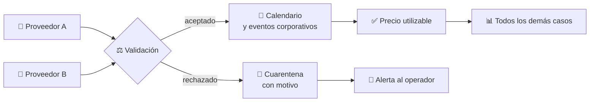
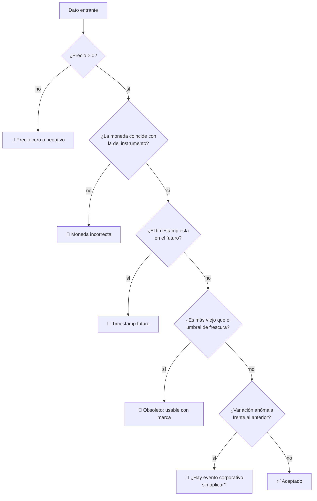

# CM-16 · Integridad de datos de mercado

> **En una frase, para cualquiera:** todo lo demás se apoya en los precios. Si un
> precio llega mal y nadie lo nota, cada decisión que se tome después estará mal
> aunque el sistema funcione perfectamente.

**Estado real:** 🔴 `planned` · **Carpeta prevista:** `domains/capital-markets/cases/16-market-data-integrity`

> [!WARNING]
> **Precios, instrumentos y proveedores simulados.** No es una autorización
> regulatoria ni una recomendación de inversión.

---

## Por qué se realiza este caso

Es el caso **más aburrido y el más fundacional** de la familia. Nadie presume de
tener buenos datos de mercado; todos sufren cuando no los tienen.

| Dato erróneo | Consecuencia aguas abajo |
|---|---|
| **Precio cero** | Valorizaciones a cero, márgenes disparados, liquidaciones forzadas |
| **Moneda incorrecta** | Un instrumento en dólares tratado como pesos: error de ×900 |
| **Timestamp futuro** | El dato «más reciente» nunca se reemplaza |
| Instrumento duplicado | Dos identificadores para lo mismo: posiciones partidas |
| Proveedor caído | Se sigue usando el último precio como si fuera actual |
| **Evento corporativo no aplicado** | Tras un split, el precio parece haber caído a la mitad |

Ese último es especialmente traicionero: el precio es correcto **y** la caída es
falsa. Sin aplicar el evento, cualquier alarma de variación se dispara sin motivo.

## La idea que enseña, y que ningún otro caso enseña

**Un dato tiene que llegar con su procedencia.** Precio, moneda, instrumento,
proveedor, marca de tiempo y qué eventos corporativos tiene ya aplicados. Un
número suelto no es un precio: es un número.

Y con ello, la distinción entre **corregir** y **sobrescribir**: una corrección
de precio deja rastro de cuál era el anterior, porque las decisiones que se
tomaron con el precio viejo hay que poder explicarlas.

## Casos de uso reales

- Consolidar precios de varios proveedores para un mismo instrumento.
- Valorizar una cartera al cierre.
- Detectar datos obsoletos antes de usarlos para calcular márgenes.
- Formación: por qué un precio sin moneda no es un precio.

## Cómo funcionará





## Esquemas

```json
{
  "quote": {
    "instrument": "ACME-SIM",
    "price": { "minorUnits": 10250, "currency": "CLP" },
    "provider": "proveedor-sim-A",
    "timestamp": "2026-08-07T13:45:00Z",
    "corporateActionsApplied": ["split-2026-05"],
    "stale": false
  }
}
```

La moneda va **dentro del precio**, no al lado. Es la misma decisión que en el
tipo `Money` del crate [`sandbox-markets`](../../crates/sandbox-markets), ya
construido: un importe sin moneda es un error esperando a ocurrir.

```json
{
  "findings": [
    { "kind": "ZeroPrice", "instrument": "ACME-SIM", "provider": "proveedor-sim-B" },
    { "kind": "CurrencyMismatch", "instrument": "GLOBAL-SIM", "expected": "USD", "received": "CLP" },
    { "kind": "StaleData", "instrument": "ACME-SIM", "ageSeconds": 3600, "threshold": 300 }
  ]
}
```

## Software necesario

| Componente | Para qué |
|---|---|
| **Rust** 1.75+ | Validación, calendario y consolidación de proveedores |
| **Node.js** 20+ / **pnpm** 9+ | Panel de cuarentena y alertas (recomendado) |

Sin jaula ni Linux. **Los proveedores son simulados**: no hay conectividad con
ninguna fuente real de datos de mercado.

## Instalación

```bash
cargo build --release
```

## Procesos que se crearán

```text
sandboxctl markets data --scenario proveedor-caido
  │
  └─ un proceso determinista, sin red
      ├─ proveedores simulados con fallos inyectables
      ├─ calendario de mercado
      └─ cuarentena append-only
```

## Tiempo de carga estimado

| Operación | Coste esperado |
|---|---|
| Validar un dato | microsegundos |
| Consolidar un día de datos simulados | < 1 s |
| Aplicar un evento corporativo al histórico | milisegundos |

## Qué hace falta para construirlo

1. Modelo de dato con procedencia completa.
2. Las seis validaciones listadas, cada una con escenario.
3. Umbral de frescura configurable, con marca de obsoleto en vez de silencio.
4. Calendario de mercado: festivos y horarios.
5. Corrección con rastro, nunca sobrescritura.
6. Integración con [CM-17](cm-17-eventos-corporativos.md).

---

**Ver también:** [Catálogo completo](../CATALOGO.md) · [CM-17 · eventos corporativos](cm-17-eventos-corporativos.md) · [CM-14 · resiliencia](cm-14-resiliencia-operacional.md)
