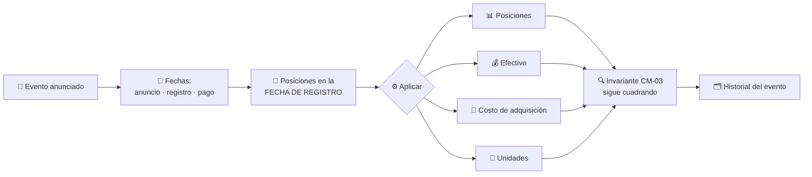
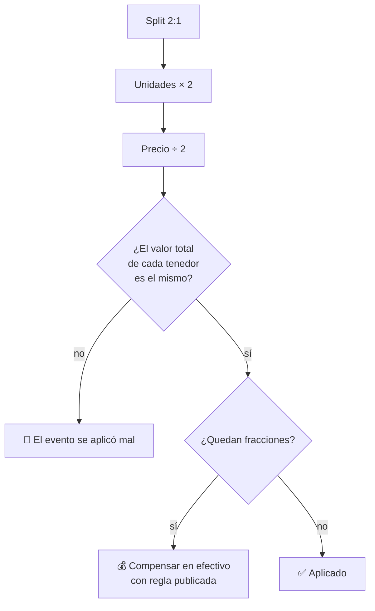

# CM-17 · Eventos corporativos

> **En una frase, para cualquiera:** de vez en cuando una empresa parte sus
> acciones en dos, o reparte dividendos. Nadie compró ni vendió nada, pero todas
> las cuentas de todos los dueños tienen que cambiar a la vez.

**Estado real:** 🟠 `prototype` — hay código y escenarios que se ejecutan, **sin verificación en un entorno real** · **Módulo:** [`crates/sandbox-markets/src/cases/corporate_actions.rs`](../../crates/sandbox-markets/src/cases/corporate_actions.rs)

> [!WARNING]
> **Emisores, eventos y posiciones simulados.** No es una autorización regulatoria
> ni una recomendación de inversión.

---

## Por qué se realiza este caso

Los eventos corporativos son la principal fuente de descuadres que **no vienen de
una operación**. El sistema está preparado para «alguien compró, alguien
vendió»; un split no encaja en ese molde y hay que aplicarlo a mano sobre todas
las posiciones a la vez.

| Evento | Qué cambia |
|---|---|
| **Dividendo** | Aparece efectivo, sin que nadie haya vendido nada |
| **Split** | Se multiplican las unidades y se divide el precio: el valor total no cambia |
| Consolidación | Lo contrario del split |
| Canje | Un instrumento se convierte en otro |
| Derechos preferentes | Aparece un derecho a comprar, que caduca si no se ejerce |
| Vencimiento | El instrumento deja de existir |
| Rescate | El emisor lo recompra |

Y hay tres fechas que casi nunca coinciden, lo que genera la mayoría de los
errores: **quién tenía el instrumento en la fecha de registro**, no quién lo
tiene cuando se paga.

## La idea que enseña, y que ningún otro caso enseña

**Una transformación sobre todas las posiciones a la vez, sin que nadie opere.**
Es atómica —o se aplica a todos o a ninguno— y tiene que dejar el libro
cuadrado. Es el ensayo más exigente del invariante de
[CM-03](cm-03-custodia-y-segregacion-de-activos.md), porque toca miles de
posiciones simultáneamente.

## Casos de uso reales

- Un custodio que aplica dividendos a las cuentas de sus clientes.
- Ajustar precios históricos tras un split para que las series sean comparables.
- Calcular el costo de adquisición después de un canje.
- Formación: por qué un split no hace más rico a nadie.

## Cómo funcionará





Las fracciones son el detalle que se olvida: en un split 3:2, quien tenía 5
unidades pasa a tener 7,5. Y media unidad no existe.

## Esquemas

```json
{
  "corporateAction": {
    "id": "ca-2026-05",
    "instrument": "ACME-SIM",
    "kind": "split",
    "ratio": { "from": 1, "to": 2 },
    "announcedAt": "2026-05-01",
    "recordDate": "2026-05-15",
    "paymentDate": "2026-05-20",
    "fractionPolicy": "cash-in-lieu"
  }
}
```

```json
{
  "applied": {
    "positionsAffected": 1840,
    "unitsBefore": 500000,
    "unitsAfter": 1000000,
    "totalValueChanged": false,
    "cashInLieuPaid": { "minorUnits": 42000, "currency": "CLP" },
    "ledgerBalanced": true,
    "atomic": true
  }
}
```

`totalValueChanged: false` es el invariante del split; `ledgerBalanced: true` es
el de custodia. Los dos tienen que cumplirse a la vez.

## Software necesario

| Componente | Para qué |
|---|---|
| **Rust** 1.75+ | Aplicación atómica sobre posiciones y libro contable |
| **Node.js** 20+ / **pnpm** 9+ | Panel de eventos (opcional) |

Sin jaula ni Linux. Se apoya en `Money`, `Ledger` y `CustodyBook`, **ya
construidos**.

## Instalación

```bash
cargo build --release
```

## Procesos que se crearán

```text
sandboxctl markets corporate-action --event ca-2026-05
  │
  └─ un proceso determinista, sin red
      ├─ snapshot de posiciones a la fecha de registro
      ├─ aplicación ATÓMICA (todas o ninguna)
      └─ conciliación CM-03 al terminar
```

## Tiempo de carga estimado

| Operación | Coste esperado |
|---|---|
| Aplicar un evento a 10 000 posiciones | < 100 ms |
| Conciliación posterior | milisegundos |
| Recalcular precios históricos ajustados | proporcional a la serie |

## Qué hace falta para construirlo

1. Los siete tipos de evento.
2. Las tres fechas, con el snapshot tomado en la **fecha de registro**.
3. Aplicación atómica con reversa si algo falla a mitad.
4. Política de fracciones explícita y publicada.
5. Actualización de costo de adquisición e historial.
6. Conciliación con [CM-03](cm-03-custodia-y-segregacion-de-activos.md) tras cada
   evento.

## Si algo falla

El caso **ya tiene código y escenarios que se ejecutan**. Lo que sigue son sus
fallos con la causa y la salida:

| Situación | Causa | Cómo se resuelve |
|---|---|---|
| Tras un split los tenedores tienen más o menos valor | El evento se aplicó mal | `totalValueChanged` tiene que ser `false`: un split no hace más rico a nadie. Si cambia, el cálculo está mal |
| Quedan fracciones de unidad | Un split 3:2 sobre 5 unidades da 7,5 | Se compensa en efectivo con la regla publicada (`fractionPolicy`). Media unidad no existe y redondear en silencio genera descuadres |
| El dividendo fue a quien no correspondía | Se usó la fecha equivocada | Cuenta quién tenía el instrumento en la **fecha de registro**, no quien lo tiene el día del pago. Es el error más común del caso |
| El evento se aplicó a la mitad de las posiciones | Se rompió la atomicidad | O a todos o a ninguno, con reversa si algo falla a mitad. Después se concilia contra [CM-03](cm-03-custodia-y-segregacion-de-activos.md) |
| Las series históricas dejan de ser comparables | Faltan los precios ajustados | Se recalculan hacia atrás con el factor del evento, conservando también los originales |

Los fallos que afectan a **cualquier** caso —la compilación, el catálogo, la
evidencia— están resueltos uno a uno en
**[Cuando algo falla](../SOLUCION-DE-PROBLEMAS.md)**.

Esta familia **no necesita aislamiento del sistema**: no ejecuta código ajeno,
sino reglas de negocio deterministas. Por eso casi ningún fallo suyo viene del
entorno, y casi todos vienen de los datos.

## Cómo se comprueba

```bash
cargo run -p sandboxctl -- markets check --case CM-17
```

Ejecuta los escenarios de este caso y compara cada uno con lo que **declara de
antemano** que debe salir. Corre en cada commit: si el caso deja de detectar lo
que dice detectar, la integración continua se pone roja.

```bash
cargo test -p sandbox-markets corporate_actions
```

Los invariantes del módulo, incluidos los que ningún escenario de arriba cubre.

> **Sigue en `prototype`, no en `functional`.** Los escenarios se ejecutan y
> pasan, pero el caso **no emite evidencia firmada por ejecución** ni se ha
> usado contra datos que no sean los suyos. La regla completa está en el
> [ROADMAP](../../ROADMAP.md).

---

**Ver también:** [Catálogo completo](../CATALOGO.md) · [CM-03 · custodia](cm-03-custodia-y-segregacion-de-activos.md) · [CM-16 · datos de mercado](cm-16-integridad-de-datos-de-mercado.md)
