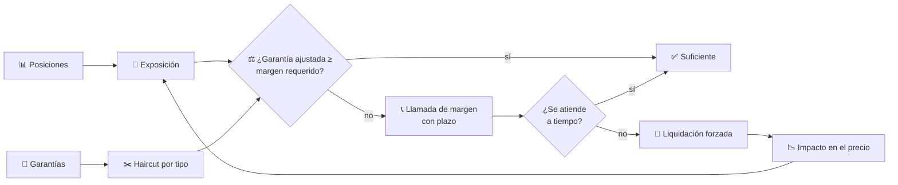
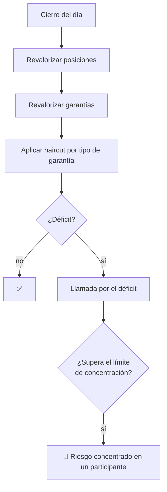

# CM-18 · Margen, garantías y riesgo

> **En una frase, para cualquiera:** si te dejan operar con dinero prestado,
> alguien tiene que asegurarse de que puedes responder cuando las cosas van en tu
> contra. Ese cálculo se hace todos los días, y cuando falla, falla para todos a
> la vez.

**Estado real:** 🔴 `planned` · **Carpeta prevista:** `domains/capital-markets/cases/18-margin-collateral-risk`

> [!WARNING]
> **Exposiciones, garantías y liquidaciones simuladas.** No es una autorización
> regulatoria ni una recomendación de inversión.

---

## Por qué se realiza este caso

El margen es lo que permite que alguien opere por más de lo que tiene, y lo que
impide que su pérdida se convierta en pérdida de otro.

| Concepto | Qué es, en llano |
|---|---|
| **Exposición** | Cuánto se puede perder si el precio va en contra |
| **Haircut** | Cuánto se descuenta del valor de una garantía. Una acción vale menos como garantía que efectivo, porque puede caer justo cuando haga falta |
| **Margen inicial** | Lo que hay que depositar para abrir la posición |
| **Margen de variación** | Lo que hay que añadir cada día según cómo se mueva el precio |
| **Llamada de margen** | El aviso de que hay que poner más, y el plazo para hacerlo |
| **Liquidación forzada** | Cerrar la posición cuando no se atiende la llamada |

Y el problema que hace este caso difícil: **las garantías caen cuando más se
necesitan**. En un mal día, el precio del activo baja y el de la garantía
también, así que la llamada de margen crece justo cuando cuesta más atenderla.
Si además todos deben liquidar a la vez, la venta forzada hunde el precio y
genera más llamadas.

## La idea que enseña, y que ningún otro caso enseña

**El riesgo es dinámico, y liquidar tiene efecto sobre el mercado.** Es el único
caso de la familia donde la acción del sistema **cambia las condiciones que la
provocaron**. Simularlo sin ese efecto es simular otra cosa.

## Casos de uso reales

- Una cámara que calcula márgenes de sus participantes.
- Un intermediario que ofrece apalancamiento a clientes.
- Pruebas de tensión sobre una cartera.
- Formación: por qué un haircut existe y por qué no es el mismo para todo.

## Cómo funcionará



El bucle final —de `Impacto` a `Exposición`— es el punto del caso. Sin él, la
simulación es optimista.



## Esquemas

```json
{
  "participant": "P1",
  "positions": [{ "instrument": "ACME-SIM", "quantity": 10000, "price": { "minorUnits": 10000, "currency": "CLP" } }],
  "collateral": [
    { "kind": "cash", "value": { "minorUnits": 5000000, "currency": "CLP" }, "haircut": 0.0 },
    { "kind": "equity", "value": { "minorUnits": 8000000, "currency": "CLP" }, "haircut": 0.25 }
  ]
}
```

```json
{
  "margin": {
    "initialRequired": { "minorUnits": 12000000, "currency": "CLP" },
    "variationToday": { "minorUnits": 900000, "currency": "CLP" },
    "collateralAfterHaircut": { "minorUnits": 11000000, "currency": "CLP" },
    "shortfall": { "minorUnits": 1900000, "currency": "CLP" },
    "marginCall": { "deadline": "2026-08-08T12:00:00Z" },
    "forcedLiquidation": null
  }
}
```

## Software necesario

| Componente | Para qué |
|---|---|
| **Rust** 1.75+ | Cálculo de margen, haircuts y simulación del impacto |
| **Node.js** 20+ / **pnpm** 9+ | Panel de exposiciones y llamadas (recomendado) |

Sin jaula ni Linux. Aritmética con **enteros en unidades mínimas**: un error de
redondeo en un cálculo de margen se convierte en una llamada equivocada.

## Instalación

```bash
cargo build --release
```

## Procesos que se crearán

```text
sandboxctl markets margin --scenario caida-de-garantias --seed 3
  │
  └─ un proceso determinista, sin red
      ├─ revalorización diaria con reloj simulado
      ├─ liquidación forzada con impacto en el precio
      └─ conciliación CM-03 y liquidación CM-10
```

## Tiempo de carga estimado

| Operación | Coste esperado |
|---|---|
| Calcular márgenes de 1 000 participantes | < 100 ms |
| Simular 250 días de mercado | segundos |
| Una liquidación forzada con impacto | milisegundos |

## Qué hace falta para construirlo

1. Exposición por posición e instrumento.
2. Haircuts por tipo de garantía, configurables y versionados.
3. Margen inicial y de variación, con revalorización diaria.
4. Llamadas con plazo y liquidación forzada al vencer.
5. **Impacto de la liquidación sobre el precio**, realimentado.
6. Límites de concentración por participante e instrumento.

---

**Ver también:** [Catálogo completo](../CATALOGO.md) · [CM-10 · liquidación](cm-10-compensacion-y-liquidacion.md) · [CM-14 · resiliencia](cm-14-resiliencia-operacional.md)
