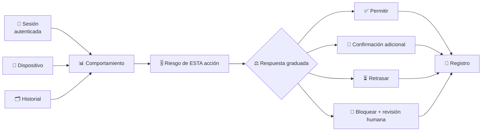
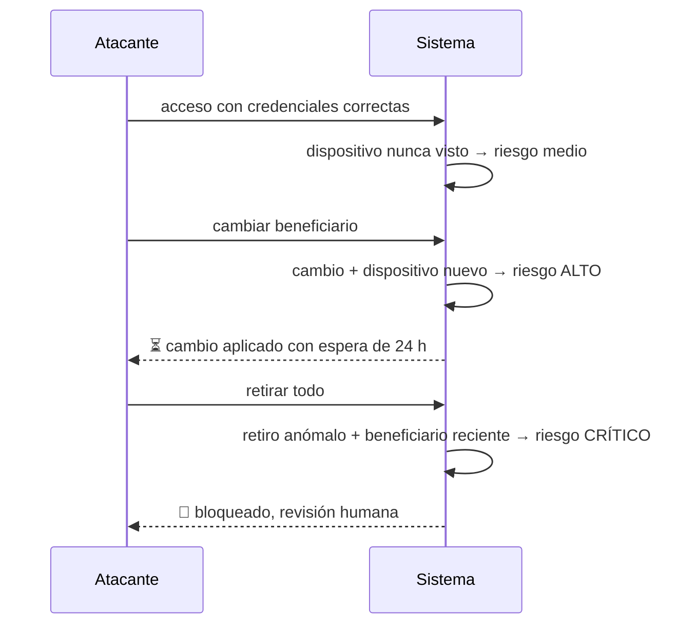

# CM-19 · Fraude y toma de cuentas

> **En una frase, para cualquiera:** alguien entra en tu cuenta con tu
> contraseña correcta. El sistema no tiene forma de saber que no eres tú, salvo
> mirando si lo que hace se parece a lo que tú haces.

**Estado real:** 🟠 `prototype` — hay código y escenarios que se ejecutan, **sin verificación en un entorno real** · **Módulo:** [`crates/sandbox-markets/src/cases/fraud.rs`](../../crates/sandbox-markets/src/cases/fraud.rs)

> [!WARNING]
> **Cuentas, dispositivos y sesiones simuladas. Sin datos personales reales.** No
> es una autorización regulatoria.

---

## Por qué se realiza este caso

En una toma de cuenta, la autenticación **funcionó correctamente**: quien entra
tiene las credenciales. Todos los controles de acceso dicen que sí. La única
señal disponible es el **comportamiento**.

| Señal | Por qué importa |
|---|---|
| **Dispositivo nuevo** | Primera vez que se ve, justo antes de un retiro |
| **Retiro anómalo** | Monto o destino que no encaja con el historial |
| **Cambio de beneficiario** seguido de retiro | La secuencia clásica |
| **Sesión imposible** | Dos accesos desde lugares incompatibles en el tiempo |
| Automatización | Ritmo de interacción que no es humano |
| Múltiples cuentas | El mismo dispositivo operando muchas cuentas ajenas |
| Credenciales comprometidas | Aparecen en una filtración conocida |

Igual que en [CM-15](cm-15-kyc-aml-y-sanciones.md), **el falso positivo hace
daño**: bloquear la cuenta de alguien que está de viaje y necesita su dinero es
una consecuencia real.

## La idea que enseña, y que ningún otro caso enseña

**Autenticar y autorizar no son lo mismo, y la confianza se recalcula.** El acceso
válido no concede permiso para todo: cada acción sensible se evalúa por su propio
riesgo en ese momento. Y la respuesta se **gradúa** —pedir confirmación adicional,
retrasar la operación, limitar el monto— en vez de elegir entre dejar pasar y
bloquear.

El retraso es la medida más subestimada: **una hora de espera en un cambio de
beneficiario no molesta a un cliente legítimo y arruina un fraude**.

## Casos de uso reales

- Una plataforma de inversión con retiros a cuentas bancarias.
- Una billetera con transferencias entre usuarios.
- Detección de cuentas mula.
- Formación: por qué el segundo factor no cierra el problema.

## Cómo funcionará





## Esquemas

```json
{
  "event": {
    "account": "cta-sintetica-1",
    "action": "withdraw",
    "amount": { "minorUnits": 4500000, "currency": "CLP" },
    "device": { "id": "dev-nuevo-1", "firstSeen": true },
    "session": { "geoLabel": "zona-B", "previousGeoLabel": "zona-A", "minutesSincePrevious": 12 },
    "beneficiaryAgeHours": 2
  }
}
```

```json
{
  "assessment": {
    "riskScore": 0.91,
    "signals": ["NewDevice", "ImpossibleSession", "RecentBeneficiary", "AmountAnomaly"],
    "response": "block-and-review",
    "humanReviewRequired": true,
    "falsePositiveCost": "el cliente no puede retirar hasta la revisión"
  }
}
```

`falsePositiveCost` está en el esquema **a propósito**: obliga a escribir lo que
cuesta equivocarse, junto a la decisión de bloquear.

## Software necesario

| Componente | Para qué |
|---|---|
| **Rust** 1.75+ | Señales, puntuación de riesgo y respuesta graduada |
| **Node.js** 20+ / **pnpm** 9+ | Cola de revisión humana (recomendado) |

Sin jaula ni Linux. **Cuentas, dispositivos y ubicaciones son sintéticos**; las
ubicaciones se representan como etiquetas, no como coordenadas, para no modelar
datos personales ni siquiera de forma simulada.

## Instalación

```bash
cargo build --release
```

## Procesos que se crearán

```text
sandboxctl markets fraud --scenario toma-de-cuenta
  │
  └─ un proceso determinista, sin red
      ├─ historial sintético por cuenta
      ├─ evaluación por acción, no por sesión
      └─ cola de revisión humana
```

## Tiempo de carga estimado

| Operación | Coste esperado |
|---|---|
| Evaluar una acción | < 1 ms |
| Simular 100 000 eventos de sesión | segundos |
| Reconstruir el historial de una cuenta | milisegundos |

## Qué hace falta para construirlo

1. Historial de comportamiento por cuenta, sintético.
2. Las siete señales listadas, cada una con escenario.
3. Puntuación de riesgo **por acción**, no por sesión.
4. Respuesta graduada, incluido el retraso como medida de primera línea.
5. Métrica de falsos positivos junto a la de detección.
6. Cola de revisión humana antes de cualquier bloqueo prolongado.

## Si algo falla

El caso **ya tiene código y escenarios que se ejecutan**. Lo que sigue son sus
fallos con la causa y la salida:

| Situación | Causa | Cómo se resuelve |
|---|---|---|
| Se bloquea a un cliente que está de viaje | Falso positivo por sesión imposible | El coste del falso positivo se escribe en el propio esquema (`falsePositiveCost`), junto a la decisión. Y la respuesta se **gradúa**: retrasar antes que bloquear |
| Un fraude pasa con credenciales correctas | La autenticación funcionó: es una toma de cuenta | Autenticar no es autorizar. Cada acción sensible se evalúa por su propio riesgo en ese momento, no por la sesión |
| El retiro se ejecuta antes de que nadie mire | No hubo demora | Una hora de espera en un cambio de beneficiario no molesta a un cliente legítimo y arruina un fraude. Es la medida más subestimada |
| Un dispositivo nuevo bloquea a todo el mundo | Señal usada sola | Ninguna señal decide por sí misma. El riesgo se compone: dispositivo nuevo **más** beneficiario reciente **más** monto anómalo |
| Se modelan ubicaciones reales | No hace falta y añade datos personales | Las ubicaciones son etiquetas (`zona-A`), no coordenadas. Basta para detectar una sesión imposible |

Los fallos que afectan a **cualquier** caso —la compilación, el catálogo, la
evidencia— están resueltos uno a uno en
**[Cuando algo falla](../SOLUCION-DE-PROBLEMAS.md)**.

Esta familia **no necesita aislamiento del sistema**: no ejecuta código ajeno,
sino reglas de negocio deterministas. Por eso casi ningún fallo suyo viene del
entorno, y casi todos vienen de los datos.

## Cómo se comprueba

```bash
cargo run -p sandboxctl -- markets check --case CM-19
```

Ejecuta los escenarios de este caso y compara cada uno con lo que **declara de
antemano** que debe salir. Corre en cada commit: si el caso deja de detectar lo
que dice detectar, la integración continua se pone roja.

```bash
cargo test -p sandbox-markets fraud
```

Los invariantes del módulo, incluidos los que ningún escenario de arriba cubre.

> **Sigue en `prototype`, no en `functional`.** Los escenarios se ejecutan y
> pasan, pero el caso **no emite evidencia firmada por ejecución** ni se ha
> usado contra datos que no sean los suyos. La regla completa está en el
> [ROADMAP](../../ROADMAP.md).

---

**Ver también:** [Catálogo completo](../CATALOGO.md) · [CM-15 · KYC y AML](cm-15-kyc-aml-y-sanciones.md) · [CM-11 · consentimiento](cm-11-finanzas-abiertas-y-consentimiento.md)
