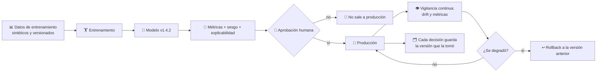
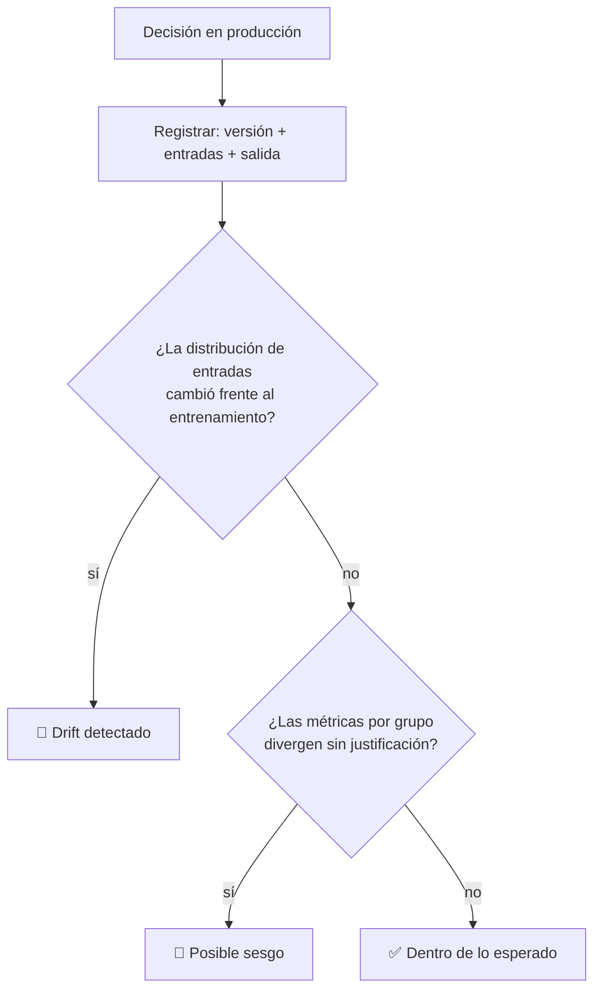

# CM-20 · Gobierno de modelos e IA financiera

> **En una frase, para cualquiera:** si un programa decide quién recibe un
> crédito o qué cartera te recomiendan, alguien tiene que poder responder tres
> preguntas: qué versión decidió, con qué datos, y quién se hace responsable.

**Estado real:** 🔴 `planned` · **Carpeta prevista:** `domains/capital-markets/cases/20-ai-model-governance`

> [!WARNING]
> **Modelos, métricas y datos simulados. Sin datos personales reales.** No es una
> autorización regulatoria ni una recomendación de inversión.

---

## Por qué se realiza este caso

Es **transversal**: no prueba una actividad, prueba **cómo se gobierna cualquier
modelo** que ya aparece en otros casos —el robo-advisor de
[CM-07](cm-07-robo-advisor.md), el scoring de [CM-06](cm-06-asesoria-crediticia.md),
la detección de fraude de [CM-19](cm-19-fraude-y-toma-de-cuentas.md), la
vigilancia de [CM-09](cm-09-vigilancia-de-abuso-de-mercado.md), el enrutamiento de
[CM-04](cm-04-enrutamiento-inteligente-de-ordenes.md).

Lo que se descuida sistemáticamente:

| Descuido | Consecuencia |
|---|---|
| No registrar la versión que decidió | No se puede reconstruir una decisión pasada |
| No guardar con qué datos se entrenó | No se puede explicar un sesgo |
| No medir el **drift** | El modelo sigue funcionando sobre un mundo que ya cambió |
| No medir **sesgo** | Trato distinto sin justificación, descubierto por un tercero |
| No tener **rollback** | Un modelo peor en producción y sin vuelta atrás |
| No tener supervisión humana | Nadie responde por la decisión |

El *drift* es el más silencioso: nada falla, no hay error en los registros, y el
modelo simplemente acierta cada vez menos porque el mundo se movió.

## La idea que enseña, y que ningún otro caso enseña

**Un modelo en producción es una decisión con dueño.** Tiene versión, aprobación,
métricas de seguimiento y una forma de volver atrás. Sin eso, no es un sistema:
es una caja que nadie puede defender ante quien reclame.

## Casos de uso reales

- Un comité que aprueba modelos antes de ponerlos en producción.
- Responder a un cliente que reclama una decisión automatizada.
- Detectar que un modelo se degradó antes de que lo note el negocio.
- Auditar si un modelo trata distinto a grupos comparables.

## Cómo funcionará





## Esquemas

### Registro de modelo

```json
{
  "model": {
    "id": "robo-advisor",
    "version": "1.4.2",
    "trainedOn": { "dataset": "sintetico-2026-06", "sha256": "…" },
    "metrics": { "accuracy": 0.87, "calibration": 0.92 },
    "biasReport": { "groups": ["A", "B"], "maxDisparity": 0.03, "threshold": 0.05 },
    "explainability": "importancia de variables documentada",
    "approvedBy": "comite-simulado",
    "approvedAt": "2026-07-01T00:00:00Z",
    "rollbackTo": "1.4.1"
  }
}
```

### Vigilancia

```json
{
  "monitoring": {
    "model": "robo-advisor@1.4.2",
    "window": "2026-08",
    "drift": { "detected": true, "feature": "horizonte", "psi": 0.31, "threshold": 0.2 },
    "metricsNow": { "accuracy": 0.79 },
    "recommendation": "rollback a 1.4.1 y reentrenar",
    "humanDecisionRequired": true
  }
}
```

## Software necesario

| Componente | Para qué | ¿Obligatorio? |
|---|---|---|
| **Rust** 1.75+ | Registro de modelos, métricas de drift y sesgo | Sí |
| **Node.js** 20+ / **pnpm** 9+ | Panel de gobierno y aprobaciones | Recomendado |
| **Python** 3.11+ | Solo si un modelo de ejemplo lo requiere | No |

Sin jaula ni Linux para el gobierno en sí. Si algún día se entrenara un modelo
con código de terceros, ese entrenamiento sí debería correr bajo el
[caso 12](12-notebooks-de-ciencia-de-datos.md) — que es exactamente el puente
entre las dos familias de este repositorio.

## Instalación

```bash
cargo build --release
```

## Procesos que se crearán

```text
sandboxctl markets model --check drift --model robo-advisor@1.4.2
  │
  └─ un proceso determinista, sin red
      ├─ registro de modelos append-only
      ├─ métricas de drift y sesgo sobre datos sintéticos
      └─ decisión de rollback que requiere aprobación humana
```

## Tiempo de carga estimado

| Operación | Coste esperado |
|---|---|
| Registrar una versión | < 10 ms |
| Calcular drift sobre una ventana | < 1 s |
| Reconstruir una decisión histórica | < 10 ms |
| Rollback a la versión anterior | inmediato: es cambiar el puntero |

## Qué hace falta para construirlo

1. Registro de modelos append-only con versión, datos y métricas.
2. Cada decisión de los demás casos guarda la versión que la tomó.
3. Detección de drift con umbral configurable.
4. Medición de sesgo entre grupos, sobre datos **sintéticos**.
5. Aprobación humana obligatoria antes de producción y antes de un rollback.
6. Reconstrucción de cualquier decisión pasada.

## Si algo falla

Este caso **todavía no tiene código**. Lo que sigue son los fallos que el diseño
tiene que resolver, y cómo va a resolverlos:

| Situación | Causa | Cómo se resuelve |
|---|---|---|
| No se puede explicar una decisión pasada | No se guardó la versión del modelo que la tomó | Cada decisión de los demás casos guarda `modelVersion`. Sin eso no hay forma de responder a quien reclama |
| El modelo acierta cada vez menos y nada falla | **Drift**: el mundo cambió y el modelo no | Se vigila la distribución de entradas contra la del entrenamiento. Superado el umbral, se recomienda rollback y reentrenamiento |
| Trato distinto entre grupos comparables | Posible sesgo, a veces por una variable que aproxima a otra prohibida | Se mide `maxDisparity` entre grupos en cada versión, sobre datos sintéticos. Un modelo que no se mide no se puede defender |
| No se puede volver a la versión anterior | No hay rollback | El registro es append-only y el rollback es cambiar un puntero. Un modelo peor en producción sin vuelta atrás es el fallo más caro del caso |
| Un modelo sale a producción sin aprobación | Fallo de proceso | La aprobación humana es obligatoria antes de producción **y antes de un rollback**: volver atrás también es una decisión |

Los fallos que afectan a **cualquier** caso —la compilación, el catálogo, la
evidencia— están resueltos uno a uno en
**[Cuando algo falla](../SOLUCION-DE-PROBLEMAS.md)**.

Esta familia **no necesita aislamiento del sistema**: no ejecuta código ajeno,
sino reglas de negocio deterministas. Por eso casi ningún fallo suyo viene del
entorno, y casi todos vienen de los datos.

---

**Ver también:** [Catálogo completo](../CATALOGO.md) · [CM-07 · robo-advisor](cm-07-robo-advisor.md) · [Caso 12 · notebooks](12-notebooks-de-ciencia-de-datos.md)
