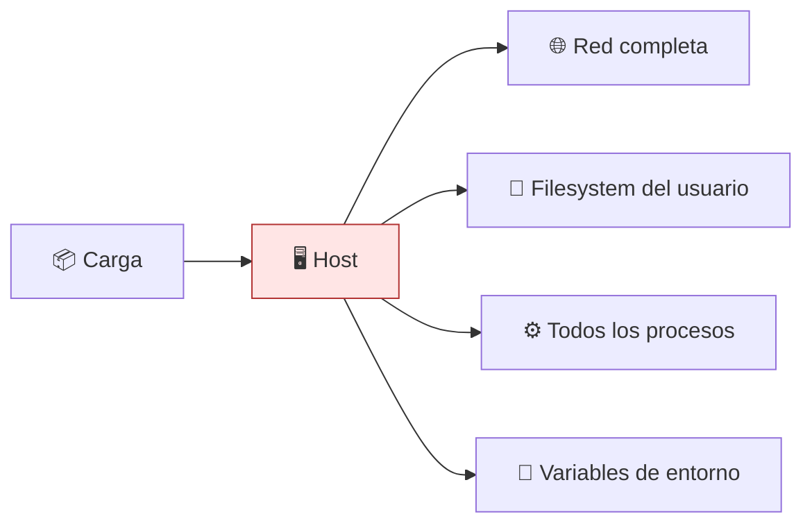

# Lab 01 · Línea base sin restricciones

> **Nivel:** `initial` · **Estado:** `ready`

Ejecutar una carga **sin ningún aislamiento** y medir exactamente qué queda expuesto.

---

## 🎯 Por qué importa

Es el laboratorio más importante del recorrido y el que más gente se salta. Sin
ver lo que una carga alcanza cuando nadie la contiene, los controles de los
laboratorios siguientes son abstracciones: no se sabe qué quitan. Aquí se
obtiene la fotografía contra la que se comparará todo lo demás.

---

## 🗺️ Cómo funciona



---

## ▶️ Práctica

```bash
# La línea base necesita opt-in explícito: ejecuta SIN aislamiento.
export SANDBOX_LABS_ALLOW_NATIVE=1

# Qué alcanza una carga cuando nadie la contiene
cargo run -p sandboxctl -- escape --runtime native
```

### Salida esperada

```text
DIMENSIÓN / SONDA             native
──────────────────────────────────────
network-egress                     ❌
filesystem-escape                  ❌
process-visibility                 ❌
environment-leak                   ✅
privilege-check                    ✅

Detalle de las fugas:
  · network-egress — conexiones establecidas: dns-cloudflare,dns-google
  · filesystem-escape — rutas sensibles legibles: ~/.aws/credentials
  · process-visibility — 47 PIDs visibles (umbral 12)
```

---

## ✅ Cómo se verifica

Las sondas **tienen que escapar**. Si en tu host salieran todas contenidas, no
estarías midiendo nada — y los ✅ de los laboratorios siguientes no significarían
nada tampoco. CI ejecuta esta contraprueba en cada commit por ese motivo.

---

## 🏭 Caso de uso real

Auditar qué expone tu equipo de desarrollo antes de ejecutar el primer `npm
install` de una dependencia que no has leído. La respuesta habitual —red
abierta, credenciales de nube legibles, todo el árbol de procesos visible— es la
que justifica el resto del repositorio.

---

## ⚠️ Errores comunes

- `native` **no es un sandbox**. Solo aplica timeout y límite de salida. Nunca lo uses con código que no hayas escrito tú.
- El doble cerrojo (`SANDBOX_LABS_ALLOW_NATIVE=1` y `allowNative` en el manifiesto) existe para que ejecutar sin aislamiento sea siempre una decisión consciente.

---

## 🧾 Evidencia

Cada ejecución con `sandboxctl run` deja un JSON en `evidence/runs/` con:

| Campo | Qué prueba |
|---|---|
| `integrity.policySha256` | Qué política exacta se aplicó |
| `integrity.workloadSha256` | Qué código exacto se ejecutó |
| `policy.effectiveControls` | Qué controles se aplicaron de verdad |
| `policy.unsupportedControls` | Qué pidió la política y no se pudo aplicar |
| `result` | Estado, código de salida y salida acotada |

Formato completo en [docs/EVIDENCE_FORMAT.md](../../docs/EVIDENCE_FORMAT.md).

---

## 🔗 Siguiente paso

**Lab 04 · Namespaces de Linux** → [`04-linux-namespaces/`](../04-linux-namespaces/)

> [!WARNING]
> No ejecutes código desconocido en tu equipo de trabajo. `experimental` no
> significa apto para cargas hostiles: usa una VM que puedas destruir.
