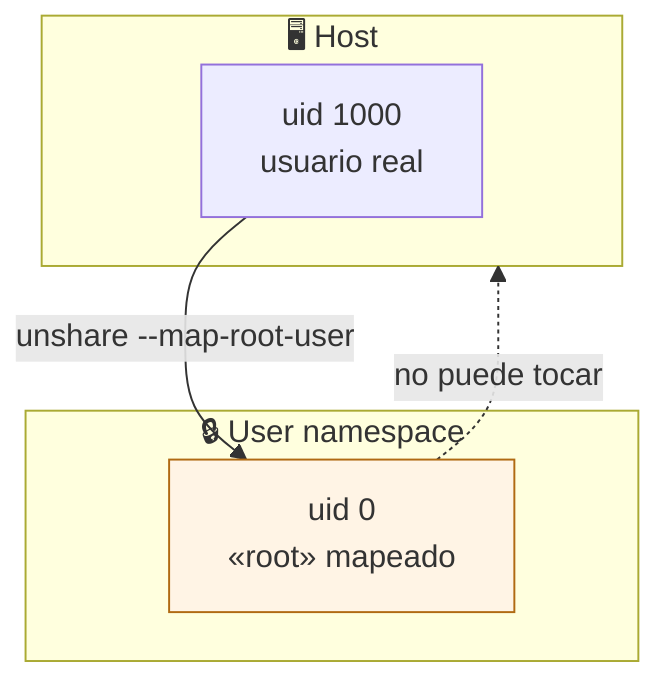

# Lab 02 · Usuarios, permisos y el mito del uid 0

> **Nivel:** `initial` · **Estado:** `ready`

Distinguir el privilegio **real** del privilegio **aparente** dentro de un user namespace.

---

## 🎯 Por qué importa

Ver `uid=0(root)` dentro de un sandbox asusta la primera vez y tranquiliza
demasiado la segunda. Ese cero está mapeado: no vale nada fuera del namespace.
Lo que sí importa son las capabilities que sobreviven, porque son las que
permiten montar, trazar procesos o tocar la red del host.

---

## 🗺️ Cómo funciona



---

## ▶️ Práctica

```bash
# Identidad en el host
id

# Identidad dentro de un user namespace
unshare --user --map-root-user id

# El mapeo que lo explica todo
unshare --user --map-root-user cat /proc/self/uid_map

# Qué capabilities sobreviven de verdad
cargo run -p sandboxctl -- escape --runtime unshare 2>&1 | grep privilege
```

### Salida esperada

```text
uid=1000(tu-usuario) gid=1000(tu-usuario)
uid=0(root) gid=0(root) groups=0(root),65534(nogroup)
         0       1000          1

privilege-check                    ✅
  → uid=0 mapeado en user namespace; capabilities acotadas al namespace
```

---

## ✅ Cómo se verifica

La tercera columna del `uid_map` es el tamaño del rango: `0 1000 1` significa
que el uid 0 de dentro es el uid 1000 de fuera, y solo ese. La sonda `privilege-
check` distingue este caso del root real leyendo `CapEff` y `uid_map` a la vez.

---

## 🏭 Caso de uso real

Justificar ante una revisión de seguridad por qué un contenedor rootless que
muestra `root` en su shell no es una escalada de privilegios — y qué habría que
mirar para que sí lo fuera.

---

## ⚠️ Errores comunes

- `uid=0` dentro ≠ root fuera. Lo que hay que auditar es `CapEff` en `/proc/self/status`.
- Si `uid_map` dice `0 0 4294967295`, **no** estás en un user namespace propio: eres root de verdad.

---

## 🧾 Evidencia

Cada ejecución con `sandboxctl run` deja un JSON en `evidence/runs/` con:

| Campo | Qué prueba |
|---|---|
| `integrity.policySha256` | Qué política exacta se aplicó |
| `integrity.workloadSha256` | Qué código exacto se ejecutó |
| `policy.effectiveControls` | Qué controles se aplicaron de verdad |
| `policy.unsupportedControls` | Qué pidió la política y no se pudo aplicar |
| `result` | Estado, código de salida y salida acotada |

Formato completo en [docs/EVIDENCE_FORMAT.md](../../docs/EVIDENCE_FORMAT.md).

---

## 🔗 Siguiente paso

**Lab 03 · Jaula de filesystem** → [`03-filesystem-jail/`](../03-filesystem-jail/)

> [!WARNING]
> No ejecutes código desconocido en tu equipo de trabajo. `experimental` no
> significa apto para cargas hostiles: usa una VM que puedas destruir.
